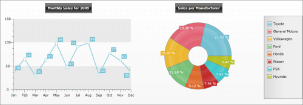

# Creating a Chart With Custom Layout

If the default layout provided by the __RadChart.DefaultView__ does not fit your scenario, then you can define your own layout where to put all the elements you need. Moreover - you can add as many __ChartArea__, __ChartLegend__ and __ChartTitle__ as you need.

If, for example, you want to show the monthly sales of cars for the year 2009 on one chart and next to it, as a second chart to display the sales per car manufacturer with a legend, then you have to set __UseDefaultLayout__to __False__ and to define your own. In this example, you have __Grid__ with two rows and three columns. On the first row two __ChartTitle__ elements are placed in the first and the second columns where the chart areas will be placed. On the second row will be added two __ChartArea__ controls in the first two columns and a __ChartLegend__ in the third column.

#### __XAML__

{{region radchart-populating-with-data-creating-chart-declaratively_5}}
	<telerikChart:RadChart UseDefaultLayout="False" Height="362" Width="1042" VerticalAlignment="Bottom">
	    <Grid VerticalAlignment="Stretch" HorizontalAlignment="Stretch" Margin="10,10,0,20">
	        <Grid.RowDefinitions>
	            <RowDefinition Height="Auto" />
	            <RowDefinition Height="*" />
	        </Grid.RowDefinitions>
	        <Grid.ColumnDefinitions>
	            <ColumnDefinition Width="*" />
	            <ColumnDefinition Width="*" />
	            <ColumnDefinition Width="Auto" />
	        </Grid.ColumnDefinitions>
	        <telerikCharting:ChartTitle Margin="0,0,0,10" HorizontalAlignment="Center" Content="Monthly Sales for 2009" 
	            Grid.Row="0" Grid.Column="0" />
	        <telerikCharting:ChartArea HorizontalAlignment="Stretch" VerticalAlignment="Stretch" 
	            Grid.Row="1" Grid.Column="0">
	            <telerikCharting:ChartArea.DataSeries>
	                <!-- Line Chart -->
	                <telerikCharting:DataSeries>
	                    <telerikCharting:DataSeries.Definition>
	                        <telerikCharting:LineSeriesDefinition >
	                        </telerikCharting:LineSeriesDefinition>
	                    </telerikCharting:DataSeries.Definition>
	                    <telerikCharting:DataPoint YValue="38" XCategory="Jan"/>
	                    <telerikCharting:DataPoint YValue="65" XCategory="Feb"/>
	                    <telerikCharting:DataPoint YValue="30" XCategory="Mar"/>
	                    <telerikCharting:DataPoint YValue="63" XCategory="Apr"/>
	                    <telerikCharting:DataPoint YValue="98" XCategory="May"/>
	                    <telerikCharting:DataPoint YValue="47" XCategory="Jun"/>
	                    <telerikCharting:DataPoint YValue="91" XCategory="Jul"/>
	                    <telerikCharting:DataPoint YValue="99" XCategory="Aug"/>
	                    <telerikCharting:DataPoint YValue="32" XCategory="Sep"/>
	                    <telerikCharting:DataPoint YValue="77" XCategory="Oct"/>
	                    <telerikCharting:DataPoint YValue="62" XCategory="Nov"/>
	                    <telerikCharting:DataPoint YValue="38" XCategory="Dec"/>
	                </telerikCharting:DataSeries>
	            </telerikCharting:ChartArea.DataSeries>
	        </telerikCharting:ChartArea>
	        <telerikCharting:ChartTitle HorizontalAlignment="Center" Content="Sales per Manufacturer"
	            Margin="0,0,0,10" Grid.Row="0" Grid.Column="1" />
	        <telerikCharting:ChartArea LegendName="ChartLegendManufacturers" VerticalAlignment="Stretch" HorizontalAlignment="Stretch" 
	            Margin="0,0,0,15" Grid.Row="1" Grid.Column="1">
	            <telerikCharting:ChartArea.DataSeries>
	                <!-- Doughnut Chart -->
	                <telerikCharting:DataSeries>
	                    <telerikCharting:DataSeries.Definition>
	                        <telerikCharting:DoughnutSeriesDefinition ItemLabelFormat="p">
	                        </telerikCharting:DoughnutSeriesDefinition>
	                    </telerikCharting:DataSeries.Definition>
	                    <telerikCharting:DataPoint YValue="0.215208267" LegendLabel="Toyota"/>
	                    <telerikCharting:DataPoint YValue="0.192960612" LegendLabel="General Motors"/>
	                    <telerikCharting:DataPoint YValue="0.151830229" LegendLabel="Volkswagen"/>
	                    <telerikCharting:DataPoint YValue="0.125964366" LegendLabel="Ford"/>
	                    <telerikCharting:DataPoint YValue="0.091152353" LegendLabel="Honda"/>
	                    <telerikCharting:DataPoint YValue="0.079093251" LegendLabel="Nissan"/>
	                    <telerikCharting:DataPoint YValue="0.079093251" LegendLabel="PSA"/>
	                    <telerikCharting:DataPoint YValue="0.06469767" LegendLabel="Hyundai"/>
	                </telerikCharting:DataSeries>
	            </telerikCharting:ChartArea.DataSeries>
	        </telerikCharting:ChartArea>
	        <telerikCharting:ChartLegend x:Name="ChartLegendManufacturers" Header="" VerticalAlignment="Stretch" 
	            Grid.Row="1" Grid.Column="2" />
	    </Grid>
	</telerikChart:RadChart>
	{{endregion}}

In the image bellow you can see how the custom layout chart looks like:

# See Also

 * [Overview]()

 * [Creating a Chart Declaratively]()

 * [Data Binding Support Overview]()

 * [Data Binding with Automatic Series Mappings]()

 * [Data Binding with Manual Series Mapping]()
