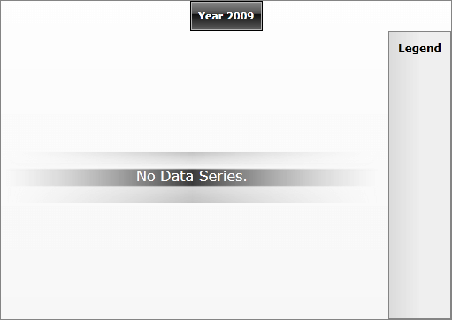

# Creating a Chart Declaratively

In some situations you might want to create a chart declaratively - in XAML. This is useful when you have static data that will not change in time.

This tutorial will walk you through the common tasks of:

* [Adding RadChart and setting the DefaultView property](#Adding_RadChart_and_Setting_the_DefaultView_Property)

* [Adding ChartTitle](#Adding_ChartTitle)

* [Adding ChartLegend](#Adding_ChartLegend)

* [Adding ChartArea](#Adding_ChartArea)

* [Adding DataSeries](#Adding_DataSeries)

>In order to use __RadChart__control in your projects you have to add references to __Telerik.Windows.Controls.Charting.dll__.

## Adding RadChart and Setting the DefaultView Property

For most of the cases, where a chart has a title, a legend and a chart area, __RadChart__control provides you with a __DefaultView__that contains these three elements. 

In your XAML file, add a new __RadChart__ declaration and make a new instance of __ChartDefaultView__which has to be set to the __RadChart.DefaultView__ property.

#### __XAML__

{{region radchart-populating-with-data-creating-chart-declaratively_0}}
	<telerikChart:RadChart>
	    <telerikChart:RadChart.DefaultView>
	        <telerikCharting:ChartDefaultView>
	        </telerikCharting:ChartDefaultView>
	    </telerikChart:RadChart.DefaultView>
	</telerikChart:RadChart>
	{{endregion}}

>

To use __RadChart__in your XAML file, add a reference to the following namespaces:

__xmlns:telerikChart="clr-namespace:Telerik.Windows.Controls;assembly=Telerik.Windows.Controls.Charting"__ and  
__xmlns:telerikCharting="clr-namespace:Telerik.Windows.Controls.Charting;assembly=Telerik.Windows.Controls.Charting"__

The __ChartDefaultView__contains [ChartTitle](), [ChartLegend]() and [ChartArea]() and you have to use them to build the chart in the way you need. The next several sections will show you how to set these properties.

## Adding ChartTitle

After declaring the default view, the next step is to add a chart title. Find your __RadChart__ declaration and add chart title "Year 2009" which is positioned in the center:

#### __XAML__

{{region radchart-populating-with-data-creating-chart-declaratively_1}}
	<telerikChart:RadChart VerticalAlignment="Top">
	    <telerikChart:RadChart.DefaultView>
	        <telerikCharting:ChartDefaultView>
	
	            <telerikCharting:ChartDefaultView.ChartTitle>
	                <telerikCharting:ChartTitle Content="Year 2009" HorizontalAlignment="Center"/>
	            </telerikCharting:ChartDefaultView.ChartTitle>
	
	        </telerikCharting:ChartDefaultView>
	    </telerikChart:RadChart.DefaultView>
	</telerikChart:RadChart>
	{{endregion}}

         
      

## Adding ChartLegend

Add a __ChartLegend__declaration to your default view declaration. If you want the data series which is added later in the __ChartArea__to be automatically added in the legend, set the __UseAutoGeneratedItems__ property to __True__.

#### __XAML__

{{region radchart-populating-with-data-creating-chart-declaratively_2}}
	<telerikChart:RadChart VerticalAlignment="Top">
	    <telerikChart:RadChart.DefaultView>
	        <telerikCharting:ChartDefaultView>
	
	            <telerikCharting:ChartDefaultView.ChartTitle>
	                <telerikCharting:ChartTitle Content="Year 2009" HorizontalAlignment="Center"/>
	            </telerikCharting:ChartDefaultView.ChartTitle>
	
	            <telerikCharting:ChartDefaultView.ChartLegend>
	                <telerikCharting:ChartLegend x:Name="chartLegend" UseAutoGeneratedItems="True" />
	            </telerikCharting:ChartDefaultView.ChartLegend>
	
	        </telerikCharting:ChartDefaultView>
	    </telerikChart:RadChart.DefaultView>
	</telerikChart:RadChart>
	{{endregion}}

## Adding ChartArea

The third step in the populating a __RadChart__with data is adding a __ChartArea__.

>

Note that to show the __DataSeries__ in the legend you have to also set the __ChartArea.LegendName__ property with the name of the __ChartLegend__ you want.

#### __XAML__

{{region radchart-populating-with-data-creating-chart-declaratively_3}}
	<telerikChart:RadChart VerticalAlignment="Top">
	    <telerikChart:RadChart.DefaultView>
	        <telerikCharting:ChartDefaultView>
	
	            <telerikCharting:ChartDefaultView.ChartTitle>
	                <telerikCharting:ChartTitle Content="Year 2009" HorizontalAlignment="Center"/>
	            </telerikCharting:ChartDefaultView.ChartTitle>
	
	            <telerikCharting:ChartDefaultView.ChartLegend>
	                <telerikCharting:ChartLegend x:Name="chartLegend" UseAutoGeneratedItems="True" />
	            </telerikCharting:ChartDefaultView.ChartLegend>
	
	            <telerikCharting:ChartDefaultView.ChartArea>
	                <telerikCharting:ChartArea LegendName="chartLegend">
	                </telerikCharting:ChartArea>
	            </telerikCharting:ChartDefaultView.ChartArea>
	
	        </telerikCharting:ChartDefaultView>
	    </telerikChart:RadChart.DefaultView>
	</telerikChart:RadChart>
	{{endregion}}

## Adding DataSeries

The __ChartArea__ has a list of __DataSeries__, where you have to add one __DataSeries__ per the chart graphic you want to see. The __DataSeries__ has a property __Definition__ of type __ISeriesDefinition__ where the chart type has to be specified - __LineSeriesDefinition__ for line chart, __BarSeriesDefinition__ for bar chart, etc. The last thing you have to define is the data for each __DataSeries__: simply add as many __DataPoint__s as you need____- one for each point of the chart.

The __DataPoint__ class represents a single piece of data that is visualized in a chart series. For each __DataPoint__, you can define several values depending on the chart type: __XValue__ and __YValue__, __High__ and __Low__, __Open__ and __Close__, etc. These values are used later to visually calculate and draw the chart graphic.

Other properties of __DataPoint__ are the __LegendLable__and the __LegendFormat.__ The first one specifies the text displayed in the __ChartLegend__ related to that __DataSeries,__ while the second one defines the format of the labels.

The XAML bellow defines __LineSeriesDefinition__, that represents the line chart showing the Turnover for year 2009. The data is defined as __DataPoints__, where __Y-Axis__ (__YValue__) is set with the desired value. The second data series is __BarSeriesDefinition__ for the Expenses defined in a similar way.

#### __XAML__

{{region radchart-populating-with-data-creating-chart-declaratively_4}}
	<telerikChart:RadChart VerticalAlignment="Top">
	    <telerikChart:RadChart.DefaultView>
	        <telerikCharting:ChartDefaultView>
	
	            <telerikCharting:ChartDefaultView.ChartTitle>
	                <telerikCharting:ChartTitle Content="Year 2009" HorizontalAlignment="Center"/>
	            </telerikCharting:ChartDefaultView.ChartTitle>
	
	            <telerikCharting:ChartDefaultView.ChartLegend>
	                <telerikCharting:ChartLegend x:Name="chartLegend" UseAutoGeneratedItems="True" />
	            </telerikCharting:ChartDefaultView.ChartLegend>
	
	            <telerikCharting:ChartDefaultView.ChartArea>
	                <telerikCharting:ChartArea LegendName="chartLegend">
	                    <telerikCharting:ChartArea.DataSeries>
	
	                        <!-- Line Chart -->
	                        <telerikCharting:DataSeries LegendLabel="Turnover">
	                            <telerikCharting:DataSeries.Definition>
	                                <telerikCharting:LineSeriesDefinition >
	                                </telerikCharting:LineSeriesDefinition>
	                            </telerikCharting:DataSeries.Definition>
	
	                            <telerikCharting:DataPoint YValue="154" XCategory="Jan"/>
	                            <telerikCharting:DataPoint YValue="138" XCategory="Feb"/>
	                            <telerikCharting:DataPoint YValue="143" XCategory="Mar"/>
	                            <telerikCharting:DataPoint YValue="120" XCategory="Apr"/>
	                            <telerikCharting:DataPoint YValue="135" XCategory="May"/>
	                            <telerikCharting:DataPoint YValue="125" XCategory="Jun"/>
	                            <telerikCharting:DataPoint YValue="179" XCategory="Jul"/>
	                            <telerikCharting:DataPoint YValue="170" XCategory="Aug"/>
	                            <telerikCharting:DataPoint YValue="198" XCategory="Sep"/>
	                            <telerikCharting:DataPoint YValue="187" XCategory="Oct"/>
	                            <telerikCharting:DataPoint YValue="193" XCategory="Nov"/>
	                            <telerikCharting:DataPoint YValue="176" XCategory="Dec"/>
	                        </telerikCharting:DataSeries>
	
	                        <!-- Bar Chart -->
	                        <telerikCharting:DataSeries LegendLabel="Expenses">
	                            <telerikCharting:DataSeries.Definition>
	                                <telerikCharting:BarSeriesDefinition>
	                                </telerikCharting:BarSeriesDefinition>
	                            </telerikCharting:DataSeries.Definition>
	
	                            <telerikCharting:DataPoint YValue="45" XCategory="Jan"/>
	                            <telerikCharting:DataPoint YValue="48" XCategory="Feb"/>
	                            <telerikCharting:DataPoint YValue="53" XCategory="Mar"/>
	                            <telerikCharting:DataPoint YValue="41" XCategory="Apr"/>
	                            <telerikCharting:DataPoint YValue="32" XCategory="May"/>
	                            <telerikCharting:DataPoint YValue="28" XCategory="Jun"/>
	                            <telerikCharting:DataPoint YValue="63" XCategory="Jul"/>
	                            <telerikCharting:DataPoint YValue="74" XCategory="Aug"/>
	                            <telerikCharting:DataPoint YValue="77" XCategory="Sep"/>
	                            <telerikCharting:DataPoint YValue="85" XCategory="Oct"/>
	                            <telerikCharting:DataPoint YValue="89" XCategory="Nov"/>
	                            <telerikCharting:DataPoint YValue="80" XCategory="Dec"/>
	                        </telerikCharting:DataSeries>
	                    </telerikCharting:ChartArea.DataSeries>
	                </telerikCharting:ChartArea>
	            </telerikCharting:ChartDefaultView.ChartArea>
	        </telerikCharting:ChartDefaultView>
	    </telerikChart:RadChart.DefaultView>
	</telerikChart:RadChart>
	{{endregion}}

The result is [categorical chart](), where on __X-Axis__ you can see the months:

         
      

# See Also

 * [Overview]()

 * [Creating a Chart in Code-behind]()

 * [Data Binding Support Overview]()

 * [Data Binding with Automatic Series Mappings]()

 * [Data Binding with Manual Series Mapping]()
