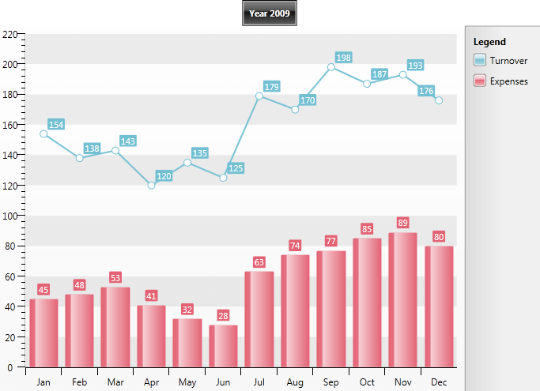

# Creating a Chart in Code-behind


__RadChart__ provides you with API, which you can use to build the charts you need from the code-behind, without using XAML. 

This tutorial will walk you through the common tasks of:

* [Adding RadChart and setting the DefaultView property in the code-behind](#cadding-radchart-and-setting-the-defaultview-property)

* [Adding ChartTitle in the code-behind](#adding-charttitle)

* [Adding ChartLegend in the code-behind](#adding-chartlegend)

* [Adding ChartArea in the code-behind](#adding-chartarea)

* [Adding DataSeries in the code-behind](#adding-dataseries)

>In order to use __RadChart__ control in your projects you have to add references to __Telerik.Windows.Controls.Charting.dll__ and to add references to the following namespaces:


```C#
	using Telerik.Windows.Controls;
	using Telerik.Windows.Controls.Charting;
	using System.Windows.Controls;
```
```VB.NET
	Imports Telerik.Windows.Controls
	Imports Telerik.Windows.Controls.Charting
```


## Adding RadChart and Setting the DefaultView Property

The first thing you have to do is to create a new instance of the __RadChart__ class in the code and add it to a parent control. 


```C#
	private RadChart CreateChart_DefaultView()
	{
	    RadChart telerikChart = new RadChart();
	    return telerikChart;
	}
```
```VB.NET
	Private Function CreateChart_DefaultView() As Telerik.Windows.Controls.RadChart
	    Dim telerikChart As New Telerik.Windows.Controls.RadChart()
	    Return telerikChart
	End Function
```


The __ChartDefaultView__ contains [ChartTitle](), [ChartLegend]() and [ChartArea]() and you have to use them to build the chart in the way you need. The next several sections will show you how to set these properties.

## Adding ChartTitle

After declaring the default view, the next step is to add a chart title. Find your __RadChart__ declaration and add chart title "Year 2009" which is positioned in the center: 


```C#
	private RadChart CreateChart_DefaultView()
	{
	    RadChart telerikChart = new RadChart();    //Chart Title
	    telerikChart.DefaultView.ChartTitle.Content = "Year 2009";
	    telerikChart.DefaultView.ChartTitle.HorizontalAlignment = HorizontalAlignment.Center;
	    return telerikChart;
	}
```
```VB.NET
	Private Function CreateChart_DefaultView() As Telerik.Windows.Controls.RadChart
	    Dim telerikChart As New Telerik.Windows.Controls.RadChart()
	    'Chart Title '
	    telerikChart.DefaultView.ChartTitle.Content = "Year 2009"
	    telerikChart.DefaultView.ChartTitle.HorizontalAlignment = HorizontalAlignment.Center
	    Return telerikChart
	End Function
```


## Adding ChartLegend

Add a __ChartLegend__ declaration to your default view declaration. If you want the data series which is added later in the __ChartArea__ to be automatically added in the legend, set the __UseAutoGeneratedItems__ property is set to __True__. 


```C#
	private RadChart CreateChart_DefaultView()
	{
	    RadChart telerikChart = new RadChart();    //Chart Title
	    telerikChart.DefaultView.ChartTitle.Content = "Year 2009";
	    telerikChart.DefaultView.ChartTitle.HorizontalAlignment = HorizontalAlignment.Center;    //Chart Legend
	    telerikChart.DefaultView.ChartLegend.UseAutoGeneratedItems = true; return telerikChart;
	}
```
```VB.NET
	Private Function CreateChart_DefaultView() As Telerik.Windows.Controls.RadChart
	    Dim telerikChart As New Telerik.Windows.Controls.RadChart()
	    'Chart Title '
	    telerikChart.DefaultView.ChartTitle.Content = "Year 2009"
	    telerikChart.DefaultView.ChartTitle.HorizontalAlignment = HorizontalAlignment.Center
	    Return telerikChart
	End Function
```


## Adding ChartArea

The third step in the populating a __RadChart__ with data is adding a __ChartArea__.


```C#
	private Telerik.Windows.Controls.RadChart CreateChart_DefaultView()
	{
	    RadChart telerikChart = new RadChart();    //Chart Title
	    telerikChart.DefaultView.ChartTitle.Content = "Year 2009";
	    telerikChart.DefaultView.ChartTitle.HorizontalAlignment = HorizontalAlignment.Center;    //Chart Legend
	    telerikChart.DefaultView.ChartLegend.UseAutoGeneratedItems = true;    //Line Chart
	    DataSeries lineSeries = new DataSeries();
	    lineSeries.LegendLabel = "Turnover";
	    lineSeries.Definition = new LineSeriesDefinition();
	    telerikChart.DefaultView.ChartArea.DataSeries.Add(lineSeries);    //Bar Chart
	    DataSeries barSeries = new DataSeries();
	    barSeries.LegendLabel = "Expenses";
	    telerikChart.DefaultView.ChartArea.DataSeries.Add(barSeries);
	    return telerikChart;
	}
```
```VB.NET
	Private Function CreateChart_DefaultView() As Telerik.Windows.Controls.RadChart
	    Dim telerikChart As New Telerik.Windows.Controls.RadChart()
	
	    'Chart Title
	    telerikChart.DefaultView.ChartTitle.Content = "Year 2009"
	    telerikChart.DefaultView.ChartTitle.HorizontalAlignment = HorizontalAlignment.Center
	
	    'Chart Legend '
	    telerikChart.DefaultView.ChartLegend.UseAutoGeneratedItems = True
	
	    'Line Chart '
	    Dim lineSeries As New DataSeries()
	    lineSeries.LegendLabel = "Turnover"
	    lineSeries.Definition = New LineSeriesDefinition()
	
	    telerikChart.DefaultView.ChartArea.DataSeries.Add(lineSeries)
	
	    'Bar Chart '
	    Dim barSeries As New DataSeries()
	    barSeries.LegendLabel = "Expenses"
	
	    telerikChart.DefaultView.ChartArea.DataSeries.Add(barSeries)
	
	    Return telerikChart
	End Function
```


## Adding DataSeries

The __ChartArea__ has a list of __DataSeries__, where you have to add one __DataSeries__ per the chart graphic you want to see. The __DataSeries__ has a property __Definition__ of type __ISeriesDefinition__ where the chart type has to be specified - __LineSeriesDefinition__ for line chart, __BarSeriesDefinition__ for bar chart, etc. The last thing you have to define is the data for each __DataSeries__: simply add as many __DataPoints__ as you need - one for each point of the chart.

The __DataPoint__ class represents a single piece of data that is visualized in a chart series. For each __DataPoint__, you can define several values depending on the chart type: __XValue__ and __YValue__, __High__ and __Low__, __Open__ and __Close__, etc. These values are used later to visually calculate and draw the chart graphic.

Other properties of __DataPoint__ are the __LegendLable__ аnd the __LegendFormat.__ The first one specifies the text displayed in the __ChartLegend__ related to that __DataSeries__, while the second one defines the format of the labels.

The code bellow defines __LineSeriesDefinition__, that represents the line chart showing the Turnover for the year 2009. The data is defined as __DataPoints__, where __Y-Axis__ (YValue) is set with the desired value. The second data series is __BarSeriesDefinition__ for the Expenses defined in a similar way.


```C#
	private Telerik.Windows.Controls.RadChart CreateChart_DefaultView()
	{
	    RadChart telerikChart = new RadChart();    //Chart Title
	    telerikChart.DefaultView.ChartTitle.Content = "Year 2009";
	    telerikChart.DefaultView.ChartTitle.HorizontalAlignment = HorizontalAlignment.Center;    //Chart Legend
	    telerikChart.DefaultView.ChartLegend.UseAutoGeneratedItems = true;    //Line Chart
	    DataSeries lineSeries = new DataSeries();
	    lineSeries.LegendLabel = "Turnover";
	    lineSeries.Definition = new LineSeriesDefinition(); lineSeries.Add(new DataPoint() { YValue = 154, XCategory = "Jan" });
	    lineSeries.Add(new DataPoint() { YValue = 138, XCategory = "Feb" });
	    lineSeries.Add(new DataPoint() { YValue = 143, XCategory = "Mar" });
	    lineSeries.Add(new DataPoint() { YValue = 120, XCategory = "Apr" });
	    lineSeries.Add(new DataPoint() { YValue = 135, XCategory = "May" });
	    lineSeries.Add(new DataPoint() { YValue = 125, XCategory = "Jun" });
	    lineSeries.Add(new DataPoint() { YValue = 179, XCategory = "Jul" });
	    lineSeries.Add(new DataPoint() { YValue = 170, XCategory = "Aug" });
	    lineSeries.Add(new DataPoint() { YValue = 198, XCategory = "Sep" });
	    lineSeries.Add(new DataPoint() { YValue = 187, XCategory = "Oct" });
	    lineSeries.Add(new DataPoint() { YValue = 193, XCategory = "Nov" });
	    lineSeries.Add(new DataPoint() { YValue = 176, XCategory = "Dec" }); 
	    telerikChart.DefaultView.ChartArea.DataSeries.Add(lineSeries);    //Bar Chart
	    DataSeries barSeries = new DataSeries();
	    barSeries.LegendLabel = "Expenses";
	    barSeries.Definition = new BarSeriesDefinition(); barSeries.Add(new DataPoint() { YValue = 45, XCategory = "Jan" });
	    barSeries.Add(new DataPoint() { YValue = 48, XCategory = "Feb" });
	    barSeries.Add(new DataPoint() { YValue = 53, XCategory = "Mar" });
	    barSeries.Add(new DataPoint() { YValue = 41, XCategory = "Apr" });
	    barSeries.Add(new DataPoint() { YValue = 32, XCategory = "May" });
	    barSeries.Add(new DataPoint() { YValue = 28, XCategory = "Jun" });
	    barSeries.Add(new DataPoint() { YValue = 63, XCategory = "Jul" });
	    barSeries.Add(new DataPoint() { YValue = 74, XCategory = "Aug" });
	    barSeries.Add(new DataPoint() { YValue = 77, XCategory = "Sep" });
	    barSeries.Add(new DataPoint() { YValue = 85, XCategory = "Oct" });
	    barSeries.Add(new DataPoint() { YValue = 89, XCategory = "Nov" });
	    barSeries.Add(new DataPoint() { YValue = 80, XCategory = "Dec" }); 
	    telerikChart.DefaultView.ChartArea.DataSeries.Add(barSeries); 
	    return telerikChart;
	}
```
```VB.NET
	Private Function CreateChart_DefaultView() As Telerik.Windows.Controls.RadChart
	    Dim telerikChart As New Telerik.Windows.Controls.RadChart()
	    'Chart Title '
	    telerikChart.DefaultView.ChartTitle.Content = "Year 2009"
	    telerikChart.DefaultView.ChartTitle.HorizontalAlignment = HorizontalAlignment.Center
	    'Chart Legend '
	    telerikChart.DefaultView.ChartLegend.UseAutoGeneratedItems = True
	    'Line Chart '
	    Dim lineSeries As New DataSeries()
	    lineSeries.LegendLabel = "Turnover"
	    lineSeries.Definition = New LineSeriesDefinition()
	    Dim dataPoint As New DataPoint()
	    dataPoint.YValue = 154
	    dataPoint.XCategory = "Jan"
	    lineSeries.Add(dataPoint)
	    dataPoint = New DataPoint()
	    dataPoint.YValue = 138
	    dataPoint.XCategory = "Feb"
	    lineSeries.Add(dataPoint)
	    dataPoint = New DataPoint()
	    dataPoint.YValue = 143
	    dataPoint.XCategory = "Mar"
	    lineSeries.Add(dataPoint)
	    dataPoint = New DataPoint()
	    dataPoint.YValue = 120
	    dataPoint.XCategory = "Apr"
	    lineSeries.Add(dataPoint)
	    dataPoint = New DataPoint()
	    dataPoint.YValue = 135
	    dataPoint.XCategory = "May"
	    lineSeries.Add(dataPoint)
	    dataPoint = New DataPoint()
	    dataPoint.YValue = 125
	    dataPoint.XCategory = "Jun"
	    lineSeries.Add(dataPoint)
	    dataPoint = New DataPoint()
	    dataPoint.YValue = 179
	    dataPoint.XCategory = "Jul"
	    lineSeries.Add(dataPoint)
	    dataPoint = New DataPoint()
	    dataPoint.YValue = 170
	    dataPoint.XCategory = "Aug"
	    lineSeries.Add(dataPoint)
	    dataPoint = New DataPoint()
	    dataPoint.YValue = 198
	    dataPoint.XCategory = "Sep"
	    lineSeries.Add(dataPoint)
	    dataPoint = New DataPoint()
	    dataPoint.YValue = 187
	    dataPoint.XCategory = "Sep"
	    lineSeries.Add(dataPoint)
	    dataPoint = New DataPoint()
	    dataPoint.YValue = 193
	    dataPoint.XCategory = "Nov"
	    lineSeries.Add(dataPoint)
	    dataPoint = New DataPoint()
	    dataPoint.YValue = 176
	    dataPoint.XCategory = "Dec"
	    lineSeries.Add(dataPoint)
	    telerikChart.DefaultView.ChartArea.DataSeries.Add(lineSeries)
	    'Bar Chart '
	    Dim barSeries As New DataSeries()
	    barSeries.LegendLabel = "Expenses"
	    barSeries.Definition = New BarSeriesDefinition()
	    dataPoint = New DataPoint()
	    dataPoint.YValue = 45
	    dataPoint.XCategory = "Jan"
	    barSeries.Add(dataPoint)
	    dataPoint = New DataPoint()
	    dataPoint.YValue = 48
	    dataPoint.XCategory = "Feb"
	    barSeries.Add(dataPoint)
	    dataPoint = New DataPoint()
	    dataPoint.YValue = 53
	    dataPoint.XCategory = "Mar"
	    barSeries.Add(dataPoint)
	    dataPoint = New DataPoint()
	    dataPoint.YValue = 41
	    dataPoint.XCategory = "Apr"
	    barSeries.Add(dataPoint)
	    dataPoint = New DataPoint()
	    dataPoint.YValue = 32
	    dataPoint.XCategory = "May"
	    barSeries.Add(dataPoint)
	    dataPoint = New DataPoint()
	    dataPoint.YValue = 28
	    dataPoint.XCategory = "Jun"
	    barSeries.Add(dataPoint)
	    dataPoint = New DataPoint()
	    dataPoint.YValue = 63
	    dataPoint.XCategory = "Jul"
	    barSeries.Add(dataPoint)
	    dataPoint = New DataPoint()
	    dataPoint.YValue = 74
	    dataPoint.XCategory = "Aug"
	    barSeries.Add(dataPoint)
	    dataPoint = New DataPoint()
	    dataPoint.YValue = 77
	    dataPoint.XCategory = "Sep"
	    barSeries.Add(dataPoint)
	    dataPoint = New DataPoint()
	    dataPoint.YValue = 85
	    dataPoint.XCategory = "Oct"
	    barSeries.Add(dataPoint)
	    dataPoint = New DataPoint()
	    dataPoint.YValue = 89
	    dataPoint.XCategory = "Nov"
	    barSeries.Add(dataPoint)
	    dataPoint = New DataPoint()
	    dataPoint.YValue = 80
	    dataPoint.XCategory = "Dec"
	    barSeries.Add(dataPoint)
	    telerikChart.DefaultView.ChartArea.DataSeries.Add(barSeries)
	    Return telerikChart
	End Function
```


The result is [categorical chart](), where on __X-Axis__ you can see the months: 



## See Also

 * [Overview]()

 * [Creating a Chart Declaratively]()

 * [Data Binding Support Overview]()

 * [Data Binding with Automatic Series Mappings]()

 * [Data Binding with Manual Series Mapping]()
