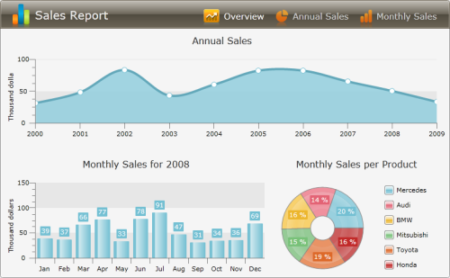
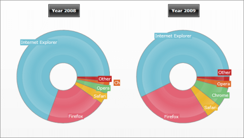

# Data Binding to Many Chart Areas


## 

__RadChart's__ [DefaultView]() provides you with layout that consists of [Chart Title](), [Chart Area]() and [Chart Legend](). However, in some cases, you might need to have more than one __ChartArea__ in order to display two or more charts separately. Of course, you will also need to use data binding via [SeriesMapping/ItemMapping]() in order to populate the __RadChart__ with data.



When you have multiple __ChartAreas__, for each series you can specify which chart area to be used to display the series. To do that, in XAML, use the __SeriesMapping.ChartAreaName__ property and specify the name of the __ChartArea__ you want to be used for that series. Alternatively, you can specify the __ChartArea__ in the code behind by using __SeriesMapping.ChartArea__ property - simply set it to the desired __ChartArea__ instance.

The example below demonstrates how to bind two series to two different __ChartAreas__. Which means that you cannot use the [DefaultView](), so you will have to first set __RadChart.UseDefaultView__ to __False__. Then, add a __Grid__ with two rows and two columns. On the first row add one __ChartTitle__ for each of the columns. On the second row add two __ChartAreas__. Give a name to each __ChartArea__ and it will be used later to bind series to a chart area: "webBrowsersShare2008Chart" and "webBrowsersShare2009Chart" respectively.

The last step is to bind the data via [SeriesMapping/ItemMapping](). For each series, set the __ChartAreaName__ to the name of the previously defined __ChartArea__:

#### __XAML__

```XAML
	<telerik:RadChart x:Name="radChart" UseDefaultLayout="False">
	    <Grid Margin="10,10,0,20">
	        <Grid.RowDefinitions>
	            <RowDefinition Height="Auto" />
	            <RowDefinition Height="*" />
	        </Grid.RowDefinitions>
	        <Grid.ColumnDefinitions>
	            <ColumnDefinition Width="*" />
	            <ColumnDefinition Width="*" />
	        </Grid.ColumnDefinitions>
	        <telerik:ChartTitle Grid.Row="0" Grid.Column="0"
	                            Margin="0,0,0,10" HorizontalAlignment="Center"
	                            Content="Year 2008" />
	        <telerik:ChartTitle Grid.Row="0" Grid.Column="1"
	                            Margin="0,0,0,10" HorizontalAlignment="Center"
	                            Content="Year 2009" />
	        <telerik:ChartArea x:Name="webBrowsersShare2008Chart" Grid.Row="1" Grid.Column="0" />
	        <telerik:ChartArea x:Name="webBrowsersShare2009Chart" Grid.Row="1"
	                           Grid.Column="1" Margin="0,0,0,15" />
	    </Grid>
	
	    <telerik:RadChart.SeriesMappings>
	        <telerik:SeriesMapping ChartAreaName="webBrowsersShare2008Chart" CollectionIndex="0">
	            <telerik:SeriesMapping.SeriesDefinition>
	                <telerik:DoughnutSeriesDefinition />
	            </telerik:SeriesMapping.SeriesDefinition>
	
	            <telerik:SeriesMapping.ItemMappings>
	                <telerik:ItemMapping DataPointMember="YValue" FieldName="Value" />
	                <telerik:ItemMapping DataPointMember="Label" FieldName="Description" />
	            </telerik:SeriesMapping.ItemMappings>
	        </telerik:SeriesMapping>
	        <telerik:SeriesMapping ChartAreaName="webBrowsersShare2009Chart" CollectionIndex="1">
	            <telerik:SeriesMapping.SeriesDefinition>
	                <telerik:DoughnutSeriesDefinition />
	            </telerik:SeriesMapping.SeriesDefinition>
	            <telerik:SeriesMapping.ItemMappings>
	                <telerik:ItemMapping DataPointMember="YValue" FieldName="Value" />
	                <telerik:ItemMapping DataPointMember="Label" FieldName="Description" />
	            </telerik:SeriesMapping.ItemMappings>
	        </telerik:SeriesMapping>
	    </telerik:RadChart.SeriesMappings>
	</telerik:RadChart>
```


#### __C#__

```C#
	//Creating new instance of RadChart control
	Telerik.Windows.Controls.RadChart radChart = new Telerik.Windows.Controls.RadChart();
	radChart.UseDefaultLayout = false;
	//....
	//Creating Grid with two rows and two columns to host two ChartTitles and two ChartAreas
	Grid chartLayout = new Grid();
	chartLayout.Margin = new Thickness( 10, 10, 0, 20 );
	chartLayout.RowDefinitions.Add( new RowDefinition() );
	chartLayout.RowDefinitions[ 0 ].Height = new GridLength( 0, GridUnitType.Auto );
	chartLayout.RowDefinitions.Add( new RowDefinition() );
	radChart.Content = chartLayout;
	chartLayout.ColumnDefinitions.Add( new ColumnDefinition() );
	chartLayout.ColumnDefinitions.Add( new ColumnDefinition() );
	//Creating ChartTitle for the left chart
	Telerik.Windows.Controls.Charting.ChartTitle chartTitle = new Telerik.Windows.Controls.Charting.ChartTitle();
	chartTitle.Margin = new Thickness( 0, 0, 0, 10 );
	chartTitle.HorizontalAlignment = HorizontalAlignment.Center;
	chartTitle.Content = "Year 2008";
	chartLayout.Children.Add( chartTitle );
	//Creating ChartArea of for the left chart
	Telerik.Windows.Controls.Charting.ChartArea chartArea1 = new Telerik.Windows.Controls.Charting.ChartArea();
	chartArea1.Name = "webBrowsersShare2008Chart";
	chartLayout.Children.Add( chartArea1 );
	Grid.SetRow( chartArea1, 1 );
	//Creating ChartTitle for the right chart
	chartTitle = new Telerik.Windows.Controls.Charting.ChartTitle();
	chartTitle.Margin = new Thickness( 0, 0, 0, 10 );
	chartTitle.HorizontalAlignment = HorizontalAlignment.Center;
	chartTitle.Content = "Year 2009";
	chartLayout.Children.Add( chartTitle );
	Grid.SetColumn( chartTitle, 1 );
	//Creating ChartArea of for the right chart
	Telerik.Windows.Controls.Charting.ChartArea chartArea2 = new Telerik.Windows.Controls.Charting.ChartArea();
	chartArea2 = new Telerik.Windows.Controls.Charting.ChartArea();
	chartArea2.Name = "webBrowsersShare2009Chart";
	chartLayout.Children.Add( chartArea2 );
	Grid.SetRow( chartArea2, 1 );
	Grid.SetColumn( chartArea2, 1 );
	//Creating series mapping for the first chart and link it to the left ChartArea
	SeriesMapping seriesMapping = new SeriesMapping();
	seriesMapping.CollectionIndex = 0;
	seriesMapping.ChartAreaName = "webBrowsersShare2008Chart";
	seriesMapping.SeriesDefinition = new DoughnutSeriesDefinition();
	seriesMapping.ItemMappings.Add( new ItemMapping( "Value", DataPointMember.YValue ) );
	seriesMapping.ItemMappings.Add( new ItemMapping( "Description", DataPointMember.Label ) );
	radChart.SeriesMappings.Add( seriesMapping );
	//Creating series mapping for the first chart and link it to the right ChartArea
	seriesMapping = new SeriesMapping();
	seriesMapping.CollectionIndex = 1;
	seriesMapping.ChartAreaName = "webBrowsersShare2009Chart";
	seriesMapping.SeriesDefinition = new DoughnutSeriesDefinition();
	seriesMapping.ItemMappings.Add( new ItemMapping( "Value", DataPointMember.YValue ) );
	seriesMapping.ItemMappings.Add( new ItemMapping( "Description", DataPointMember.Label ) );
	radChart.SeriesMappings.Add( seriesMapping );
	//....
```


#### __VB.NET__

```VB.NET
	'Creating new instance of RadChart control'
	Dim radChart As New Telerik.Windows.Controls.RadChart()
	'....'
	'Creating Grid with two rows and two columns to host two ChartTitles and two ChartAreas'
	Dim chartLayout As New Grid()
	chartLayout.Margin = New Thickness(10, 10, 0, 20)
	chartLayout.RowDefinitions.Add(New RowDefinition())
	chartLayout.RowDefinitions(0).Height = New GridLength(0, GridUnitType.Auto)
	chartLayout.RowDefinitions.Add(New RowDefinition())
	radChart.Content = chartLayout
	chartLayout.ColumnDefinitions.Add(New ColumnDefinition())
	chartLayout.ColumnDefinitions.Add(New ColumnDefinition())
	'Creating ChartTitle for the left chart'
	Dim chartTitle As New Telerik.Windows.Controls.Charting.ChartTitle()
	chartTitle.Margin = New Thickness(0, 0, 0, 10)
	chartTitle.HorizontalAlignment = HorizontalAlignment.Center
	chartTitle.Content = "Year 2008"
	chartLayout.Children.Add(chartTitle)
	'Creating ChartArea of for the left chart'
	Dim chartArea1 As New Telerik.Windows.Controls.Charting.ChartArea()
	chartArea1.Name = "webBrowsersShare2008Chart"
	chartLayout.Children.Add(chartArea1)
	Grid.SetRow(chartArea1, 1)
	'Creating ChartTitle for the right chart'
	chartTitle = New Telerik.Windows.Controls.Charting.ChartTitle()
	chartTitle.Margin = New Thickness(0, 0, 0, 10)
	chartTitle.HorizontalAlignment = HorizontalAlignment.Center
	chartTitle.Content = "Year 2009"
	chartLayout.Children.Add(chartTitle)
	Grid.SetColumn(chartTitle, 1)
	'Creating ChartArea of for the right chart'
	Dim chartArea2 As New Telerik.Windows.Controls.Charting.ChartArea()
	chartArea2 = New Telerik.Windows.Controls.Charting.ChartArea()
	chartArea2.Name = "webBrowsersShare2009Chart"
	chartLayout.Children.Add(chartArea2)
	Grid.SetRow(chartArea2, 1)
	Grid.SetColumn(chartArea2, 1)
	'Creating series mapping for the first chart and link it to the left ChartArea'
	Dim seriesMapping As New SeriesMapping()
	seriesMapping.CollectionIndex = 0
	seriesMapping.ChartAreaName = "webBrowsersShare2008Chart"
	seriesMapping.SeriesDefinition = New DoughnutSeriesDefinition()
	seriesMapping.ItemMappings.Add(New ItemMapping("Value", DataPointMember.YValue))
	seriesMapping.ItemMappings.Add(New ItemMapping("Description", DataPointMember.Label))
	radChart.SeriesMappings.Add(seriesMapping)
	'Creating series mapping for the first chart and link it to the right ChartArea'
	seriesMapping = New SeriesMapping()
	seriesMapping.CollectionIndex = 1
	seriesMapping.ChartAreaName = "webBrowsersShare2009Chart"
	seriesMapping.SeriesDefinition = New DoughnutSeriesDefinition()
	seriesMapping.ItemMappings.Add(New ItemMapping("Value", DataPointMember.YValue))
	seriesMapping.ItemMappings.Add(New ItemMapping("Description", DataPointMember.Label))
	radChart.SeriesMappings.Add(seriesMapping)
	'....'
```


As you can see from the image below, the __RadChart__ layout is changed and contains two __ChartAreas__ - for year 2008 and for year 2009. Two series are created and for each one of them __CharAreaName__ property is set to the appropriate __ChartArea__. Thus, the data for year 2008 goes to the left __ChartArea__ while the data for 2009 goes to the right __ChartArea__. Another option is to use __SeriesMapping.AreaName__ from the code behind to set the desired instance of the __ChartArea__ directly:



## See Also

 * [Populating with Data Overview]()

 * [Data Binding Support Overview]()

 * [Data Binding with Manual Series Mapping]()

 * [Data Binding to Nested Collections]()
