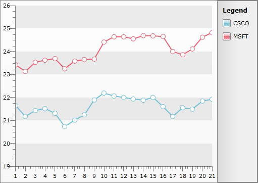

# Data Binding to Nested Collections

The purpose of this tutorial is to show you how to populate __RadChart__ with data in a form of nested collections using [Data Binding with Manual Series Mapping]().

__In order to bind RadChart to nested collections:__

##### 1. Create a new business object and name it __TradeData__.

```C#
	using System;
	using System.Collections.ObjectModel;
	namespace Silverlight.Help.RadChartSamples
	{
	    public class TradeData
	    {
	        public string Emission
	        {
	            get;
	            set;
	        }
	        public DateTime FromDate
	        {
	            get;
	            set;
	        }
	        public DateTime ToDate
	        {
	            get;
	            set;
	        }
	        public double Open
	        {
	            get;
	            set;
	        }
	        public double High
	        {
	            get;
	            set;
	        }
	        public double Low
	        {
	            get;
	            set;
	        }
	        public double Close
	        {
	            get;
	            set;
	        }
	        public double Volume
	        {
	            get;
	            set;
	        }
	        public static ObservableCollection<TradeData> GetWeeklyData( string code )
	        {
	            ObservableCollection<TradeData> tradeData;
	            if ( code == "CSCO" )
	            {
	                tradeData = new ObservableCollection<TradeData>() {
	                    new TradeData() { Emission="CSCO", FromDate = new DateTime( 2009, 8, 10 ), Open = 21.9800, High = 22.1200, Low = 21.5000, Close = 21.6400, Volume = 46602230 },
	                    new TradeData() { Emission="CSCO", FromDate = new DateTime( 2009, 8, 11 ), Open = 21.4700, High = 21.5300, Low = 21.0600, Close = 21.1700, Volume = 53545300 },
	                    new TradeData() { Emission="CSCO", FromDate = new DateTime( 2009, 8, 12 ), Open = 21.2300, High = 21.6100, Low = 21.1800, Close = 21.4300, Volume = 49330780 },
	                    new TradeData() { Emission="CSCO", FromDate = new DateTime( 2009, 8, 13 ), Open = 21.5400, High = 21.6500, Low = 21.3400, Close = 21.5100, Volume = 38914230 },
	                    new TradeData() { Emission="CSCO", FromDate = new DateTime( 2009, 8, 14 ), Open = 21.4700, High = 21.5500, Low = 21.0000, Close = 21.3100, Volume = 35131850 },
	                    new TradeData() { Emission="CSCO", FromDate = new DateTime( 2009, 8, 17 ), Open = 20.9400, High = 20.9600, Low = 20.6800, Close = 20.7300, Volume = 32361720 },
	                    new TradeData() { Emission="CSCO", FromDate = new DateTime( 2009, 8, 18 ), Open = 20.8200, High = 21.1500, Low = 20.7900, Close = 21.0100, Volume = 33300840 },
	                    new TradeData() { Emission="CSCO", FromDate = new DateTime( 2009, 8, 19 ), Open = 20.7600, High = 21.4400, Low = 20.7400, Close = 21.2400, Volume = 39197070 },
	                    new TradeData() { Emission="CSCO", FromDate = new DateTime( 2009, 8, 20 ), Open = 21.2500, High = 21.9600, Low = 21.2000, Close = 21.8900, Volume = 55194380 },
	                    new TradeData() { Emission="CSCO", FromDate = new DateTime( 2009, 8, 21 ), Open = 22.0800, High = 22.2700, Low = 21.7700, Close = 22.1900, Volume = 56572840 },
	                    new TradeData() { Emission="CSCO", FromDate = new DateTime( 2009, 8, 24 ), Open = 22.2200, High = 22.6400, Low = 21.9300, Close = 22.0600, Volume = 52670800 },
	                    new TradeData() { Emission="CSCO", FromDate = new DateTime( 2009, 8, 25 ), Open = 22.1550, High = 22.2500, Low = 21.8500, Close = 22.0000, Volume = 28401080 },
	                    new TradeData() { Emission="CSCO", FromDate = new DateTime( 2009, 8, 26 ), Open = 21.9100, High = 22.0000, Low = 21.8100, Close = 21.9300, Volume = 33523570 },
	                    new TradeData() { Emission="CSCO", FromDate = new DateTime( 2009, 8, 27 ), Open = 21.6700, High = 21.9100, Low = 21.4700, Close = 21.8800, Volume = 30278510 },
	                    new TradeData() { Emission="CSCO", FromDate = new DateTime( 2009, 8, 28 ), Open = 22.1500, High = 22.3500, Low = 21.8000, Close = 22.0000, Volume = 35933920 },
	                    new TradeData() { Emission="CSCO", FromDate = new DateTime( 2009, 8, 31 ), Open = 21.7400, High = 21.8400, Low = 21.5100, Close = 21.6000, Volume = 31401760 },
	                    new TradeData() { Emission="CSCO", FromDate = new DateTime( 2009, 9, 1 ), Open = 21.4600, High = 21.8700, Low = 21.0800, Close = 21.1700, Volume = 48741440 },
	                    new TradeData() { Emission="CSCO", FromDate = new DateTime( 2009, 9, 2 ), Open = 21.0900, High = 21.7300, Low = 21.0700, Close = 21.5500, Volume = 40225600 },
	                    new TradeData() { Emission="CSCO", FromDate = new DateTime( 2009, 9, 3 ), Open = 21.7300, High = 21.9000, Low = 21.3400, Close = 21.4900, Volume = 33830210 },
	                    new TradeData() { Emission="CSCO", FromDate = new DateTime( 2009, 9, 4 ), Open = 21.5900, High = 21.9600, Low = 21.4000, Close = 21.8400, Volume = 28951200 },
	                    new TradeData() { Emission="CSCO", FromDate = new DateTime( 2009, 9, 8 ), Open = 22.0000, High = 22.2100, Low = 21.7900, Close = 21.9200, Volume = 37912164 } };
	            }
	            else
	            {
	                tradeData = new ObservableCollection<TradeData>() {
	                    new TradeData() { Emission="MSFT", FromDate = new DateTime( 2009, 8, 10 ), Open = 23.4600, High = 23.5500, Low = 23.3000, Close = 23.4200, Volume = 35258950 },
	                    new TradeData() { Emission="MSFT", FromDate = new DateTime( 2009, 8, 11 ), Open = 23.3200, High = 23.4000, Low = 23.0500, Close = 23.1300, Volume = 33611790 },
	                    new TradeData() { Emission="MSFT", FromDate = new DateTime( 2009, 8, 12 ), Open = 23.1300, High = 23.9000, Low = 23.0300, Close = 23.5300, Volume = 61936270 },
	                    new TradeData() { Emission="MSFT", FromDate = new DateTime( 2009, 8, 13 ), Open = 23.6300, High = 23.8500, Low = 23.4000, Close = 23.6200, Volume = 38951990 },
	                    new TradeData() { Emission="MSFT", FromDate = new DateTime( 2009, 8, 14 ), Open = 23.6200, High = 23.8000, Low = 23.5100, Close = 23.6900, Volume = 46328540 },
	                    new TradeData() { Emission="MSFT", FromDate = new DateTime( 2009, 8, 17 ), Open = 23.3200, High = 23.6000, Low = 23.2300, Close = 23.2500, Volume = 42462890 },
	                    new TradeData() { Emission="MSFT", FromDate = new DateTime( 2009, 8, 18 ), Open = 23.2900, High = 23.6520, Low = 23.2700, Close = 23.5800, Volume = 38831620 },
	                    new TradeData() { Emission="MSFT", FromDate = new DateTime( 2009, 8, 19 ), Open = 23.2500, High = 23.7200, Low = 23.2500, Close = 23.6500, Volume = 41814320 },
	                    new TradeData() { Emission="MSFT", FromDate = new DateTime( 2009, 8, 20 ), Open = 23.6000, High = 23.8700, Low = 23.5400, Close = 23.6700, Volume = 39502680 },
	                    new TradeData() { Emission="MSFT", FromDate = new DateTime( 2009, 8, 21 ), Open = 23.9300, High = 24.4200, Low = 23.7700, Close = 24.4100, Volume = 68995700},
	                    new TradeData() { Emission="MSFT", FromDate = new DateTime( 2009, 8, 24 ), Open = 24.4100, High = 24.7326, Low = 24.2800, Close = 24.6400, Volume = 54159300 },
	                    new TradeData() { Emission="MSFT", FromDate = new DateTime( 2009, 8, 25 ), Open = 24.6000, High = 24.8200, Low = 24.4600, Close = 24.6400, Volume = 43961480 },
	                    new TradeData() { Emission="MSFT", FromDate = new DateTime( 2009, 8, 26 ), Open = 24.5900, High = 24.7500, Low = 24.4200, Close = 24.5500, Volume = 41060010 },
	                    new TradeData() { Emission="MSFT", FromDate = new DateTime( 2009, 8, 27 ), Open = 24.4100, High = 24.7800, Low = 24.3000, Close = 24.6900, Volume = 45433940 },
	                    new TradeData() { Emission="MSFT", FromDate = new DateTime( 2009, 8, 28 ), Open = 25.0700, High = 25.4900, Low = 24.6100, Close = 24.6800, Volume = 55789640 },
	                    new TradeData() { Emission="MSFT", FromDate = new DateTime( 2009, 8, 31 ), Open = 24.5700, High = 24.8500, Low = 24.2900, Close = 24.6500, Volume = 49582950 },
	                    new TradeData() { Emission="MSFT", FromDate = new DateTime( 2009, 9, 1 ), Open = 24.3500, High = 24.7400, Low = 23.9000, Close = 24.0000, Volume = 62571800 },
	                    new TradeData() { Emission="MSFT", FromDate = new DateTime( 2009, 9, 2 ), Open = 23.8200, High = 24.1400, Low = 23.7800, Close = 23.8600, Volume = 40726040 },
	                    new TradeData() { Emission="MSFT", FromDate = new DateTime( 2009, 9, 3 ), Open = 23.9100, High = 24.1400, Low = 23.7600, Close = 24.1100, Volume = 34110810 },
	                    new TradeData() { Emission="MSFT", FromDate = new DateTime( 2009, 9, 4 ), Open = 24.0900, High = 24.8001, Low = 24.0800, Close = 24.6200, Volume = 44987570 },
	                    new TradeData() { Emission="MSFT", FromDate = new DateTime( 2009, 9, 8 ), Open = 24.6200, High = 24.8400, Low = 24.4100, Close = 24.8200, Volume = 52243880 } };
	            }
	            return tradeData;
	        }
	    }
	}
```
```VB.NET
	Imports System
	Imports System.Collections.ObjectModel
	Namespace Silverlight.Help.RadChartSamples
	 Public Class TradeData
	  Public Property Emission() As String
	   Get
	    Return m_Emission
	   End Get
	   Set
	    m_Emission = Value
	   End Set
	  End Property
	  Private m_Emission As String
	  Public Property FromDate() As DateTime
	   Get
	    Return m_FromDate
	   End Get
	   Set
	    m_FromDate = Value
	   End Set
	  End Property
	  Private m_FromDate As DateTime
	  Public Property ToDate() As DateTime
	   Get
	    Return m_ToDate
	   End Get
	   Set
	    m_ToDate = Value
	   End Set
	  End Property
	  Private m_ToDate As DateTime
	  Public Property Open() As Double
	   Get
	    Return m_Open
	   End Get
	   Set
	    m_Open = Value
	   End Set
	  End Property
	  Private m_Open As Double
	  Public Property High() As Double
	   Get
	    Return m_High
	   End Get
	   Set
	    m_High = Value
	   End Set
	  End Property
	  Private m_High As Double
	  Public Property Low() As Double
	   Get
	    Return m_Low
	   End Get
	   Set
	    m_Low = Value
	   End Set
	  End Property
	  Private m_Low As Double
	  Public Property Close() As Double
	   Get
	    Return m_Close
	   End Get
	   Set
	    m_Close = Value
	   End Set
	  End Property
	  Private m_Close As Double
	  Public Property Volume() As Double
	   Get
	    Return m_Volume
	   End Get
	   Set
	    m_Volume = Value
	   End Set
	  End Property
	  Private m_Volume As Double
	  Public Shared Function GetWeeklyData(code As String) As ObservableCollection(Of TradeData)
	   Dim tradeData As ObservableCollection(Of TradeData)
	   If code = "CSCO" Then
	    tradeData = New ObservableCollection(Of TradeData)() With { _
	     New TradeData() With { _
	      .Emission = "CSCO", _
	      .FromDate = New DateTime(2009, 8, 10), _
	      .Open = 21.98, _
	      .High = 22.12, _
	      .Low = 21.5, _
	      .Close = 21.64, _
	      .Volume = 46602230 _
	     }, _
	     New TradeData() With { _
	      .Emission = "CSCO", _
	      .FromDate = New DateTime(2009, 8, 11), _
	      .Open = 21.47, _
	      .High = 21.53, _
	      .Low = 21.06, _
	      .Close = 21.17, _
	      .Volume = 53545300 _
	     }, _
	     New TradeData() With { _
	      .Emission = "CSCO", _
	      .FromDate = New DateTime(2009, 8, 12), _
	      .Open = 21.23, _
	      .High = 21.61, _
	      .Low = 21.18, _
	      .Close = 21.43, _
	      .Volume = 49330780 _
	     }, _
	     New TradeData() With { _
	      .Emission = "CSCO", _
	      .FromDate = New DateTime(2009, 8, 13), _
	      .Open = 21.54, _
	      .High = 21.65, _
	      .Low = 21.34, _
	      .Close = 21.51, _
	      .Volume = 38914230 _
	     }, _
	     New TradeData() With { _
	      .Emission = "CSCO", _
	      .FromDate = New DateTime(2009, 8, 14), _
	      .Open = 21.47, _
	      .High = 21.55, _
	      .Low = 21.0, _
	      .Close = 21.31, _
	      .Volume = 35131850 _
	     }, _
	     New TradeData() With { _
	      .Emission = "CSCO", _
	      .FromDate = New DateTime(2009, 8, 17), _
	      .Open = 20.94, _
	      .High = 20.96, _
	      .Low = 20.68, _
	      .Close = 20.73, _
	      .Volume = 32361720 _
	     }, _
	     New TradeData() With { _
	      .Emission = "CSCO", _
	      .FromDate = New DateTime(2009, 8, 18), _
	      .Open = 20.82, _
	      .High = 21.15, _
	      .Low = 20.79, _
	      .Close = 21.01, _
	      .Volume = 33300840 _
	     }, _
	     New TradeData() With { _
	      .Emission = "CSCO", _
	      .FromDate = New DateTime(2009, 8, 19), _
	      .Open = 20.76, _
	      .High = 21.44, _
	      .Low = 20.74, _
	      .Close = 21.24, _
	      .Volume = 39197070 _
	     }, _
	     New TradeData() With { _
	      .Emission = "CSCO", _
	      .FromDate = New DateTime(2009, 8, 20), _
	      .Open = 21.25, _
	      .High = 21.96, _
	      .Low = 21.2, _
	      .Close = 21.89, _
	      .Volume = 55194380 _
	     }, _
	     New TradeData() With { _
	      .Emission = "CSCO", _
	      .FromDate = New DateTime(2009, 8, 21), _
	      .Open = 22.08, _
	      .High = 22.27, _
	      .Low = 21.77, _
	      .Close = 22.19, _
	      .Volume = 56572840 _
	     }, _
	     New TradeData() With { _
	      .Emission = "CSCO", _
	      .FromDate = New DateTime(2009, 8, 24), _
	      .Open = 22.22, _
	      .High = 22.64, _
	      .Low = 21.93, _
	      .Close = 22.06, _
	      .Volume = 52670800 _
	     }, _
	     New TradeData() With { _
	      .Emission = "CSCO", _
	      .FromDate = New DateTime(2009, 8, 25), _
	      .Open = 22.155, _
	      .High = 22.25, _
	      .Low = 21.85, _
	      .Close = 22.0, _
	      .Volume = 28401080 _
	     }, _
	     New TradeData() With { _
	      .Emission = "CSCO", _
	      .FromDate = New DateTime(2009, 8, 26), _
	      .Open = 21.91, _
	      .High = 22.0, _
	      .Low = 21.81, _
	      .Close = 21.93, _
	      .Volume = 33523570 _
	     }, _
	     New TradeData() With { _
	      .Emission = "CSCO", _
	      .FromDate = New DateTime(2009, 8, 27), _
	      .Open = 21.67, _
	      .High = 21.91, _
	      .Low = 21.47, _
	      .Close = 21.88, _
	      .Volume = 30278510 _
	     }, _
	     New TradeData() With { _
	      .Emission = "CSCO", _
	      .FromDate = New DateTime(2009, 8, 28), _
	      .Open = 22.15, _
	      .High = 22.35, _
	      .Low = 21.8, _
	      .Close = 22.0, _
	      .Volume = 35933920 _
	     }, _
	     New TradeData() With { _
	      .Emission = "CSCO", _
	      .FromDate = New DateTime(2009, 8, 31), _
	      .Open = 21.74, _
	      .High = 21.84, _
	      .Low = 21.51, _
	      .Close = 21.6, _
	      .Volume = 31401760 _
	     }, _
	     New TradeData() With { _
	      .Emission = "CSCO", _
	      .FromDate = New DateTime(2009, 9, 1), _
	      .Open = 21.46, _
	      .High = 21.87, _
	      .Low = 21.08, _
	      .Close = 21.17, _
	      .Volume = 48741440 _
	     }, _
	     New TradeData() With { _
	      .Emission = "CSCO", _
	      .FromDate = New DateTime(2009, 9, 2), _
	      .Open = 21.09, _
	      .High = 21.73, _
	      .Low = 21.07, _
	      .Close = 21.55, _
	      .Volume = 40225600 _
	     }, _
	     New TradeData() With { _
	      .Emission = "CSCO", _
	      .FromDate = New DateTime(2009, 9, 3), _
	      .Open = 21.73, _
	      .High = 21.9, _
	      .Low = 21.34, _
	      .Close = 21.49, _
	      .Volume = 33830210 _
	     }, _
	     New TradeData() With { _
	      .Emission = "CSCO", _
	      .FromDate = New DateTime(2009, 9, 4), _
	      .Open = 21.59, _
	      .High = 21.96, _
	      .Low = 21.4, _
	      .Close = 21.84, _
	      .Volume = 28951200 _
	     }, _
	     New TradeData() With { _
	      .Emission = "CSCO", _
	      .FromDate = New DateTime(2009, 9, 8), _
	      .Open = 22.0, _
	      .High = 22.21, _
	      .Low = 21.79, _
	      .Close = 21.92, _
	      .Volume = 37912164 _
	     } _
	    }
	   Else
	    tradeData = New ObservableCollection(Of TradeData)() With { _
	     New TradeData() With { _
	      .Emission = "MSFT", _
	      .FromDate = New DateTime(2009, 8, 10), _
	      .Open = 23.46, _
	      .High = 23.55, _
	      .Low = 23.3, _
	      .Close = 23.42, _
	      .Volume = 35258950 _
	     }, _
	     New TradeData() With { _
	      .Emission = "MSFT", _
	      .FromDate = New DateTime(2009, 8, 11), _
	      .Open = 23.32, _
	      .High = 23.4, _
	      .Low = 23.05, _
	      .Close = 23.13, _
	      .Volume = 33611790 _
	     }, _
	     New TradeData() With { _
	      .Emission = "MSFT", _
	      .FromDate = New DateTime(2009, 8, 12), _
	      .Open = 23.13, _
	      .High = 23.9, _
	      .Low = 23.03, _
	      .Close = 23.53, _
	      .Volume = 61936270 _
	     }, _
	     New TradeData() With { _
	      .Emission = "MSFT", _
	      .FromDate = New DateTime(2009, 8, 13), _
	      .Open = 23.63, _
	      .High = 23.85, _
	      .Low = 23.4, _
	      .Close = 23.62, _
	      .Volume = 38951990 _
	     }, _
	     New TradeData() With { _
	      .Emission = "MSFT", _
	      .FromDate = New DateTime(2009, 8, 14), _
	      .Open = 23.62, _
	      .High = 23.8, _
	      .Low = 23.51, _
	      .Close = 23.69, _
	      .Volume = 46328540 _
	     }, _
	     New TradeData() With { _
	      .Emission = "MSFT", _
	      .FromDate = New DateTime(2009, 8, 17), _
	      .Open = 23.32, _
	      .High = 23.6, _
	      .Low = 23.23, _
	      .Close = 23.25, _
	      .Volume = 42462890 _
	     }, _
	     New TradeData() With { _
	      .Emission = "MSFT", _
	      .FromDate = New DateTime(2009, 8, 18), _
	      .Open = 23.29, _
	      .High = 23.652, _
	      .Low = 23.27, _
	      .Close = 23.58, _
	      .Volume = 38831620 _
	     }, _
	     New TradeData() With { _
	      .Emission = "MSFT", _
	      .FromDate = New DateTime(2009, 8, 19), _
	      .Open = 23.25, _
	      .High = 23.72, _
	      .Low = 23.25, _
	      .Close = 23.65, _
	      .Volume = 41814320 _
	     }, _
	     New TradeData() With { _
	      .Emission = "MSFT", _
	      .FromDate = New DateTime(2009, 8, 20), _
	      .Open = 23.6, _
	      .High = 23.87, _
	      .Low = 23.54, _
	      .Close = 23.67, _
	      .Volume = 39502680 _
	     }, _
	     New TradeData() With { _
	      .Emission = "MSFT", _
	      .FromDate = New DateTime(2009, 8, 21), _
	      .Open = 23.93, _
	      .High = 24.42, _
	      .Low = 23.77, _
	      .Close = 24.41, _
	      .Volume = 68995700 _
	     }, _
	     New TradeData() With { _
	      .Emission = "MSFT", _
	      .FromDate = New DateTime(2009, 8, 24), _
	      .Open = 24.41, _
	      .High = 24.7326, _
	      .Low = 24.28, _
	      .Close = 24.64, _
	      .Volume = 54159300 _
	     }, _
	     New TradeData() With { _
	      .Emission = "MSFT", _
	      .FromDate = New DateTime(2009, 8, 25), _
	      .Open = 24.6, _
	      .High = 24.82, _
	      .Low = 24.46, _
	      .Close = 24.64, _
	      .Volume = 43961480 _
	     }, _
	     New TradeData() With { _
	      .Emission = "MSFT", _
	      .FromDate = New DateTime(2009, 8, 26), _
	      .Open = 24.59, _
	      .High = 24.75, _
	      .Low = 24.42, _
	      .Close = 24.55, _
	      .Volume = 41060010 _
	     }, _
	     New TradeData() With { _
	      .Emission = "MSFT", _
	      .FromDate = New DateTime(2009, 8, 27), _
	      .Open = 24.41, _
	      .High = 24.78, _
	      .Low = 24.3, _
	      .Close = 24.69, _
	      .Volume = 45433940 _
	     }, _
	     New TradeData() With { _
	      .Emission = "MSFT", _
	      .FromDate = New DateTime(2009, 8, 28), _
	      .Open = 25.07, _
	      .High = 25.49, _
	      .Low = 24.61, _
	      .Close = 24.68, _
	      .Volume = 55789640 _
	     }, _
	     New TradeData() With { _
	      .Emission = "MSFT", _
	      .FromDate = New DateTime(2009, 8, 31), _
	      .Open = 24.57, _
	      .High = 24.85, _
	      .Low = 24.29, _
	      .Close = 24.65, _
	      .Volume = 49582950 _
	     }, _
	     New TradeData() With { _
	      .Emission = "MSFT", _
	      .FromDate = New DateTime(2009, 9, 1), _
	      .Open = 24.35, _
	      .High = 24.74, _
	      .Low = 23.9, _
	      .Close = 24.0, _
	      .Volume = 62571800 _
	     }, _
	     New TradeData() With { _
	      .Emission = "MSFT", _
	      .FromDate = New DateTime(2009, 9, 2), _
	      .Open = 23.82, _
	      .High = 24.14, _
	      .Low = 23.78, _
	      .Close = 23.86, _
	      .Volume = 40726040 _
	     }, _
	     New TradeData() With { _
	      .Emission = "MSFT", _
	      .FromDate = New DateTime(2009, 9, 3), _
	      .Open = 23.91, _
	      .High = 24.14, _
	      .Low = 23.76, _
	      .Close = 24.11, _
	      .Volume = 34110810 _
	     }, _
	     New TradeData() With { _
	      .Emission = "MSFT", _
	      .FromDate = New DateTime(2009, 9, 4), _
	      .Open = 24.09, _
	      .High = 24.8001, _
	      .Low = 24.08, _
	      .Close = 24.62, _
	      .Volume = 44987570 _
	     }, _
	     New TradeData() With { _
	      .Emission = "MSFT", _
	      .FromDate = New DateTime(2009, 9, 8), _
	      .Open = 24.62, _
	      .High = 24.84, _
	      .Low = 24.41, _
	      .Close = 24.82, _
	      .Volume = 52243880 _
	     } _
	    }
	   End If
	   Return tradeData
	  End Function
	 End Class
	End Namespace
```

##### 2. Add a new __RadChart__ declaration.

```XAML
	<Grid x:Name="LayoutRoot"
	        Background="White">
	    <telerik:RadChart x:Name="radChart">
	        <telerik:RadChart.DefaultView>
	            <telerik:ChartDefaultView>
	                <telerik:ChartDefaultView.ChartTitle>
	                    <telerik:ChartTitle Content="Trade Data" />
	                </telerik:ChartDefaultView.ChartTitle>
	            </telerik:ChartDefaultView>
	        </telerik:RadChart.DefaultView>
	    </telerik:RadChart>
	</Grid>
```

##### 3. The key here is to use the __SeriesMapping.CollectionIndex__property. __RadChart__ support nested collections via __SeriesMapping.CollectionIndex__ property. This property allows the chart to be data bound to a collection/array nested inside another collection/array. The index used is the index of the internal collection inside the __ItemsSource__.


```XAML
	<Grid x:Name="LayoutRoot"
	        Background="White">
	    <telerik:RadChart x:Name="radChart">
	        <telerik:RadChart.DefaultView>
	            <telerik:ChartDefaultView>
	                <telerik:ChartDefaultView.ChartTitle>
	                    <telerik:ChartTitle Content="Trade Data" />
	                </telerik:ChartDefaultView.ChartTitle>
	            </telerik:ChartDefaultView>
	        </telerik:RadChart.DefaultView>
	        <telerik:RadChart.SeriesMappings>
	            <telerik:SeriesMapping LegendLabel="CSCO" CollectionIndex="0">
	                <telerik:SeriesMapping.SeriesDefinition>
	                    <telerik:LineSeriesDefinition ShowItemLabels="False" />
	                </telerik:SeriesMapping.SeriesDefinition>
	                <telerik:SeriesMapping.ItemMappings>
	                    <telerik:ItemMapping DataPointMember="YValue"
	                                            FieldName="Close" />
	                </telerik:SeriesMapping.ItemMappings>
	            </telerik:SeriesMapping>
	            <telerik:SeriesMapping LegendLabel="MSFT" CollectionIndex="1">
	                <telerik:SeriesMapping.SeriesDefinition>
	                    <telerik:LineSeriesDefinition ShowItemLabels="False" />
	                </telerik:SeriesMapping.SeriesDefinition>
	                <telerik:SeriesMapping.ItemMappings>
	                    <telerik:ItemMapping DataPointMember="YValue"
	                                            FieldName="Close" />
	                </telerik:SeriesMapping.ItemMappings>
	            </telerik:SeriesMapping>
	        </telerik:RadChart.SeriesMappings>
	    </telerik:RadChart>
	</Grid>
```

##### 4. Set the ItemsSource property of the __RadChart__ control.

```C#
	List<ObservableCollection<TradeData>> sampleData = new List<ObservableCollection<TradeData>>();
	sampleData.Add( TradeData.GetWeeklyData( "CSCO" ) );
	sampleData.Add( TradeData.GetWeeklyData( "MSFT" ) );
	this.radChart.ItemsSource = sampleData;
```
```VB.NET
	Dim sampleData As New List(Of ObservableCollection(Of TradeData))()
	sampleData.Add(TradeData.GetWeeklyData("CSCO"))
	sampleData.Add(TradeData.GetWeeklyData("MSFT"))
	Me.radChart.ItemsSource = sampleData
```


##### 5. The final result should look like the snapshot below.



##### 6. The same functionality can be achieved with code-behind as well. Below is listed the equivalent procedural code.


```C#
	List<ObservableCollection<TradeData>> sampleData = new List<ObservableCollection<TradeData>>();
	sampleData.Add( TradeData.GetWeeklyData( "CSCO" ) );
	sampleData.Add( TradeData.GetWeeklyData( "MSFT" ) );
	
	//Series mapping for the collection with index 0
	SeriesMapping seriesMapping = new SeriesMapping();
	seriesMapping.CollectionIndex = 0;
	seriesMapping.LegendLabel = "CSCO";
	seriesMapping.SeriesDefinition = new LineSeriesDefinition();
	seriesMapping.SeriesDefinition.ShowItemLabels = false;
	ItemMapping itemMapping = new ItemMapping();
	itemMapping.DataPointMember = DataPointMember.YValue;
	itemMapping.FieldName = "Close";
	seriesMapping.ItemMappings.Add( itemMapping );
	this.radChart.SeriesMappings.Add( seriesMapping );
	
	//Series mapping for the collection with index 1
	seriesMapping = new SeriesMapping();
	seriesMapping.CollectionIndex = 1;
	seriesMapping.LegendLabel = "MSFT";
	seriesMapping.SeriesDefinition = new LineSeriesDefinition();
	seriesMapping.SeriesDefinition.ShowItemLabels = false;
	itemMapping = new ItemMapping();
	itemMapping.DataPointMember = DataPointMember.YValue;
	itemMapping.FieldName = "Close";
	seriesMapping.ItemMappings.Add( itemMapping );
	this.radChart.SeriesMappings.Add( seriesMapping );
	this.radChart.ItemsSource = sampleData;
```
```VB.NET
	Dim sampleData As New List(Of ObservableCollection(Of TradeData))()
	sampleData.Add(TradeData.GetWeeklyData("CSCO"))
	sampleData.Add(TradeData.GetWeeklyData("MSFT"))
	
	'Series mapping for the collection with index 0
	Dim seriesMapping As New SeriesMapping()
	seriesMapping.CollectionIndex = 0
	seriesMapping.LegendLabel = "CSCO"
	seriesMapping.SeriesDefinition = New LineSeriesDefinition()
	seriesMapping.SeriesDefinition.ShowItemLabels = False
	Dim itemMapping As New ItemMapping()
	itemMapping.DataPointMember = DataPointMember.YValue
	itemMapping.FieldName = "Close"
	seriesMapping.ItemMappings.Add(itemMapping)
	Me.radChart.SeriesMappings.Add(seriesMapping)
	
	'Series mapping for the collection with index 1
	seriesMapping = New SeriesMapping()
	seriesMapping.CollectionIndex = 1
	seriesMapping.LegendLabel = "MSFT"
	seriesMapping.SeriesDefinition = New LineSeriesDefinition()
	seriesMapping.SeriesDefinition.ShowItemLabels = False
	itemMapping = New ItemMapping()
	itemMapping.DataPointMember = DataPointMember.YValue
	itemMapping.FieldName = "Close"
	seriesMapping.ItemMappings.Add(itemMapping)
	Me.radChart.SeriesMappings.Add(seriesMapping)
	Me.radChart.ItemsSource = sampleData
```

## See Also

 * [Populating with Data Overview]()

 * [Data Binding Support Overview]()

 * [Data Binding with Manual Series Mapping]()

 * [Data Binding to Many Chart Areas]()
