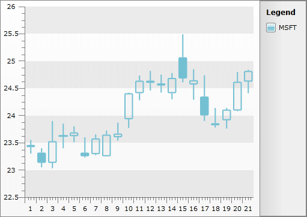

# Data Binding with Manual Series Mapping


Besides the [automatic series mapping](), __RadChart__ supports manual series mapping where you have a full control on how the data is bound to the chart.
	  

## 

The manual series mapping offers you the following opportunities:
		

* You can explicitly define which data field from the underlying data source to be bound to which data point member.

* To set labels of the chart series.

* To bind to [nested collections]().

* To create [categorical charts]().

>Note that series definitions set through the __SeriesMapping.SeriesDefinition__ property provide full support for change notifications with the exception of grouping scenarios i.e. if you will be dynamically changing the series appearance (e.g. SeriesDefinition.Appearance.Fill / Stroke properties), the recommended approach would be to assign unique SeriesDefinition instance to each SeriesMapping instance in your chart control.

For grouping scenarios you can access the generated DataSeries directly (i.e. RadChart.DefaultView.ChartArea.DataSeries[i]) and update its __DataSeries.Definition__ properties.
			

>Note that you cannot reuse series definitions in this scenario (i.e. assign single definition instance to multiple mappings) as changing a definition property would be propagated to all series (e.g. you have 3 series mappings that hold reference to single BarSeriesDefinition -- setting any SeriesMapping.SeriesDefinition.Appearance.Fill to Purple, would case all 3 series to change their color to Purple and that is hardly the expected result).

The purpose of this tutorial is to show you how to use __RadChart__ with __Manual Series Mapping__.
		

>The chart types that require multiple data fields, like __Stick__ or __CandleStick__, need manual series mapping in order to operate correctly.


1 . Create a new business object and name it __TradeData__.


```C#
	public class TradeData
	{
	    public string Emission
	    {
	        get;
	        set;
	    }
	    public DateTime FromDate
	    {
	        get;
	        set;
	    }
	    public DateTime ToDate
	    {
	        get;
	        set;
	    }
	    public double Open
	    {
	        get;
	        set;
	    }
	    public double High
	    {
	        get;
	        set;
	    }
	    public double Low
	    {
	        get;
	        set;
	    }
	    public double Close
	    {
	        get;
	        set;
	    }
	    public double Volume
	    {
	        get;
	        set;
	    }
	    public static ObservableCollection<TradeData> GetWeeklyData( string code )
	    {
	        ObservableCollection<TradeData> tradeData;
	        tradeData = new ObservableCollection<TradeData>() {
	            new TradeData() { Emission="MSFT", FromDate = new DateTime( 2009, 8, 10 ), Open = 23.4600, High = 23.5500, Low = 23.3000, Close = 23.4200, Volume = 35258950 },
	            new TradeData() { Emission="MSFT", FromDate = new DateTime( 2009, 8, 11 ), Open = 23.3200, High = 23.4000, Low = 23.0500, Close = 23.1300, Volume = 33611790 },
	            new TradeData() { Emission="MSFT", FromDate = new DateTime( 2009, 8, 12 ), Open = 23.1300, High = 23.9000, Low = 23.0300, Close = 23.5300, Volume = 61936270 },
	            new TradeData() { Emission="MSFT", FromDate = new DateTime( 2009, 8, 13 ), Open = 23.6300, High = 23.8500, Low = 23.4000, Close = 23.6200, Volume = 38951990 },
	            new TradeData() { Emission="MSFT", FromDate = new DateTime( 2009, 8, 14 ), Open = 23.6200, High = 23.8000, Low = 23.5100, Close = 23.6900, Volume = 46328540 },
	            new TradeData() { Emission="MSFT", FromDate = new DateTime( 2009, 8, 17 ), Open = 23.3200, High = 23.6000, Low = 23.2300, Close = 23.2500, Volume = 42462890 },
	            new TradeData() { Emission="MSFT", FromDate = new DateTime( 2009, 8, 18 ), Open = 23.2900, High = 23.6520, Low = 23.2700, Close = 23.5800, Volume = 38831620 },
	            new TradeData() { Emission="MSFT", FromDate = new DateTime( 2009, 8, 19 ), Open = 23.2500, High = 23.7200, Low = 23.2500, Close = 23.6500, Volume = 41814320 },
	            new TradeData() { Emission="MSFT", FromDate = new DateTime( 2009, 8, 20 ), Open = 23.6000, High = 23.8700, Low = 23.5400, Close = 23.6700, Volume = 39502680 },
	            new TradeData() { Emission="MSFT", FromDate = new DateTime( 2009, 8, 21 ), Open = 23.9300, High = 24.4200, Low = 23.7700, Close = 24.4100, Volume = 68995700},
	            new TradeData() { Emission="MSFT", FromDate = new DateTime( 2009, 8, 24 ), Open = 24.4100, High = 24.7326, Low = 24.2800, Close = 24.6400, Volume = 54159300 },
	            new TradeData() { Emission="MSFT", FromDate = new DateTime( 2009, 8, 25 ), Open = 24.6000, High = 24.8200, Low = 24.4600, Close = 24.6400, Volume = 43961480 },
	            new TradeData() { Emission="MSFT", FromDate = new DateTime( 2009, 8, 26 ), Open = 24.5900, High = 24.7500, Low = 24.4200, Close = 24.5500, Volume = 41060010 },
	            new TradeData() { Emission="MSFT", FromDate = new DateTime( 2009, 8, 27 ), Open = 24.4100, High = 24.7800, Low = 24.3000, Close = 24.6900, Volume = 45433940 },
	            new TradeData() { Emission="MSFT", FromDate = new DateTime( 2009, 8, 28 ), Open = 25.0700, High = 25.4900, Low = 24.6100, Close = 24.6800, Volume = 55789640 },
	            new TradeData() { Emission="MSFT", FromDate = new DateTime( 2009, 8, 31 ), Open = 24.5700, High = 24.8500, Low = 24.2900, Close = 24.6500, Volume = 49582950 },
	            new TradeData() { Emission="MSFT", FromDate = new DateTime( 2009, 9, 1 ), Open = 24.3500, High = 24.7400, Low = 23.9000, Close = 24.0000, Volume = 62571800 },
	            new TradeData() { Emission="MSFT", FromDate = new DateTime( 2009, 9, 2 ), Open = 23.8200, High = 24.1400, Low = 23.7800, Close = 23.8600, Volume = 40726040 },
	            new TradeData() { Emission="MSFT", FromDate = new DateTime( 2009, 9, 3 ), Open = 23.9100, High = 24.1400, Low = 23.7600, Close = 24.1100, Volume = 34110810 },
	            new TradeData() { Emission="MSFT", FromDate = new DateTime( 2009, 9, 4 ), Open = 24.0900, High = 24.8001, Low = 24.0800, Close = 24.6200, Volume = 44987570 },
	            new TradeData() { Emission="MSFT", FromDate = new DateTime( 2009, 9, 8 ), Open = 24.6200, High = 24.8400, Low = 24.4100, Close = 24.8200, Volume = 52243880 } };
	        return tradeData;
	    }
	}
```
```VB.NET
	Public Class TradeData
	    Public Property Emission() As String
	        Get
	            Return m_Emission
	        End Get
	        Set(value As String)
	            m_Emission = value
	        End Set
	    End Property
	    Private m_Emission As String
	    Public Property FromDate() As DateTime
	        Get
	            Return m_FromDate
	        End Get
	        Set(value As DateTime)
	            m_FromDate = value
	        End Set
	    End Property
	    Private m_FromDate As DateTime
	    Public Property ToDate() As DateTime
	        Get
	            Return m_ToDate
	        End Get
	        Set(value As DateTime)
	            m_ToDate = value
	        End Set
	    End Property
	    Private m_ToDate As DateTime
	    Public Property Open() As Double
	        Get
	            Return m_Open
	        End Get
	        Set(value As Double)
	            m_Open = value
	        End Set
	    End Property
	    Private m_Open As Double
	    Public Property High() As Double
	        Get
	            Return m_High
	        End Get
	        Set(value As Double)
	            m_High = value
	        End Set
	    End Property
	    Private m_High As Double
	    Public Property Low() As Double
	        Get
	            Return m_Low
	        End Get
	        Set(value As Double)
	            m_Low = value
	        End Set
	    End Property
	    Private m_Low As Double
	    Public Property Close() As Double
	        Get
	            Return m_Close
	        End Get
	        Set(value As Double)
	            m_Close = value
	        End Set
	    End Property
	    Private m_Close As Double
	    Public Property Volume() As Double
	        Get
	            Return m_Volume
	        End Get
	        Set(value As Double)
	            m_Volume = value
	        End Set
	    End Property
	    Private m_Volume As Double
	    Public Shared Function GetWeeklyData(code As String) As ObservableCollection(Of TradeData)
	        Dim tradeData As ObservableCollection(Of TradeData)
	        tradeData = New ObservableCollection(Of TradeData)() From { _
	            New TradeData() With { _
	                .Emission = "MSFT", _
	                .FromDate = New DateTime(2009, 8, 10), _
	                .Open = 23.46, _
	                .High = 23.55, _
	                .Low = 23.3, _
	                .Close = 23.42, _
	                .Volume = 35258950 _
	            }, _
	            New TradeData() With { _
	                .Emission = "MSFT", _
	                .FromDate = New DateTime(2009, 8, 11), _
	                .Open = 23.32, _
	                .High = 23.4, _
	                .Low = 23.05, _
	                .Close = 23.13, _
	                .Volume = 33611790 _
	            }, _
	            New TradeData() With { _
	                .Emission = "MSFT", _
	                .FromDate = New DateTime(2009, 8, 12), _
	                .Open = 23.13, _
	                .High = 23.9, _
	                .Low = 23.03, _
	                .Close = 23.53, _
	                .Volume = 61936270 _
	            }, _
	            New TradeData() With { _
	                .Emission = "MSFT", _
	                .FromDate = New DateTime(2009, 8, 13), _
	                .Open = 23.63, _
	                .High = 23.85, _
	                .Low = 23.4, _
	                .Close = 23.62, _
	                .Volume = 38951990 _
	            }, _
	            New TradeData() With { _
	                .Emission = "MSFT", _
	                .FromDate = New DateTime(2009, 8, 14), _
	                .Open = 23.62, _
	                .High = 23.8, _
	                .Low = 23.51, _
	                .Close = 23.69, _
	                .Volume = 46328540 _
	            }, _
	            New TradeData() With { _
	                .Emission = "MSFT", _
	                .FromDate = New DateTime(2009, 8, 17), _
	                .Open = 23.32, _
	                .High = 23.6, _
	                .Low = 23.23, _
	                .Close = 23.25, _
	                .Volume = 42462890 _
	            }, _
	            New TradeData() With { _
	                .Emission = "MSFT", _
	                .FromDate = New DateTime(2009, 8, 18), _
	                .Open = 23.29, _
	                .High = 23.652, _
	                .Low = 23.27, _
	                .Close = 23.58, _
	                .Volume = 38831620 _
	            }, _
	            New TradeData() With { _
	                .Emission = "MSFT", _
	                .FromDate = New DateTime(2009, 8, 19), _
	                .Open = 23.25, _
	                .High = 23.72, _
	                .Low = 23.25, _
	                .Close = 23.65, _
	                .Volume = 41814320 _
	            }, _
	            New TradeData() With { _
	                .Emission = "MSFT", _
	                .FromDate = New DateTime(2009, 8, 20), _
	                .Open = 23.6, _
	                .High = 23.87, _
	                .Low = 23.54, _
	                .Close = 23.67, _
	                .Volume = 39502680 _
	            }, _
	            New TradeData() With { _
	                .Emission = "MSFT", _
	                .FromDate = New DateTime(2009, 8, 21), _
	                .Open = 23.93, _
	                .High = 24.42, _
	                .Low = 23.77, _
	                .Close = 24.41, _
	                .Volume = 68995700 _
	            }, _
	            New TradeData() With { _
	                .Emission = "MSFT", _
	                .FromDate = New DateTime(2009, 8, 24), _
	                .Open = 24.41, _
	                .High = 24.7326, _
	                .Low = 24.28, _
	                .Close = 24.64, _
	                .Volume = 54159300 _
	            }, _
	            New TradeData() With { _
	                .Emission = "MSFT", _
	                .FromDate = New DateTime(2009, 8, 25), _
	                .Open = 24.6, _
	                .High = 24.82, _
	                .Low = 24.46, _
	                .Close = 24.64, _
	                .Volume = 43961480 _
	            }, _
	            New TradeData() With { _
	                .Emission = "MSFT", _
	                .FromDate = New DateTime(2009, 8, 26), _
	                .Open = 24.59, _
	                .High = 24.75, _
	                .Low = 24.42, _
	                .Close = 24.55, _
	                .Volume = 41060010 _
	            }, _
	            New TradeData() With { _
	                .Emission = "MSFT", _
	                .FromDate = New DateTime(2009, 8, 27), _
	                .Open = 24.41, _
	                .High = 24.78, _
	                .Low = 24.3, _
	                .Close = 24.69, _
	                .Volume = 45433940 _
	            }, _
	            New TradeData() With { _
	                .Emission = "MSFT", _
	                .FromDate = New DateTime(2009, 8, 28), _
	                .Open = 25.07, _
	                .High = 25.49, _
	                .Low = 24.61, _
	                .Close = 24.68, _
	                .Volume = 55789640 _
	            }, _
	            New TradeData() With { _
	                .Emission = "MSFT", _
	                .FromDate = New DateTime(2009, 8, 31), _
	                .Open = 24.57, _
	                .High = 24.85, _
	                .Low = 24.29, _
	                .Close = 24.65, _
	                .Volume = 49582950 _
	            }, _
	            New TradeData() With { _
	                .Emission = "MSFT", _
	                .FromDate = New DateTime(2009, 9, 1), _
	                .Open = 24.35, _
	                .High = 24.74, _
	                .Low = 23.9, _
	                .Close = 24.0, _
	                .Volume = 62571800 _
	            }, _
	            New TradeData() With { _
	                .Emission = "MSFT", _
	                .FromDate = New DateTime(2009, 9, 2), _
	                .Open = 23.82, _
	                .High = 24.14, _
	                .Low = 23.78, _
	                .Close = 23.86, _
	                .Volume = 40726040 _
	            }, _
	            New TradeData() With { _
	                .Emission = "MSFT", _
	                .FromDate = New DateTime(2009, 9, 3), _
	                .Open = 23.91, _
	                .High = 24.14, _
	                .Low = 23.76, _
	                .Close = 24.11, _
	                .Volume = 34110810 _
	            }, _
	            New TradeData() With { _
	                .Emission = "MSFT", _
	                .FromDate = New DateTime(2009, 9, 4), _
	                .Open = 24.09, _
	                .High = 24.8001, _
	                .Low = 24.08, _
	                .Close = 24.62, _
	                .Volume = 44987570 _
	            }, _
	            New TradeData() With { _
	                .Emission = "MSFT", _
	                .FromDate = New DateTime(2009, 9, 8), _
	                .Open = 24.62, _
	                .High = 24.84, _
	                .Low = 24.41, _
	                .Close = 24.82, _
	                .Volume = 52243880 _
	            } _
	            }
	        Return tradeData
	    End Function
	End Class
```


2 . Add a new __RadChart__ declaration.


```XAML
	<Grid x:Name="LayoutRoot"
	Background="White">
	    <telerik:RadChart x:Name="radChart">
	        <telerik:RadChart.DefaultView>
	            <telerik:ChartDefaultView>
	                <telerik:ChartDefaultView.ChartTitle>
	                    <telerik:ChartTitle Content="Trade Data" />
	                </telerik:ChartDefaultView.ChartTitle>
	            </telerik:ChartDefaultView>
	        </telerik:RadChart.DefaultView>
	    </telerik:RadChart>
	</Grid>
```


3 . In order to map to such kind of business objects, you have to create a new instance of __SeriesMapping__. Set the __SeriesMapping.SeriesDefinition__ property to the chart type you want to use - in this case __CandleStickSeriesDefinition__.

>tipYou can find a full list of supported chart types [here]().


```XAML
	<telerik:RadChart x:Name="radChart">
	    <telerik:RadChart.SeriesMappings>
	        <telerik:SeriesMapping LegendLabel="MSFT">
	            <telerik:SeriesMapping.SeriesDefinition>
	                <telerik:CandleStickSeriesDefinition/>
	            </telerik:SeriesMapping.SeriesDefinition>
	        </telerik:SeriesMapping>
	    </telerik:RadChart.SeriesMappings>
	</telerik:RadChart>
```


4 . Add several __ItemMappings__ - one for each of the properties that take part in the candlestick chart type. For each __ItemMapping__ must be set the following properties:

5 . __DataPointMember__

6 . __FieldName__ - specifies from where the data should be taken.


```XAML
	<telerik:RadChart x:Name="radChart">
	    <telerik:RadChart.DefaultView>
	        <telerik:ChartDefaultView>
	            <telerik:ChartDefaultView.ChartTitle>
	                <telerik:ChartTitle Content="Trade Data" />
	            </telerik:ChartDefaultView.ChartTitle>
	        </telerik:ChartDefaultView>
	    </telerik:RadChart.DefaultView>
	    <telerik:RadChart.SeriesMappings>
	        <telerik:SeriesMapping LegendLabel="MSFT">
	            <telerik:SeriesMapping.SeriesDefinition>
	                <telerik:CandleStickSeriesDefinition />
	            </telerik:SeriesMapping.SeriesDefinition>
	            <telerik:SeriesMapping.ItemMappings>
	                <telerik:ItemMapping DataPointMember="Open"
	                                        FieldName="Open" />
	                <telerik:ItemMapping DataPointMember="High"
	                                        FieldName="High" />
	                <telerik:ItemMapping DataPointMember="Low"
	                                        FieldName="Low" />
	                <telerik:ItemMapping DataPointMember="Close"
	                                        FieldName="Close" />
	            </telerik:SeriesMapping.ItemMappings>
	        </telerik:SeriesMapping>
	    </telerik:RadChart.SeriesMappings>
	</telerik:RadChart>
```


7 . Set the ItemsSource property of the __RadChart__ control.


```C#
	//Gets trading data
	this.radChart.ItemsSource = TradeData.GetWeeklyData("MSFT");
```
```VB.NET
	'Gets trading data'
	Me.radChart.ItemsSource = TradeData.GetWeeklyData("MSFT")
```


8 . The final result should look like the snapshot below.


9 . The same functionality can be achieved with code-behind as well. Below is listed the equivalent procedural code.


```C#
	SeriesMapping seriesMapping = new SeriesMapping();
	seriesMapping.LegendLabel = "MSFT (Microsoft)";
	seriesMapping.SeriesDefinition = new CandleStickSeriesDefinition();
	ItemMapping itemMapping = new ItemMapping();
	itemMapping.DataPointMember = DataPointMember.Open;
	itemMapping.FieldName = "Open";
	seriesMapping.ItemMappings.Add(itemMapping);
	itemMapping = new ItemMapping();
	itemMapping.DataPointMember = DataPointMember.High;
	itemMapping.FieldName = "High";
	seriesMapping.ItemMappings.Add(itemMapping);
	itemMapping = new ItemMapping();
	itemMapping.DataPointMember = DataPointMember.Low;
	itemMapping.FieldName = "Low";
	seriesMapping.ItemMappings.Add(itemMapping);
	itemMapping = new ItemMapping();
	itemMapping.DataPointMember = DataPointMember.Close;
	itemMapping.FieldName = "Close";
	seriesMapping.ItemMappings.Add(itemMapping);
	this.radChart.SeriesMappings.Add(seriesMapping);
```
```VB.NET
	Dim seriesMapping As New SeriesMapping()
	seriesMapping.LegendLabel = "MSFT (Microsoft)"
	seriesMapping.SeriesDefinition = New CandleStickSeriesDefinition()
	Dim itemMapping As New ItemMapping()
	itemMapping.DataPointMember = DataPointMember.Open
	itemMapping.FieldName = "Open"
	seriesMapping.ItemMappings.Add(itemMapping)
	itemMapping = New ItemMapping()
	itemMapping.DataPointMember = DataPointMember.High
	itemMapping.FieldName = "High"
	seriesMapping.ItemMappings.Add(itemMapping)
	itemMapping = New ItemMapping()
	itemMapping.DataPointMember = DataPointMember.Low
	itemMapping.FieldName = "Low"
	seriesMapping.ItemMappings.Add(itemMapping)
	itemMapping = New ItemMapping()
	itemMapping.DataPointMember = DataPointMember.Close
	itemMapping.FieldName = "Close"
	seriesMapping.ItemMappings.Add(itemMapping)
	Me.radChart.SeriesMappings.Add(seriesMapping)
```


## See Also

 * [Populating with Data Overview]()

 * [Data Binding Support Overview]()

 * [Data Binding with Automatic Series Mappings]()

 * [Data Binding to Nested Collections]()

 * [Data Binding to Many Chart Areas]()

 * [Creating a Chart Declaratively]()

 * [Creating a Chart in Code-behind]()
