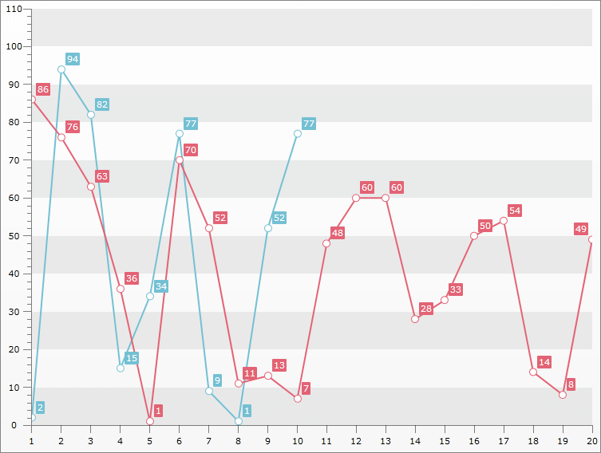

# Multiple Datasources


## 

[SeriesMapping]()*ItemsSource* feature is new* to* Q1 2011. It will be helpful for those who want to use declarative binding and is much more MVVM friendly. It also allows the RadChart's Series to have different number of datapoints.  

The following example will demonstrate how to bind two Line Series - the first one with Manual Series Mapping and the second one with the new feature:

1 . Create new *Business Object*:


```C#
	public class MyDateObject
	{
	    public double Value { get; set; }
	    public double Value2 { get; set; }
	
	    public MyDateObject(double value, double value2)
	    {
	        this.Value = value;
	        this.Value2 = value2; 
	    }
	
	    public static ObservableCollection<MyDateObject> GetData(int count)
	    {
	        Random r = new Random();
	        ObservableCollection<MyDateObject> result = new ObservableCollection<MyDateObject>();
	
	        for (int i = 0; i < count; i++)
	        {
	            result.Add(new MyDateObject(r.Next(0, 100), r.Next(0, 100)));
	        }
	
	        return result;
	    }
	}
```
```VB.NET
	Public Class MyDateObject
	    Public Property Value() As Double
	    Public Property Value2() As Double
	
	    Public Sub New(ByVal value As Double, ByVal value2 As Double)
	        Me.Value = value
	        Me.Value2 = value2
	    End Sub
	
	    Public Shared Function GetData(ByVal count As Integer) As ObservableCollection(Of MyDateObject)
	        Dim r As New Random()
	        Dim result As New ObservableCollection(Of MyDateObject)()
	
	        For i As Integer = 0 To count - 1
	            result.Add(New MyDateObject(r.Next(0, 100), r.Next(0, 100)))
	        Next i
	
	        Return result
	    End Function
	End Class
```


2 . Create a new class named __MyViewModel__, which implements the __ViewModelBase__ interface. It's property *Data* will be used as ItemsSource for the Chart (to bind the First Line using [Manual Series Mapping]() approach) and the *MappingData* will be ItemsSource for the second Line.


```C#
	public class MyViewModel : ViewModelBase
	{
	    private ObservableCollection<MyDateObject> _data;
	    public ObservableCollection<MyDateObject> Data
	    {
	        get
	        {
	            return this._data;
	        }
	        set
	        {
	            if (this._data != value)
	            {
	                this._data = value;
	                this.OnPropertyChanged("Data");
	            }
	        }
	    }
	
	    private ObservableCollection<MyDateObject> _mappingData;
	    public ObservableCollection<MyDateObject> MappingData
	    {
	        get
	        {
	            return this._mappingData;
	        }
	        set
	        {
	            if (this._mappingData != value)
	            {
	                this._mappingData = value;
	                this.OnPropertyChanged("MappingData");
	            }
	        }
	    }
	
	    public MyViewModel()
	    {
	        this.Data = MyDateObject.GetData(10);
	        this.MappingData = MyDateObject.GetData(20);
	    }
	}
```
```VB.NET
	Public Class MyViewModel
	    Inherits ViewModelBase
	    Private _data As ObservableCollection(Of MyDateObject)
	    Public Property Data() As ObservableCollection(Of MyDateObject)
	        Get
	            Return Me._data
	        End Get
	        Set(ByVal value As ObservableCollection(Of MyDateObject))
	            If Me._data IsNot value Then
	                Me._data = value
	                Me.OnPropertyChanged("Data")
	            End If
	        End Set
	    End Property
	
	    Private _mappingData As ObservableCollection(Of MyDateObject)
	    Public Property MappingData() As ObservableCollection(Of MyDateObject)
	        Get
	            Return Me._mappingData
	        End Get
	        Set(ByVal value As ObservableCollection(Of MyDateObject))
	            If Me._mappingData IsNot value Then
	                Me._mappingData = value
	                Me.OnPropertyChanged("MappingData")
	            End If
	        End Set
	    End Property
	
	    Public Sub New()
	        Me.Data = MyDateObject.GetData(10)
	        Me.MappingData = MyDateObject.GetData(20)
	    End Sub
	End Class
```


3 . Add new RadChart declaration.


```XAML
	<telerik:RadChart x:Name="RadChart1" ItemsSource="{Binding Data}" UseDefaultLayout="False">
	            <telerik:ChartArea x:Name="ChartArea1" EnableAnimations="False"/>
	            <telerik:RadChart.SeriesMappings>
	                <telerik:SeriesMapping ChartAreaName="ChartArea1" >
	                    <telerik:SeriesMapping.SeriesDefinition>
	                        <telerik:LineSeriesDefinition />
	                    </telerik:SeriesMapping.SeriesDefinition>
	                    <telerik:ItemMapping FieldName="Value" DataPointMember="YValue"/>
	                </telerik:SeriesMapping>
	                <telerik:SeriesMapping ChartAreaName="ChartArea1" ItemsSource="{Binding MappingData}" >
	                    <telerik:SeriesMapping.SeriesDefinition>
	                        <telerik:LineSeriesDefinition/>
	                    </telerik:SeriesMapping.SeriesDefinition>
	                    <telerik:ItemMapping FieldName="Value2" DataPointMember="YValue"/>
	                </telerik:SeriesMapping>
	            </telerik:RadChart.SeriesMappings>
	        </telerik:RadChart>
```


>The key here is to disable the Default Layout of the RadChart and manually set the two SeriesMappings in common ChartArea - done with providing same name to the Chart Area with "ChartAreaName" property. Otherwise the "No Data Series" default message will appear over the two Line Series.

4 . The final result should look like the snapshot below:




Another example is available [here](https://demos.telerik.com/silverlight/#Chart/MultipleDataSources).
