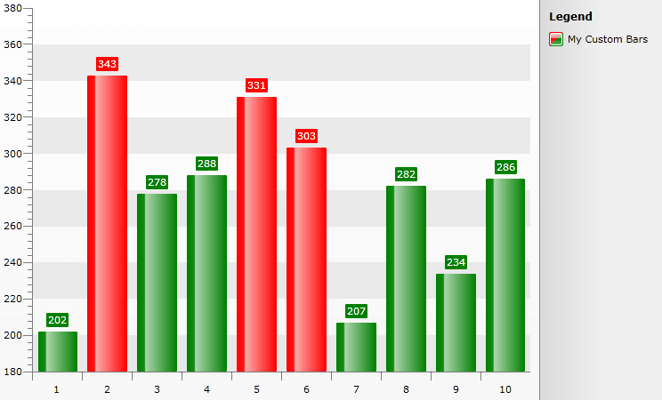

# Custom Item Style


## 

This feature allows you to create a custom style and apply it to a number of chart items. The feature is represented by a delegate which should create and return the desired style. This allows you to create custom styles for the individual chart items depending on your custom logic. To learn more read on.

The delegate accepts four parameters:

* __Control item__ - represents the chart item that is currently processed. This could be either a derivative of the __BaseChartItem__ ( __Bar__, __Bubble__, __Pie__, __Stick__, etc.), or a derivative of the __SelfDrawingSeries__ ( __LineSeries__, __SplineSeries__, __AreaSeries__, __SplineAreaSeries__, etc). or a __SeriesItemLabel__, or a __ChartLegendItem__.

* __Style style__ - represents the style that would be applied to the respective chart item by default. You can use it to set the __Style.BasedOn__ property of the style created by the delegate.

* __DataPoint dataPoint__ - represents the DataPoint associated with the processed chart item. Note that its value will be null if the chart item is of type __SelfDrawingSeries__.

* __DataSeries dataSeries__ - represents the __DataSeries__ associated with the chart item.

To set the delegate you have to use the __CreateItemStyleDelegate__ property. Here is an example of how to set it.

>The __Style style__ argument will have the following __TargetType__ depending on the different values of the __Control item__ argument:

* BaseChartItem - __Shape__

* SelfDrawingSeries - __SelfDrawingSeries__

* SeriesItemLabel - __SeriesitemLabel__

* ChartLegendItem - __Path__


```C#
	public Sample()
	{
	    InitializeComponent();
	    this.radChart.CreateItemStyleDelegate = this.BuildCustomItemStyle;
	}
	public Style BuildCustomItemStyle(Control item, Style style, DataPoint point, DataSeries dataSeries )
	{
	    Style newStyle = new Style();
	    newStyle.BasedOn = style;
	    return newStyle;
	}
```


```VB.NET
	Public Sub New()
	    InitializeComponent()
	    Me.radChart.CreateItemStyleDelegate = AddressOf Me.BuildCustomItemStyle
	End Sub
	Public Function BuildCustomItemStyle(item As Control, style As Style, point As DataPoint, dataSeries As DataSeries) As Style
	    Dim newStyle As New Style()
	    newStyle.BasedOn = Style
	    Return Style
	End Function
```


The following sample demonstrates a more complex logic inside the delegate - how to color the bars in a specific color, depending on their value. If the Bar's YValue is greater than 300 the Bar will be colored red, otherwise it should be green. Since changing the colors of the Bars won't affect their Labels (they will remain with the default color) another CustomItemStyle is used to color them accordingly. Finally the LegendItem's color is changed so that it corresponds to the Bar's colors.


```C#
	public partial class MainPage : UserControl
	{
	    public MainPage()
	    {
	        InitializeComponent();
	        int maxItems = 10;
	        Random r = new Random();
	
	        List<Company> sampleData = new List<Company>();
	
	        for (int i = 0; i < maxItems; i++)
	        {
	            sampleData.Add(new Company(r.Next(200, 400)));
	        }
	
	        SeriesMapping seriesMapping = new SeriesMapping();
	        seriesMapping.LegendLabel = "My Custom Bars";
	        seriesMapping.SeriesDefinition = new BarSeriesDefinition();
	        seriesMapping.ItemMappings.Add(new ItemMapping("PurchasePrice", DataPointMember.YValue));
	
	        this.RadChart1.ItemsSource = sampleData;
	        this.RadChart1.SeriesMappings.Add(seriesMapping);
	
	        this.RadChart1.CreateItemStyleDelegate = BuildCustomItemStyle;
	
	    }
	
	    public class Company
	    {
	        public double PurchasePrice { get; set; }
	
	        public Company(double price)
	        {
	            PurchasePrice = price;
	        }
	    }
	
	    public Style BuildCustomItemStyle(Control item, Style style, DataPoint point, DataSeries dataSeries)
	    {
	        Style newStyle = new Style(style.TargetType);
	        newStyle.BasedOn = style;
	        Brush brush;
	
	        if (item is BaseChartItem)
	        {
	            if (dataSeries[(item as BaseChartItem).CurrentIndex].YValue > 300)
	            {
	                brush = new SolidColorBrush(Colors.Red);
	            }
	            else
	            {
	                brush = new SolidColorBrush(Colors.Green);
	            }
	            newStyle.Setters.Add(new Setter(Shape.FillProperty, brush));
	        }
	
	        if (item is SeriesItemLabel)
	        {
	            if ((item as SeriesItemLabel).DataPoint.YValue > 300)
	                brush = new SolidColorBrush(Colors.Red);
	            else
	                brush = new SolidColorBrush(Colors.Green);
	            newStyle.Setters.Add(new Setter(SeriesItemLabel.FillProperty, brush));
	            newStyle.Setters.Add(new Setter(SeriesItemLabel.StrokeProperty, brush));
	        }
	        if (item is ChartLegendItem)
	        {
	            brush = this.Resources["LegendItemStyle"] as Brush;
	            newStyle.Setters.Add(new Setter(Path.FillProperty, brush));
	        }
	
	        return newStyle;
	    }
	}
```


```VB.NET
	Partial Public Class MainPage
	    Inherits UserControl
	    Public Sub New()
	        InitializeComponent()
	        Dim maxItems As Integer = 10
	        Dim r As New Random()
	        Dim sampleData As New List(Of Company)()
	        For i As Integer = 0 To maxItems - 1
	            sampleData.Add(New Company(r.Next(200, 400)))
	        Next i
	        Dim seriesMapping As New SeriesMapping()
	        seriesMapping.LegendLabel = "My Custom Bars"
	        seriesMapping.SeriesDefinition = New BarSeriesDefinition()
	        seriesMapping.ItemMappings.Add(New ItemMapping("PurchasePrice", DataPointMember.YValue))
	        RadChart1.ItemsSource = sampleData
	        RadChart1.SeriesMappings.Add(seriesMapping)
	        Me.RadChart1.CreateItemStyleDelegate = AddressOf BuildCustomItemStyle
	    End Sub
	    Public Class Company
	        Public Property PurchasePrice() As Double
	        Public Sub New(ByVal price As Double)
	            PurchasePrice = price
	        End Sub
	    End Class
	    Public Function BuildCustomItemStyle(ByVal item As Control, ByVal style As Style, ByVal point As DataPoint, ByVal dataSeries As DataSeries) As Style
	        Dim newStyle As New Style(style.TargetType)
	        newStyle.BasedOn = style
	        Dim brush As Brush
	        If TypeOf item Is BaseChartItem Then
	            If dataSeries((TryCast(item, BaseChartItem)).CurrentIndex).YValue > 300 Then
	                brush = New SolidColorBrush(Colors.Red)
	            Else
	                brush = New SolidColorBrush(Colors.Green)
	            End If
	            newStyle.Setters.Add(New Setter(Shape.FillProperty, brush))
	        End If
	
	        If TypeOf item Is SeriesItemLabel Then
	            If (TryCast(item, SeriesItemLabel)).DataPoint.YValue > 300 Then
	                brush = New SolidColorBrush(Colors.Red)
	            Else
	                brush = New SolidColorBrush(Colors.Green)
	            End If
	            newStyle.Setters.Add(New Setter(SeriesItemLabel.FillProperty, brush))
	            newStyle.Setters.Add(New Setter(SeriesItemLabel.StrokeProperty, brush))
	        End If
	        If TypeOf item Is ChartLegendItem Then
	            brush = TryCast(Me.Resources("LegendItemStyle"), Brush)
	            newStyle.Setters.Add(New Setter(Path.FillProperty, brush))
	        End If
	        Return newStyle
	    End Function
	End Class
```


The *LegendItemStyle* used :


```XAML
	<LinearGradientBrush x:Key="LegendItemStyle" EndPoint="1,1" StartPoint="0,0">
	<GradientStop Color="Red" Offset="0"/>
	<GradientStop Color="Red" Offset="0.5"/>
	<GradientStop Color="Green" Offset="0.51"/>
	<GradientStop Color="Green" Offset="1"/>
	</LinearGradientBrush>
```


The picture below demonstrates the result:
 
 
