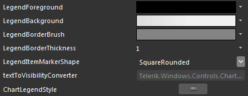
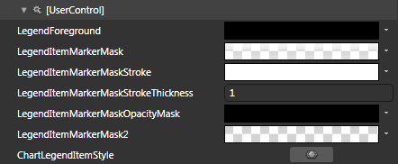

# Styling the Chart Legend


The __RadChart__ exposes the __LegendStyle__ property of type __Style__. It is applied to the __ChartLegend__ control inside the __RadChart__. You can also style the Legend Items by setting an appropriate style to the __LegendItemStyle__ of the __ChartLegend__ control.

You have two options:

* To create an empty styles and set it up on your own.

* To copy the default styles of the control and modify it.

This topic will show you how to perform the second one.

## Modifying the Default Styles

>The __ChartLegend__ and the __ChartLegendItem__ controls are located in the __Telerik.Windows.Controls.Charting__ namespace of the __Telerik.Windows.Controls.Charting__ assembly. In order to use them you have to declare it in XAML: `xmlns:telerikCharting="clr-namespace:Telerik.Windows.Controls.Charting;assembly=Telerik.Windows.Controls.Charting" XAMLLanguage Filtered SectionASP.NET`

When working in Expression Blend, the namespaces that are needed will be added automatically.

Load your project in Expression Blend and open the User Control that holds the __RadChart__. You have to use a dummy controls in order to get the default styles. To create one find the __ChartLegend__ or the __ChartLegendItem__ control in the 'Assets' pane and draw one on the art board. In the 'Objects and Timeline' pane select the control, you've drawn and from the menu choose *Object -> Edit Style -> Edit a Copy*. You will be prompted for the name of the style and where to be placed.

>tipIf you choose to define the style in Application, it would be available for the entire application. This allows you to define a style only once and then reuse it where needed.

After clicking 'OK', Expression Blend will generate the default value for the selected __Style__ in the __Resources__ section of your User Control. The properties available for the style will be loaded in the 'Properties' pane and you will be able to modify their default values. You can also edit the generated XAML in the XAML View or in Visual Studio.

>tipTo change the fill of the legend item's marker set the __MarkerFill__ property of the __CHhrtLegendItem__ through its __Style__. For the stroke of the marker use the __Stroke__ property of the __ChartLegendItem__. 

If you go to the 'Resources' pane, you will see an editable list of resources generated together with the style and used by it. In this list you will find the brushes, styles and templates needed to change the visual appearance of the targeted control__.__Their names indicate to which part of the appearance they are assigned.

Here are the resources generated with the __ChartLegendStyle__: 




* __LegendForeground__ - a brush, that represent the foreground color of the __ChartLegend__.

* __LegendBackground__ - a brush, that represents the background color of the __ChartLegend__.

* __LegendBorderBrush__ - a brush, that represents the border color of the __ChartLegend__.

* __LegendBorderThickness__ - represents the thickness of the border around the __ChartLegend__.

* __LegendItemMarkerShape__ - represents the shape of the marker inside the __ChartLegend's__ item.

* __ChartLegendStyle__ - the __Style__, applied to the __ChartLegend__ control.

Here are the resources generated with the __ChartLegendItemStyle__:



* __LegendForeground__ - a brush, that represents the foreground color of the __ChartLegendItem__.

* __LegendItemMarkerMask__ - a brush, that represents the background of the mask element for the __ChatLegendItem's__ marker.

* __LegendItemMarkerMaskStroke__ - a brush, that represents the border color of the mask element for the __ChatLegendItem's__ marker.

* __LegendItemMarkerMaskStrokeThickness__ - that represents the thickness of the border of the mask element for the __ChatLegendItem's__ marker.

* __LegendItemMarkerMaskStroke__ - a brush, that represents the opacity mask of the mask element for the __ChatLegendItem's__ marker.

* __LegendItemMarkerMask__ - a brush, that represents the background of the secondary mask element for the __ChatLegendItem's__ marker.

* __ChartLegendItemStyle__ - the __Style__, applied to the __ChartLegendItem__ control.

To apply the styles to the real controls, set the __ChartLegendItemStyle__ in the Style for the __ChartLegend__.

#### __XAML__

```XAML
	<Style x:Key="ChartLegendStyle" TargetType="telerik:ChartLegend">
	    <!--  ...  -->
	    <Setter Property="LegendItemStyle" Value="{StaticResource ChartLegendItemStyle}" />
	    <!--  ...  -->
	</Style>
```


After that set the __ChartLegendStyle__ to the __RadChart__.

#### __XAML__

```XAML
	<telerik:RadChart x:Name="radChart" LegendStyle="{StaticResource ChartLegendStyle}" />
```


>Don't forget to delete the dummy controls, when you finish editing the style.

Here is the XAML, generated for the __Styles__:

#### __XAML__

```XAML
	<SolidColorBrush x:Key="LegendForeground" Color="#FF000000" />
	<LinearGradientBrush x:Key="LegendItemMarkerMask" StartPoint="0.5,0" EndPoint="0.5,1">
	    <GradientStop Offset="0.009" Color="#D8FFFFFF" />
	    <GradientStop Offset="1" Color="#66FFFFFF" />
	    <GradientStop Offset="0.43" Color="Transparent" />
	    <GradientStop Offset="0.42" Color="#7FFFFFFF" />
	</LinearGradientBrush>
	<SolidColorBrush x:Key="LegendItemMarkerMaskOpacityMask" Color="#FF000000" />
	<SolidColorBrush x:Key="LegendItemMarkerMaskStroke" Color="White" />
	<System:Double x:Key="LegendItemMarkerMaskStrokeThickness">1</System:Double>
	<SolidColorBrush x:Key="LegendItemMarkerMask2" Color="Transparent" />
	<Style x:Key="ChartLegendItemStyle" TargetType="telerik:ChartLegendItem">
	    <Setter Property="Foreground" Value="{StaticResource LegendForeground}" />
	    <Setter Property="Padding" Value="5,0,5,0" />
	    <Setter Property="Margin" Value="0,3,0,2" />
	    <Setter Property="Template">
	        <Setter.Value>
	            <ControlTemplate TargetType="telerik:ChartLegendItem">
	                <Grid x:Name="PART_MainContainer"
	                      HorizontalAlignment="Stretch"
	                      VerticalAlignment="Top"
	                      Background="{TemplateBinding Background}">
	                    <Grid.ColumnDefinitions>
	                        <ColumnDefinition Width="Auto" />
	                        <ColumnDefinition />
	                    </Grid.ColumnDefinitions>
	                    <Path x:Name="PART_LegendItemMarker"
	                          Width="16"
	                          Height="16"
	                          Margin="{TemplateBinding Margin}"
	                          Stretch="Fill"
	                          StrokeThickness="{TemplateBinding MarkerStrokeThickness}"
	                          Style="{TemplateBinding ItemStyle}">
	                        <Path.Data>
	                            <PathGeometry x:Name="PART_ItemMarkerGeometry" />
	                        </Path.Data>
	                    </Path>
	                    <Path x:Name="PART_SelectedState"
	                          Width="14"
	                          Height="14"
	                          Margin="{TemplateBinding Margin}"
	                          Fill="{StaticResource LegendItemMarkerMask}"
	                          OpacityMask="{StaticResource LegendItemMarkerMaskOpacityMask}"
	                          Stretch="Fill"
	                          Stroke="{StaticResource LegendItemMarkerMaskStroke}"
	                          StrokeThickness="{StaticResource LegendItemMarkerMaskStrokeThickness}">
	                        <Path.Data>
	                            <PathGeometry x:Name="PART_ItemMarkerMaskGeometry" />
	                        </Path.Data>
	                    </Path>
	                    <Path Width="14"
	                          Height="14"
	                          Margin="{TemplateBinding Margin}"
	                          Fill="{StaticResource LegendItemMarkerMask2}"
	                          Stretch="Fill">
	                        <Path.Data>
	                            <PathGeometry x:Name="PART_ItemMarkerMaskGeometry2" />
	                        </Path.Data>
	                    </Path>
	                    <TextBlock x:Name="PART_TextBlock"
	                               Grid.Column="1"
	                               Margin="{TemplateBinding Margin}"
	                               Foreground="{TemplateBinding Foreground}"
	                               Padding="{TemplateBinding Padding}"
	                               Text="{TemplateBinding Label}" />
	                    <VisualStateManager.VisualStateGroups>
	                        <VisualStateGroup x:Name="HoverStates">
	                            <VisualState x:Name="Normal">
	                                <Storyboard>
	                                    <DoubleAnimation Duration="0.00:00:00.15"
	                                                     Storyboard.TargetName="PART_MainContainer"
	                                                     Storyboard.TargetProperty="Opacity"
	                                                     To="1.0" />
	                                </Storyboard>
	                            </VisualState>
	                            <VisualState x:Name="Hovered">
	                                <Storyboard>
	                                    <DoubleAnimation Duration="0.00:00:00.15"
	                                                     Storyboard.TargetName="PART_MainContainer"
	                                                     Storyboard.TargetProperty="Opacity"
	                                                     To="1.0" />
	                                </Storyboard>
	                            </VisualState>
	                            <VisualState x:Name="Hidden">
	                                <Storyboard>
	                                    <DoubleAnimation Duration="0.00:00:00.15"
	                                                     Storyboard.TargetName="PART_MainContainer"
	                                                     Storyboard.TargetProperty="Opacity"
	                                                     To="0.15" />
	                                </Storyboard>
	                            </VisualState>
	                        </VisualStateGroup>
	                        <VisualStateGroup x:Name="SelectionStates">
	                            <VisualState x:Name="Unselected" />
	                            <VisualState x:Name="Selected">
	                                <Storyboard>
	                                    <ObjectAnimationUsingKeyFrames Duration="0.00:00:00.05"
	                                                                   Storyboard.TargetName="PART_LegendItemMarker"
	                                                                   Storyboard.TargetProperty="Stroke">
	                                        <DiscreteObjectKeyFrame KeyTime="0.00:00:00.0">
	                                            <DiscreteObjectKeyFrame.Value>
	                                                <SolidColorBrush Color="#B2000000" />
	                                            </DiscreteObjectKeyFrame.Value>
	                                        </DiscreteObjectKeyFrame>
	                                    </ObjectAnimationUsingKeyFrames>
	                                    <ObjectAnimationUsingKeyFrames Duration="0.00:00:00.05"
	                                                                   Storyboard.TargetName="PART_LegendItemMarker"
	                                                                   Storyboard.TargetProperty="StrokeThickness">
	                                        <DiscreteObjectKeyFrame KeyTime="0.00:00:00.0">
	                                            <DiscreteObjectKeyFrame.Value>
	                                                <System:Double>2</System:Double>
	                                            </DiscreteObjectKeyFrame.Value>
	                                        </DiscreteObjectKeyFrame>
	                                    </ObjectAnimationUsingKeyFrames>
	                                    <ObjectAnimationUsingKeyFrames Duration="0.00:00:00.05"
	                                                                   Storyboard.TargetName="PART_SelectedState"
	                                                                   Storyboard.TargetProperty="StrokeThickness">
	                                        <DiscreteObjectKeyFrame KeyTime="0.00:00:00.0">
	                                            <DiscreteObjectKeyFrame.Value>
	                                                <System:Double>0</System:Double>
	                                            </DiscreteObjectKeyFrame.Value>
	                                        </DiscreteObjectKeyFrame>
	                                    </ObjectAnimationUsingKeyFrames>
	                                </Storyboard>
	                            </VisualState>
	                        </VisualStateGroup>
	                    </VisualStateManager.VisualStateGroups>
	                </Grid>
	            </ControlTemplate>
	        </Setter.Value>
	    </Setter>
	</Style>
	
	<LinearGradientBrush x:Key="LegendBackground" StartPoint="-0.96,0.5" EndPoint="1.96,0.5">
	    <GradientStop Color="#FFB5B5B5" />
	    <GradientStop Offset="0.5" Color="#FFF0F0F0" />
	</LinearGradientBrush>
	<SolidColorBrush x:Key="LegendBorderBrush" Color="#FF848484" />
	<Thickness x:Key="LegendBorderThickness">1</Thickness>
	<telerik:MarkerShape x:Key="LegendItemMarkerShape">SquareRounded</telerik:MarkerShape>
	<telerik:TextToVisibilityConverter x:Key="textToVisibilityConverter" />
	<Style x:Key="ChartLegendStyle" TargetType="telerik:ChartLegend">
	    <Setter Property="Foreground" Value="{StaticResource LegendForeground}" />
	    <Setter Property="Background" Value="{StaticResource LegendBackground}" />
	    <Setter Property="Padding" Value="10,10,10,5" />
	    <Setter Property="Margin" Value="0" />
	    <Setter Property="BorderBrush" Value="{StaticResource LegendBorderBrush}" />
	    <Setter Property="BorderThickness" Value="{StaticResource LegendBorderThickness}" />
	    <Setter Property="HeaderFontWeight" Value="Bold" />
	    <Setter Property="HorizontalContentAlignment" Value="Stretch" />
	    <Setter Property="VerticalContentAlignment" Value="Stretch" />
	    <Setter Property="LegendItemMarkerShape" Value="{StaticResource LegendItemMarkerShape}" />
	    <Setter Property="Template">
	        <Setter.Value>
	            <ControlTemplate TargetType="telerik:ChartLegend">
	                <Border Background="{TemplateBinding Background}"
	                        BorderBrush="{TemplateBinding BorderBrush}"
	                        BorderThickness="{TemplateBinding BorderThickness}">
	                    <Grid Margin="{TemplateBinding Padding}">
	                        <Grid.RowDefinitions>
	                            <RowDefinition Height="Auto" />
	                            <RowDefinition Height="*" />
	                        </Grid.RowDefinitions>
	                        <ContentControl Content="{TemplateBinding Header}"
	                                        ContentTemplate="{TemplateBinding HeaderTemplate}"
	                                        FontWeight="{TemplateBinding HeaderFontWeight}"
	                                        Foreground="{TemplateBinding Foreground}" />
	                        <ItemsPresenter Grid.Row="1"
	                                        HorizontalAlignment="{TemplateBinding HorizontalContentAlignment}"
	                                        VerticalAlignment="{TemplateBinding VerticalContentAlignment}" />
	                    </Grid>
	                </Border>
	            </ControlTemplate>
	        </Setter.Value>
	    </Setter>
	    <Setter Property="ItemsPanel">
	        <Setter.Value>
	            <ItemsPanelTemplate>
	                <telerik:RadWrapPanel Orientation="{Binding ItemsPanelOrientation}" />
	            </ItemsPanelTemplate>
	        </Setter.Value>
	    </Setter>
	    <Setter Property="HeaderTemplate">
	        <Setter.Value>
	            <DataTemplate>
	                <Grid>
	                    <TextBlock Width="Auto"
	                               Height="Auto"
	                               HorizontalAlignment="Left"
	                               FontSize="12"
	                               Padding="0,0,0,2"
	                               Text="{Binding}"
	                               TextWrapping="Wrap"
	                               Visibility="{Binding Converter={StaticResource textToVisibilityConverter}}" />
	                </Grid>
	            </DataTemplate>
	        </Setter.Value>
	    </Setter>
	</Style>
```


## See Also

 * [Styling the Plot Area]()
 * [Styling the No Data Control]()
 * [Styling the Item Labels]()
