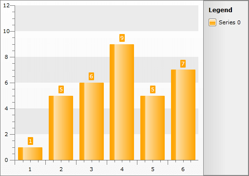
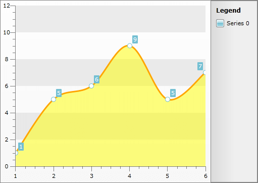
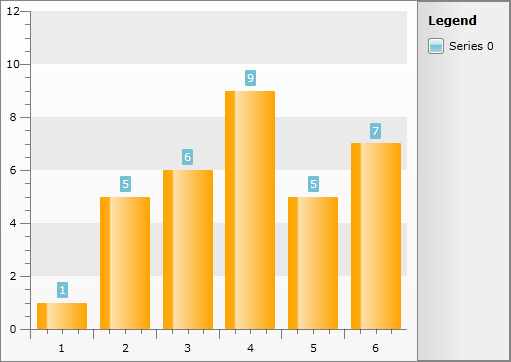
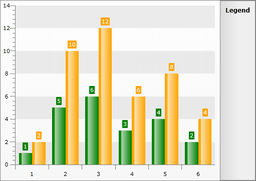
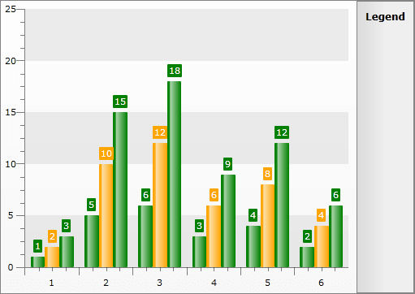
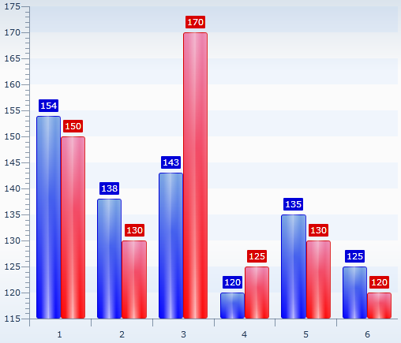
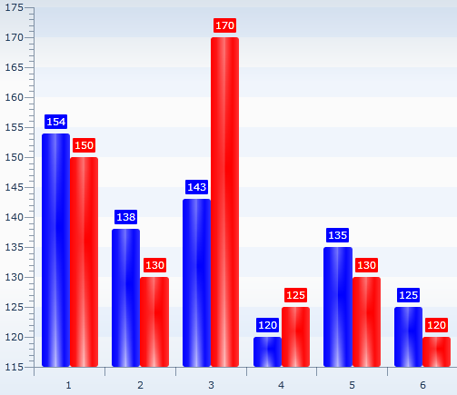
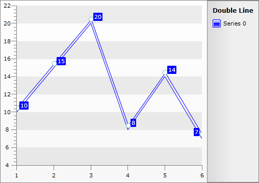

# Styling the Chart Series


There are four ways to style the chart series. The first and easier one is to [use the shortcut visual properties of the ISeriesDefinition interface](#Styling_the_Series_via_the_SeriesDefinition_classes)

the second is to [use the complex styles property](#Styling_the_Series_via_Styles) provided by the __ChartArea__ of the __RadChart__ , the third is to [use Palette Brushes](#Styling_Series_via_PaletteBrushes) and the forth is to retemplate the default series style.

## Styling the Series via the SeriesDefinition classes

This is the easiest approach that you can use in order to style the chart series. It uses the shortcut visual properties exposed by the __ISeriesDefinition__ interface. These properties can be found under the __Appearance__ complex property for each one of the series. Here is a list of them:

* __Fill__ - gets or sets the brush that describes the fill for the corresponding chart series type. 


* __Stroke__ - gets or sets the brush that describes the stroke for the corresponding chart series type. 


* __StrokeThickness__ - stroke thickness for the corresponding chart series type. 

>For series that have no concept of __Fill__ such as __Line__, __Spline__, __Stick__, etc. the __Stroke/StrokeThickness__ value is the brush that defines the appearance of the whole visual segment.

* __Cursor__ - gets or sets the mouse cursor that appears when the mouse pointer hovers over a chart series item element. 

For example, you can change the appearance of a __BarSeries__ in the following way.


```C#
	BarSeriesDefinition barDefinition = new BarSeriesDefinition();
	barDefinition.Appearance.Fill = new SolidColorBrush( Colors.Orange );
	this.radChart.DefaultSeriesDefinition = barDefinition;
```


```VB.NET
	Dim barDefinition As New BarSeriesDefinition()
	barDefinition.Appearance.Fill = New SolidColorBrush(Colors.Orange)
	Me.radChart.DefaultSeriesDefinition = barDefinition
```


Here is the result.


## Styling the Series via Styles

The second way is to define a style and set it through the __SeriesStyles__ complex property of the __ChartArea__. It contains style entries for all distinct series types. These types can be divided in two groups - __Self-Drawing (Continuous) Series__ and __Item-Drawn (Discrete) Series__.

>Using this type of styling only the series elements will get customized, the item labels and the legend items will remain with their default appearance.

>tipBy setting the __Styles__ this way, they will get applied to every series of this type. In order to use styles and apply them to certain series you can combine the two methods. This is done by setting them to the __SeriesDefinition.ItemStyle__ property for item-drawn series or the __SeriesDefinition.SeriesStyle__ property for self-drawn series.

* To create a style for the __Self-Drawing Series__ (Line, StackedLine, Spline, StackedSpline, Area, StackedArea, StackedArea100, SplineArea, StackedSplineArea, StackedSplineArea100, Range, SplineRange) you have to create a style that targets the __SelfDrawingSeries__ class in the __Telerik.Windows.Controls.Charting__ namespace. 


```XAML
	<Style x:Key="SelfDrawingSeriesStyle" TargetType="telerik:SelfDrawingSeries" />
```

The type exposes two style properties - __BorderLineStyle__ and __BackgroundStyle__. The __BorderLineStyle__ is __obligatory__, as it defines the main chart contour. The __BackgroundStyle must be__ set when your chart represents an area. Here is an example:


```XAML
	<Style x:Key="SplineAreaStyle" TargetType="telerik:SelfDrawingSeries">
	    <Setter Property="BorderLineStyle">
	        <Setter.Value>
	            <Style TargetType="Shape">
	                <Setter Property="Stroke" Value="Orange" />
	                <Setter Property="StrokeThickness" Value="3" />
	            </Style>
	        </Setter.Value>
	    </Setter>
	    <Setter Property="BackgroundStyle">
	        <Setter.Value>
	            <Style TargetType="Shape">
	                <Setter Property="Fill" Value="Yellow" />
	                <Setter Property="Opacity" Value="0.5" />
	            </Style>
	        </Setter.Value>
	    </Setter>
	</Style>
```


```C#
	this.radChart.DefaultView.ChartArea.SeriesStyles.SplineAreaSeriesStyle = this.Resources[ "SplineAreaStyle" ] as Style;
```


```VB.NET
	Me.radChart.DefaultView.ChartArea.SeriesStyles.SplineAreaSeriesStyle = TryCast(Me.Resources("SplineAreaStyle"), Style)
```



* To create a style for the __Item-Drawn Series__ (Bar, StackedBar, StackedBar100, HorizontalBar, HorizontalStackedBar, HorizontalStackedBar100, Pie, Doughnut, Stick, CandleStick, Bubble) you have to create a style that targets the __Shape__ class. 

Here is an example:


```XAML
	<Style x:Key="BarStyle" TargetType="Shape">
	    <Setter Property="Fill" Value="Orange" />
	</Style>
```


```C#
	this.radChart.DefaultView.ChartArea.SeriesStyles.BarSeriesStyle = this.Resources[ "BarStyle" ] as Style;
```


```VB.NET
	Me.radChart.DefaultView.ChartArea.SeriesStyles.BarSeriesStyle = TryCast(Me.Resources("BarStyle"), Style)
```



>tipTo learn how to change the foreground of the item's label when using styles take a look at the [Styling the Item Labels]() topic.

## Styling Series via PaletteBrushes

The __RadChart__ exposes two __BrushCollections__:


* __RadChart.PaletteBrushes__ - defines the brushes used for the series __RadChart__ -wide.

* __RadChart.DefaultView.ChartArea.PaletteBrushes__ - defines the brushes used for the series for the specific __ChartArea__.


>tipThe __PaletteBrushes__ property is independent of the series type.

>The __PaletteBrush__ collection on the __ChartArea__ level takes precedence over the one on the __RadChart__ level and the latter takes precedence over the theme resources.

The __PaletteBrushes__ is read-only and allows you to specify a set of brushes that will be applied to the series displayed in the __RadChart__. The pattern of applying is as follows: first series - first brush, second series - second brush.


```XAML
	<telerik:RadChart x:Name="radChart" VerticalAlignment="Top">
	    <telerik:RadChart.PaletteBrushes>
	        <SolidColorBrush Color="Green" />
	        <SolidColorBrush Color="Orange" />
	    </telerik:RadChart.PaletteBrushes>
	</telerik:RadChart>
```


or


```XAML
	<telerik:RadChart x:Name="radChart" VerticalAlignment="Top">
	    <telerik:RadChart.DefaultView>
	        <telerik:ChartDefaultView>
	            <telerik:ChartDefaultView.ChartArea>
	                <telerik:ChartArea PaletteBrushesRepeat="False">
	                    <telerik:ChartArea.PaletteBrushes>
	                        <SolidColorBrush Color="Green" />
	                        <SolidColorBrush Color="Orange" />
	                    </telerik:ChartArea.PaletteBrushes>
	                </telerik:ChartArea>
	            </telerik:ChartDefaultView.ChartArea>
	        </telerik:ChartDefaultView>
	    </telerik:RadChart.DefaultView>
	</telerik:RadChart>
```



There are __PaletteBrushesRepeat__ properties in both __RadChart__ and __ChartArea__, which define the behavior of the palette. When __N__ brushes are added, then the first __N__ series will use those brushes. If __PaletteBrushesRepeat__ is set to __True__, then the next __N__ series will again use the same colors. When set to __False__, the next series will fallback to use the other available resources.

>For example if you use the __ChartArea__ __PaletteBrush__ collection with __PaletteBrushesRepeat__ set to __False__, when all of the brushes get used, the next series will fallback to the __RadChart__ __PaletteBrushes__ and after them to the theme resources.


```XAML
	<telerik:RadChart x:Name="radChart"
	                  VerticalAlignment="Top"
	                  PaletteBrushesRepeat="True">
	    <telerik:RadChart.PaletteBrushes>
	        <SolidColorBrush Color="Green" />
	        <SolidColorBrush Color="Orange" />
	    </telerik:RadChart.PaletteBrushes>
	</telerik:RadChart>
```


or


```XAML
	<telerik:RadChart x:Name="radChart"
	                  VerticalAlignment="Top"
	                  PaletteBrushesRepeat="True">
	    <telerik:RadChart.DefaultView>
	        <telerik:ChartDefaultView>
	            <telerik:ChartDefaultView.ChartArea>
	                <telerik:ChartArea PaletteBrushesRepeat="False">
	                    <telerik:ChartArea.PaletteBrushes>
	                        <SolidColorBrush Color="Green" />
	                        <SolidColorBrush Color="Orange" />
	                    </telerik:ChartArea.PaletteBrushes>
	                </telerik:ChartArea>
	            </telerik:ChartDefaultView.ChartArea>
	        </telerik:ChartDefaultView>
	    </telerik:RadChart.DefaultView>
	</telerik:RadChart>
```



>tipYou can set the __PaletteBrushesUseSolidColors__ property to true so that those Themes that have *Gradient* colors will have their Gradients set to the SolidColors as given in the Palette. Such themes are *Vista*, *Summer* and *Windows7*. For comparison you may take a look at the following two pictures:

* PaletteBrushesUseSolidColors = *False* and Theme is set to Vista:



* PaletteBrushesUseSolidColors = *True* and Theme is set to Vista:

Styling Series via Retemplating

If you want to see a double line when you create new LineSeriesDefinition the onliest way to do this is by retemplating the default Line Style. The double line appearance can be achieved by Transforming the Line by Y with Value -8 for example. The default Line __Fill__, __Stroke__ and __StrokeThickness__ values of the LineSeries should be set so that they are same as the properties defined in the Style. Additionally you can style the point marks so that their color equals the one set in the Style as shown in our help topic [Styling the Point Marks](http://www.telerik.com/help/silverlight/radchart-styling-and-appearance-styling-point-marks.html).

Here is an example:


```XAML
	<Style x:Key="MyDoubleLineStyle" TargetType="telerik:Line">
	    <Setter Property="Template">
	        <Setter.Value>
	            <ControlTemplate TargetType="telerik:Line">
	                <Canvas x:Name="PART_MainContainer">
	                    <Canvas.RenderTransform>
	                        <TranslateTransform X="1" Y="-8" />
	                    </Canvas.RenderTransform>
	                    <Line x:Name="PART_LineGeometry"
	                          Fill="Blue"
	                          Stroke="Blue"
	                          StrokeThickness="1"
	                          Style="{TemplateBinding ItemStyle}"
	                          X1="0"
	                          X2="{TemplateBinding EndPointX}"
	                          Y1="{TemplateBinding StartPointY}"
	                          Y2="{TemplateBinding EndPointY}" />
	                    <telerik:PointMark x:Name="PART_PointMark"
	                                       Canvas.Top="{TemplateBinding StartPointY}"
	                                       PointMarkCanvasLeft="{TemplateBinding PointMarkCanvasLeft}"
	                                       PointMarkCanvasTop="{TemplateBinding PointMarkCanvasTop}"
	                                       ShapeStyle="{TemplateBinding PointMarkShapeStyle}"
	                                       Style="{TemplateBinding PointMarkItemStyle}"
	                                       Visibility="{TemplateBinding PointMarkVisibility}" />
	                </Canvas>
	            </ControlTemplate>
	        </Setter.Value>
	    </Setter>
	</Style>
```


>tipThe Default Style is different for RadChart with version older than Q1 2010.


```C#
	RadChart1.DefaultSeriesDefinition = line;
	line.Appearance.Stroke = new SolidColorBrush(System.Windows.Media.Colors.Blue);
	line.Appearance.Fill = new SolidColorBrush(System.Windows.Media.Colors.Blue);
	line.Appearance.StrokeThickness = 1;
	line.ItemStyle = this.Resources["MyDoubleLineStyle"] as Style;
```


```VB.NET
	RadChart1.DefaultSeriesDefinition = line
	line.Appearance.Stroke = New SolidColorBrush(System.Windows.Media.Colors.Blue)
	line.Appearance.Fill = New SolidColorBrush(System.Windows.Media.Colors.Blue)
	line.Appearance.StrokeThickness = 1
	line.ItemStyle = TryCast(Me.Resources("MyDoubleLineStyle"), Style)
```

    


## See Also

 * [Styling the Chart Area]()

 * [Styling the Chart Legend]()

 * [Styling the Plot Area]()
