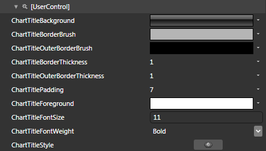
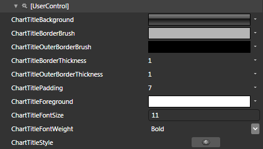
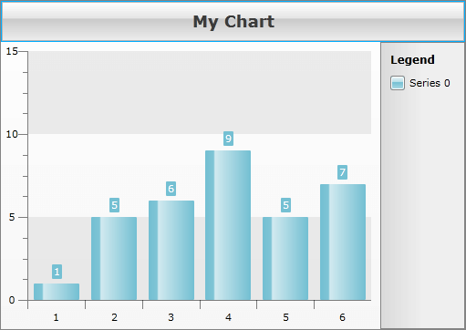

# Styling the Chart Title


The __RadChart Title__ can be styled by creating an appropriate __Style__ and setting it to the __TitleStyle__ property of the __RadChart__. 

You have two options:

* To create an empty style and set it up on your own.

* To copy the default style of the control and modify it.

This topic will show you how to perform the second one.

## Modifying the Default Style

>The __ChartTitle__ control is located in the __Telerik.Windows.Controls.Charting__ namespace of the __Telerik.Windows.Controls.Charting__ assembly. In order to use it you have to declare it in XAML:

#### __XAML__

```XAML
	xmlns:telerikCharting=&quot;clr-namespace:Telerik.Windows.Controls.Charting;assembly=Telerik.Windows.Controls.Charting&quot;
```


When working in Expression Blend, the namespaces that are needed will be added automatically.

Load your project in Expression Blend and open the User Control that holds the __RadChart__. You have to use a dummy control in order to get the default style. To create one find the __ChartTitle__ control in the 'Assets' pane and draw one on the art board. In the 'Objects and Timeline' pane select the __ChartTitle__, you've drawn and from the menu choose *Object -> Edit Style -> Edit a Copy*. You will be prompted for the name of the style and where to be placed.

>tipIf you choose to define the style in Application, it would be available for the entire application. This allows you to define a style only once and then reuse it where needed.

After clicking 'OK', Expression Blend will generate the default style of the __ChartTitle__ control in the __Resources__ section of your User Control. The properties available for the style will be loaded in the 'Properties' pane and you will be able to modify their default values. You can also edit the generated XAML in the XAML View or in Visual Studio.

If you go to the 'Resources' pane, you will see an editable list of resources generated together with the style and used by it. In this list you will find the brushes, styles and templates needed to change the visual appearance of the __ChartTitle__. Their names indicate to which part of the __ChartTitle__ appearance they are assigned.



* __ChartTitleBackground__ - a brush, that represents the background color of the __ChartTitle__.

* __ChartTitleBorderBrush__ - a brush, that represents the inner border color of the __ChartTitle__.

* __ChartTitleOuterBorderBrush__ - a brush, that represents the outer border color of the __ChartTitle__.

* __ChartTitleBorderThicknes__ - represents the thickness of the __ChartTitle's__ inner border.

* __ChartTitleOuterBorderThicknes__ - represents the thickness of the __ChartTitle's__ outer border.

* __ChartTitlePadding__ - represents the padding, applied to the content of the __ChartTitle__.

* __ChartTitleForeground__ - a brush, that represents the foreground color of the __ChartTitle__.

* __ChartTitleFontSize__ - represents the font size of the __ChartTitle's__ content.

* __ChartTitleFontWeight__ - represents the font weight of the __ChartTitle's__ content.

* __ChartTitleStyle__ - the __Style__, applied to the __ChartTitle__ control.

To apply the style to the real control, set it to the __TitleStyle__ property of the __RadChart__.

#### __XAML__

```XAML
	<telerik:RadChart x:Name="radChart" TitleStyle="{StaticResource ChartTitleStyle}" />
```


>Don't forget to delete the dummy __ChartTitle__ control, when you finish editing the style.

Here is an example of the described resources modified.


And here is the snapshot of the result.


Here is the final XAML for the __Style__ after the modifications:

#### __XAML__

```XAML
	<LinearGradientBrush x:Key="ChartTitleBackground" StartPoint="0.5,0" EndPoint="0.5,1">
	    <GradientStop Offset="1" Color="#FFEDEDED" />
	    <GradientStop Color="White" />
	    <GradientStop Offset="0.42" Color="#FFE5E5E5" />
	    <GradientStop Offset="0.43" Color="#FFCACACA" />
	</LinearGradientBrush>
	<SolidColorBrush x:Key="ChartTitleBorderBrush" Color="#FFB5B5B5" />
	<SolidColorBrush x:Key="ChartTitleOuterBorderBrush" Color="#FF00ADFF" />
	<Thickness x:Key="ChartTitleBorderThickness">1</Thickness>
	<Thickness x:Key="ChartTitleOuterBorderThickness">1</Thickness>
	<Thickness x:Key="ChartTitlePadding">7</Thickness>
	<SolidColorBrush x:Key="ChartTitleForeground" Color="#FF3B3B3B" />
	<System:Double x:Key="ChartTitleFontSize">18</System:Double>
	<FontWeight x:Key="ChartTitleFontWeight">Bold</FontWeight>
	<Style x:Key="ChartTitleStyle" TargetType="telerik:ChartTitle">
	    <Setter Property="HorizontalContentAlignment" Value="Center" />
	    <Setter Property="Background" Value="{StaticResource ChartTitleBackground}" />
	    <Setter Property="BorderBrush" Value="{StaticResource ChartTitleBorderBrush}" />
	    <Setter Property="OuterBorderBrush" Value="{StaticResource ChartTitleOuterBorderBrush}" />
	    <Setter Property="BorderThickness" Value="{StaticResource ChartTitleBorderThickness}" />
	    <Setter Property="OuterBorderThickness" Value="{StaticResource ChartTitleOuterBorderThickness}" />
	    <Setter Property="Padding" Value="{StaticResource ChartTitlePadding}" />
	    <Setter Property="Foreground" Value="{StaticResource ChartTitleForeground}" />
	    <Setter Property="FontSize" Value="{StaticResource ChartTitleFontSize}" />
	    <Setter Property="FontWeight" Value="{StaticResource ChartTitleFontWeight}" />
	    <Setter Property="Template">
	        <Setter.Value>
	            <ControlTemplate TargetType="telerik:ChartTitle">
	                <Border BorderBrush="{TemplateBinding OuterBorderBrush}" BorderThickness="{TemplateBinding OuterBorderThickness}">
	                    <Border Background="{TemplateBinding Background}"
	                            BorderBrush="{TemplateBinding BorderBrush}"
	                            BorderThickness="{TemplateBinding BorderThickness}"
	                            CornerRadius="{TemplateBinding CornerRadius}">
	                        <ContentControl Margin="{TemplateBinding Padding}"
	                                        HorizontalAlignment="{TemplateBinding HorizontalContentAlignment}"
	                                        VerticalAlignment="{TemplateBinding VerticalContentAlignment}"
	                                        Content="{TemplateBinding Content}"
	                                        FontFamily="{TemplateBinding FontFamily}"
	                                        FontSize="{TemplateBinding FontSize}"
	                                        FontStyle="{TemplateBinding FontStyle}"
	                                        FontWeight="{TemplateBinding FontWeight}"
	                                        Foreground="{TemplateBinding Foreground}" />
	                    </Border>
	                </Border>
	            </ControlTemplate>
	        </Setter.Value>
	    </Setter>
	</Style>
```


## See Also

 * [Styling the Chart Series]()

 * [Styling the Chart Area]()

 * [Styling the Chart Legend]()
