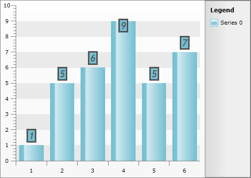

# Styling the Item Labels


## 

The item labels are part of the series definition items and are represented by the __SeriesItemLabel__ control. To style it in Expression Blend, use a dummy control to create the style and after modifying it, set it to the __RadChart__.

Open your __RadChart__ project in Expression Blend and select the __RadChart__ you want to modify. On the same scene you should place a __SeriesItemLabel__ control, that will be used as a dummy. To do so choose the 'Assets' tab. From the *Controls -> All* section select the __SeriesItemLabel__ control. With your mouse create a new instance of the control on the scene. Now select the newly created control and from the menu select *Object -> Edit Style -> Edit Copy*. You will be prompted for the name of the style and where to be placed within your application.

>tipIf you choose to define the style in Application, it would be available for the entire application. This allows you to define a style only once and then reuse it where needed.

After clicking the OK button, a style with target type __SeriesItemLabel__ will be created and the properties for this type will be loaded in the 'Properties' pane. Modify them untill you get the desired appearance.

>tipYou can also set the __Style__ for the __Label's__ border via the __LabelStyle__ property and the __Style__ for the __Label's__ connector via the __ConnectorStyle__ property.

You can modify every one of the properties available for the styles. After that set the created style to the __DefaultSeriesDefinition__ of your __RadChart__ and delete the dummy control.


```C#
	this.radChart.DefaultSeriesDefinition.SeriesItemLabelStyle = this.Resources["SeriesItemLabelStyle"] as Style;
```
```VB.NET
	Me.radChart.DefaultSeriesDefinition.SeriesItemLabelStyle = TryCast(Me.Resources("SeriesItemLabelStyle"), Style)
```


Here is a snapshot of the result.



Here is the final XAML for the __Style__:


```XAML
	<Style x:Key="SeriesItemLabelStyle" TargetType="telerik:SeriesItemLabel">
	    <Setter Property="HorizontalContentAlignment" Value="Center" />
	    <Setter Property="Padding" Value="2,0" />
	    <Setter Property="IsHitTestVisible" Value="False" />
	    <Setter Property="Foreground" Value="#FF535353" />
	    <Setter Property="Stroke" Value="#FF535353" />
	    <Setter Property="FontWeight" Value="Bold" />
	    <Setter Property="FontStyle" Value="Italic" />
	    <Setter Property="FontFamily" Value="Trebuchet MS" />
	    <Setter Property="FontSize" Value="18.667" />
	    <Setter Property="LabelStyle">
	        <Setter.Value>
	            <Style TargetType="Border">
	                <Setter Property="BorderThickness" Value="3" />
	            </Style>
	        </Setter.Value>
	    </Setter>
	    <Setter Property="ContentTemplate">
	        <Setter.Value>
	            <DataTemplate>
	                <TextBlock Text="{Binding Content, RelativeSource={RelativeSource TemplatedParent}}" TextAlignment="{Binding HorizontalContentAlignment, RelativeSource={RelativeSource TemplatedParent}}" />
	            </DataTemplate>
	        </Setter.Value>
	    </Setter>
	    <Setter Property="Template">
	        <Setter.Value>
	            <ControlTemplate TargetType="telerik:SeriesItemLabel">
	                <Canvas x:Name="PART_MainContainer">
	                    <Path Stroke="{TemplateBinding Stroke}"
	                          StrokeThickness="{TemplateBinding StrokeThickness}"
	                          Style="{TemplateBinding ConnectorStyle}"
	                          Visibility="{TemplateBinding ConnectorVisibility}">
	                        <Path.Data>
	                            <PathGeometry>
	                                <PathFigure x:Name="PART_Connector">
	                                    <PolyLineSegment />
	                                </PathFigure>
	                            </PathGeometry>
	                        </Path.Data>
	                    </Path>
	                    <Border x:Name="PART_TextContainer"
	                            Background="{TemplateBinding Fill}"
	                            BorderBrush="{TemplateBinding Stroke}"
	                            Style="{TemplateBinding LabelStyle}">
	                        <ContentPresenter Margin="{TemplateBinding Padding}" />
	                    </Border>
	                    <VisualStateManager.VisualStateGroups>
	                        <VisualStateGroup x:Name="HoverStates">
	                            <VisualState x:Name="Normal">
	                                <Storyboard>
	                                    <DoubleAnimation Duration="0.00:00:00.15"
	                                                     Storyboard.TargetName="PART_MainContainer"
	                                                     Storyboard.TargetProperty="Opacity"
	                                                     To="1.0" />
	                                </Storyboard>
	                            </VisualState>
	                            <VisualState x:Name="Hovered">
	                                <Storyboard>
	                                    <DoubleAnimation Duration="0.00:00:00.15"
	                                                     Storyboard.TargetName="PART_MainContainer"
	                                                     Storyboard.TargetProperty="Opacity"
	                                                     To="1.0" />
	                                </Storyboard>
	                            </VisualState>
	                            <VisualState x:Name="Hidden">
	                                <Storyboard>
	                                    <DoubleAnimation Duration="0.00:00:00.15"
	                                                     Storyboard.TargetName="PART_MainContainer"
	                                                     Storyboard.TargetProperty="Opacity"
	                                                     To="0.15" />
	                                </Storyboard>
	                            </VisualState>
	                        </VisualStateGroup>
	                    </VisualStateManager.VisualStateGroups>
	                </Canvas>
	            </ControlTemplate>
	        </Setter.Value>
	    </Setter>
	</Style>
```


## See Also

 * [Styling the Point Marks]()

 * [Styling the Chart Series]()

 * [Styling the Chart Area]()
