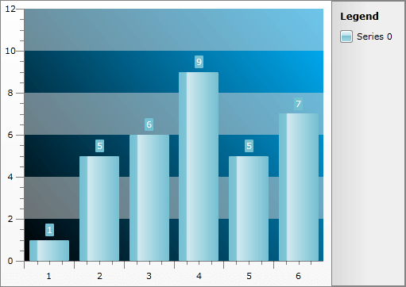

# Styling the Plot Area

## 

The plot area is part of the chart area and is represented by the __ClipPanel__ control. To style it in Expression Blend use a dummy control to create the style and after modifying it, set it to the __RadChart__.

Open your __RadChart__ project in Expression Blend and select the __RadChart__ you want to modify. On the same scene you should place a __ClipPanel__ control, that will be used as a dummy. To do so choose the 'Assets' tab. From the *Controls -> All* section select the __ClipPanel__ control. With your mouse create a new instance of the control on the scene. Now select the newly created control and from the menu select *Object -> Edit Style -> Create Empty*. You will be prompted for the name of the style and where to be placed within your application.

>tipIf you choose to define the style in Application, it would be available for the entire application. This allows you to define a style only once and then reuse it where needed.

After clicking the "OK" button, a style with target type __ClipPanel__ will be created. In the 'Properties' pane the properties available for the style will be loaded. You can modify them to get the desired appearance.

Your next step is to set the created style to the PlotAreaStyle property of the ChartArea and delete the dummy control.

#### __C#__

{{region radchart-styling-and-appearance-styling-plot-area_0}}
	this.radChart.DefaultView.ChartArea.PlotAreaStyle = this.Resources[ "ClipPanelStyle" ] as Style;
	{{endregion}}

#### __XAML__

{{region radchart-styling-and-appearance-styling-plot-area_1}}
	Me.radChart.DefaultView.ChartArea.PlotAreaStyle = TryCast(Me.Resources("ClipPanelStyle"), Style)
	{{endregion}}

Here is a snapshot of the sample result.

Here is the final XAML for the __Style__:

#### __XAML__

{{region radchart-styling-and-appearance-styling-plot-area_2}}
	
	{{endregion}}

# See Also

 * [Styling the No Data Control]()

 * [Styling the Item Labels]()

 * [Styling the Point Marks]()
