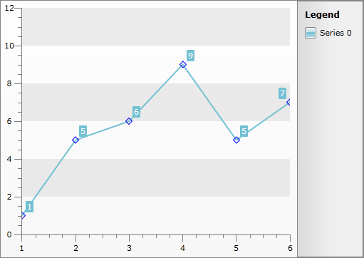
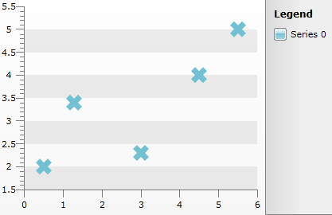

# Styling the Point Marks


## 

The easiest approach that you can use in order to style the point marks is to use the complex __Appearance__ property of the __ISeriesDefinition__ interface. This interface is implemented by all of the series definitions available in the __RadChart__ control. The __Appearance__ property exposes another complex property - __PointMark__. It exposes the following shortcut visual properties:

* __Fill__ - gets or sets the brush that describes the fill of the point mark. 

* __Stroke__ - gets or sets the brush that describes the stroke of the point mark. 

* __StrokeThickness__ - gets or sets the stroke thickness of the point mark.

* __Shape__- gets or sets the shape of the point mark, which corresponds to a value of the __Telerik.Windows.Controls.Charting.MarkerShape__ enumerator. 

>Currently, changing the point marks appearance could be done only via the provided API. Declarative customizations are not supported.

For example, you can change the appearance of the point marks for a __LineSeries__ in the following way.


```C#
	LineSeriesDefinition l = new LineSeriesDefinition();
	l.Appearance.PointMark.Stroke = new SolidColorBrush(Colors.Blue);
	l.Appearance.PointMark.StrokeThickness = 1;
	l.Appearance.PointMark.Fill = new SolidColorBrush(Colors.Transparent);
	l.Appearance.PointMark.Shape = MarkerShape.Diamond;
	this.radChart.DefaultSeriesDefinition = l;
```
```VB.NET
	Dim l As New LineSeriesDefinition()
	l.Appearance.PointMark.Stroke = New SolidColorBrush(Colors.White)
	l.Appearance.PointMark.StrokeThickness = 1
	l.Appearance.PointMark.Fill = New SolidColorBrush(Colors.Transparent)
	l.Appearance.PointMark.Shape = MarkerShape.Diamond
	Me.radChart.DefaultSeriesDefinition = l
```


Here is the result.




## 

__Customize Scatter/Bubble Series__

Changing the shape of the pointmark can be done by retemplating the Scatter/Point control (the class that represents 1 point on the screen). You can create a custom style for your scatter points as shown below and apply it to the series via __ItemStyle__ property:


```XAML
	<Style x:Key="CustomPoint" TargetType="telerik:PointMark">
	    <Setter Property="Size" Value="20" />
	    <Setter Property="Template">
	        <Setter.Value>
	            <ControlTemplate TargetType="telerik:PointMark">
	                <Canvas>
	                    <Path x:Name="PART_PointMarkPath"
	                          Canvas.Left="{TemplateBinding PointMarkCanvasLeft}"
	                          Canvas.Top="{TemplateBinding PointMarkCanvasTop}"
	                          Width="{TemplateBinding Size}"
	                          Height="{TemplateBinding Size}"
	                          Data="F1 M 6.5,3.5 L 3.5,0.5 0.5,3.5 3.5,6.5 0.5,9.5 3.5,12.5 6.5,9.5 9.5,12.5 12.5,9.5 9.5,6.5 12.5,3.5 9.5,0.5 6.5,3.5 Z"
	                          Stretch="Fill"
	                          Style="{TemplateBinding ShapeStyle}" />
	                </Canvas>
	            </ControlTemplate>
	        </Setter.Value>
	    </Setter>
	</Style>
	<Style x:Key="CustomScatter" TargetType="telerik:ScatterPoint">
	    <Setter Property="Template">
	        <Setter.Value>
	            <ControlTemplate TargetType="telerik:ScatterPoint">
	                <Canvas x:Name="PART_MainContainer">
	                    <telerik:PointMark x:Name="PART_PointMark"
	                                       Canvas.Top="{TemplateBinding StartPointY}"
	                                       PointMarkCanvasLeft="{TemplateBinding PointMarkCanvasLeft}"
	                                       PointMarkCanvasTop="{TemplateBinding PointMarkCanvasTop}"
	                                       ShapeStyle="{TemplateBinding PointMarkShapeStyle}"
	                                       Style="{StaticResource CustomPoint}" />
	                </Canvas>
	            </ControlTemplate>
	        </Setter.Value>
	    </Setter>
	</Style>
```


The result is shown below:



## See Also

 * [Styling the Chart Series]()

 * [Styling the Chart Area]()

 * [Styling the Chart Legend]()
