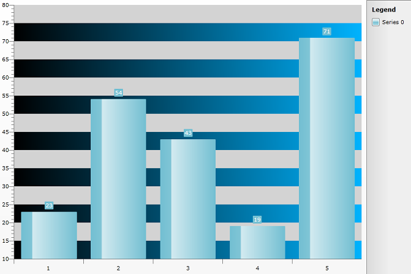

# Styling the Strip Lines


The strip lines are part of the axes items and are represented by the __StripLine and AlternateStripLine__ controls. There are two types of strip lines - Horizontal and Vertical. Each of them contains alternating Lines - one with Gray color by default (called __AlternateStripLine__) and the other is Transparent (called just __StripLine__). 

To be able to modify the colors of these lines you should use the following Styles:


```XAML
	<Style x:Key="HorizontalAlternateStripLineStyle" TargetType="Rectangle">
	    <Setter Property="Fill">
	        <Setter.Value>
	            <LinearGradientBrush SpreadMethod="Pad" StartPoint="0,1" EndPoint="1,0">
	                <GradientStop Offset="0" Color="Black" />
	                <GradientStop Offset="1" Color="#FF00B4FF" />
	            </LinearGradientBrush>
	        </Setter.Value>
	    </Setter>
	</Style>
```


```XAML
	<Style x:Key="HorizontalStripLineStyle" TargetType="Rectangle">
	    <Setter Property="Fill" Value="LightGray" />
	</Style>
```


>Set the created Styles to the __AxisY.AxisStyles__ (for modifying the color of the __Horizontal__ striplines) or __AxisX.AxisStyles__ (for __Vertical__ striplines) property of your RadChart like this:


```C#
	RadChart1.DefaultView.ChartArea.AxisY.AxisStyles.AlternateStripLineStyle = this.Resources["HorizontalAlternateStripLineStyle"] as Style;
	RadChart1.DefaultView.ChartArea.AxisY.AxisStyles.StripLineStyle = this.Resources["HorizontalStripLineStyle"] as Style;
```


```VB.NET
	RadChart1.DefaultView.ChartArea.AxisY.AxisStyles.AlternateStripLineStyle = TryCast(Me.Resources("HorizontalAlternateStripLineStyle"), Style)
	RadChart1.DefaultView.ChartArea.AxisY.AxisStyles.StripLineStyle = TryCast(Me.Resources("HorizontalStripLineStyle"), Style)
```


>tipYou should turn StripLines visibility on so that you will be able to see them.


```C#
	RadChart1.DefaultView.ChartArea.AxisY.StripLinesVisibility = System.Windows.Visibility.Visible;
```


```VB.NET
	RadChart1.DefaultView.ChartArea.AxisY.StripLinesVisibility = System.Windows.Visibility.Visible
```


Here is a snapshot of the result:

