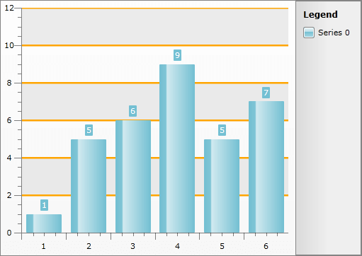

# Styling the GridLine


## 

The axis grid lines are part of the chart axis and are represented by the __Line__ control. To create a style for them in Expression Blend use a dummy control and after modifying it, set it to the __AxisStyles__ complex property of the __Axis__.

Open your __RadChart__ project in Expression Blend. To add the dummy __Line__ control you have to go to the XAML view. To do that select *View -> Active Document View -> XAML View* from the menu. Declare a __Line__ control in your XAML.

#### __XAML__

```XAML
	<Grid x:Name="LayoutRoot"
	      Background="White">
	    <!--...-->
	    <Line />
	</Grid>
```


To go back to the design view select *View -> Active Document View -> Design View* from the menu. In the 'Objects and Timeline' pane select the newly created __Line__ control. And select *Object -> Edit Style -> Create Empty* from the menu*. *You will be prompted for the name of the style and where to be placed within your application.

>tipIf you choose to define the style in Application, it would be available for the entire application. This allows you to define a style only once and then reuse it where needed.

After clicking the OK button, a style with target type __Line__ will be created and the properties for this type will be loaded in the 'Properties' pane. Modify them until you get the desired appearance.

After finishing with the changes, it is time to set the style. It can be set only through the procedural code, which means that you have to go to the Visual Studio and modify the code-behind file of your UserControl.

#### __C#__

```C#
	this.radChart.DefaultView.ChartArea.AxisX.AxisStyles.GridLineStyle = this.Resources["GridLineStyle"] as Style;
	this.radChart.DefaultView.ChartArea.AxisY.AxisStyles.GridLineStyle = this.Resources["GridLineStyle"] as Style;
```


#### __VB.NET__

```VB.NET
	Me.radChart.DefaultView.ChartArea.AxisX.AxisStyles.GridLineStyle = TryCast(Me.Resources("GridLineStyle"), Style)
	Me.radChart.DefaultView.ChartArea.AxisY.AxisStyles.GridLineStyle = TryCast(Me.Resources("GridLineStyle"), Style)
```


>tipTo show the grid lines for a particular axis you have to set its __MajorGridLinesVisibility__ property to __Visible__. Read more about grid lines [here]().

Here is a snapshot of the sample result.



Here is the final XAML for the __Style__:

#### __XAML__

```XAML
	<Style x:Key="GridLineStyle" TargetType="Line">
	    <Setter Property="Stroke" Value="Orange" />
	    <Setter Property="StrokeThickness" Value="5" />
	</Style>
```


## See Also

 * [Styling the StripLine]()

 * [Styling the Axis Item Label]()

 * [Styling the Axis Title]()
