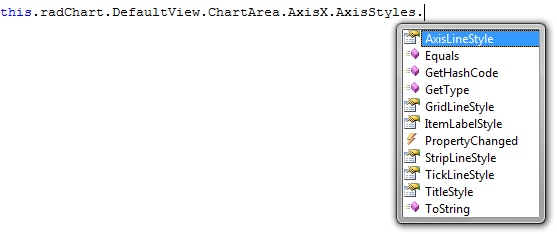

# Overview

## 

The __RadChart__ control allows you to easily style its axes via the __AxisStyles__ complex property of the __Axis__ class. You can easily access it in the code-behind:

         
      

The same applies for the y-axis.

The __AxisStyles__ complex property allows you to:

* [Style the Axis Line]()

* [Style the Axis Tick]()

* [Style the GridLine]()

* [Style the StripLine]()

* [Style the Axis Item Label]()

* [Style the Axis Title]()

# See Also

 * [Axes - Overview]()

 * [Styling and Appearance - Overview]()
