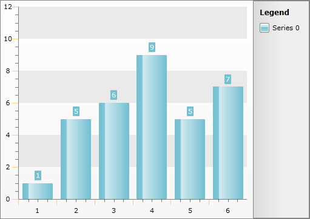

# Styling the Axis Tick


## 

>tip The approach below allow you more completely to change the appearance of the tick lines, but if you want to change only the color of it, you can use the __AxisElementBrush__ property of the __RadChart.Note__ that the value of this property will get applied to all of the axes and all of the tick lines as well.

The axis tick lines are part of the chart axis and are represented by the __Line__ control. To create a style for them in Expression Blend use a dummy control and after modifying it, set it to the __AxisStyles__ complex property of the __Axis__.

Open your __RadChart__ project in Expression Blend. To add the dummy __Line__ control you have to go to the XAML view. To do that select *View -> Active Document View -> XAML View *from the menu. Declare a __Line__ control in your XAML.


```XAML
	<Grid x:Name="LayoutRoot"
	      Background="White">
	    <!--...-->
	    <Line />
	</Grid>
```


To go back to the design view select *View -> Active Document View -> Design View* from the menu. In the 'Objects and Timeline' pane select the newly created __Line__ control. And select *Object -> Edit Style -> Create Empty* from the menu*. *You will be prompted for the name of the style and where to be placed within your application.

>tip If you choose to define the style in Application, it would be available for the entire application. This allows you to define a style only once and then reuse it where needed.

After clicking the OK button, a style with target type __Line__ will be created and the properties for this type will be loaded in the 'Properties' pane. Modify them until you get the desired appearance.

>Changing the StrokeThickness won't change anything, because of a modification to the Axis template that prevents line blurriness.

After finishing with the changes, it is time to set the style to the __TickLineStyle__ property. It can be set only through the procedural code, which means that you have to go to the Visual Studio and modify the code-behind file of your UserControl.


```C#
	this.radChart.DefaultView.ChartArea.AxisX.AxisStyles.TickLineStyle = this.Resources["AxisXTickStyle"] as Style;
	this.radChart.DefaultView.ChartArea.AxisY.AxisStyles.TickLineStyle = this.Resources["AxisYTickStyle"] as Style;
```
```VB.NET
	Me.RadChart.DefaultView.ChartArea.AxisX.AxisStyles.TickLineStyle = TryCast(Me.Resources("AxisXTickStyle"), Style)
	Me.RadChart.DefaultView.ChartArea.AxisY.AxisStyles.TickLineStyle = TryCast(Me.Resources("AxisYTickStyle"), Style)
```


>tip Setting the styles for the y-axis is done analogically via the __AxisY__ property of the __ChartArea__.

>tip To learn how to style the minor ticks take a look at the [Styling the Minor Tick]() topic.


Here is the final XAML for the __Styles__:


```XAML
	<Style x:Key="AxisXTickStyle" TargetType="Line">
	    <Setter Property="Stroke" Value="Orange" />
	</Style>
	<Style x:Key="AxisYTickStyle" TargetType="Line">
	    <Setter Property="Stroke" Value="Orange" />
	</Style>
```


## See Also

 * [Axes - Overview]()

 * [Styling the Axes - Overview]()

 * [Styling and Appearance - Overview]()

 * [Styling the Axis Line]()

 * [Styling the Axis Minor Tick]()
