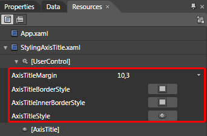
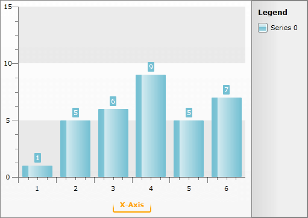

# Styling the Axis Title


## 

>tipThe approach below allow you more completely to change the appearance of the axis item label, but if you want to change only the foreground of it, you can use the __AxisForeground__ property of the __RadChart.Note__ that the value of this property will get applied to all of the axis item labels and all of the axis titles.

The axis title is part of the chart axis and is represented by the __AxisTitle__ control. To style it in Expression Blend use a dummy control to create the style and after modifying it, set it to the __RadChart__.

Open your __RadChart__ project in Expression Blend. On the same scene you should place a __AxisTitle__ control which will be used as a dummy. To do so choose the 'Assets' tab. From the 'Controls -> All' section select the __AxisTitle__ control.

With your mouse create a new instance of the control on the scene. Now select the newly created control and select *Object -> Edit Style -> Edit Copy* from the menu. You will be prompted for the name of the style and where to be placed within your application.

>tipIf you choose to define the style in Application, it would be available for the entire application. This allows you to define a style only once and then reuse it where needed.

After clicking the OK button a style with target type __AxisTitle__ will be created and the properties for this type will be loaded in the 'Properties' pane. Modify them until you get the desired appearance.

If you go to the 'Resources' pane you will see that two additional __Styles__ have been generated together with the one for the __AxisTitle__. They are for the borders which the __AxisTitle__ uses in its template. Clicking on their icons will allow you to modify them.



After finishing with the changes it is time to set the style. It can be set only through the procedural code, which means that you have to go to the Visual Studio and modify the code-behind file of your UserControl.


```C#
	this.radChart.DefaultView.ChartArea.AxisX.AxisStyles.TitleStyle = this.Resources["AxisTitleStyle"] as Style;
	this.radChart.DefaultView.ChartArea.AxisY.AxisStyles.TitleStyle = this.Resources["AxisTitleStyle"] as Style;
```


```VB.NET
	Me.radChart.DefaultView.ChartArea.AxisX.AxisStyles.TitleStyle = TryCast(Me.Resources("AxisTitleStyle"), Style)
	Me.radChart.DefaultView.ChartArea.AxisY.AxisStyles.TitleStyle = TryCast(Me.Resources("AxisTitleStyle"), Style)
```


>tipThe title for a particular axis can be set through its __Title__ property. Read more about axes [here]().



Here is the final XAML for the __Style__:


```XAML
	<Thickness x:Key="AxisTitleMargin">10,3,10,3</Thickness>
	<Style x:Key="AxisTitleBorderStyle" TargetType="Border">
	    <Setter Property="Margin" Value="0,5,0,0" />
	    <Setter Property="CornerRadius" Value="2" />
	    <Setter Property="BorderBrush">
	        <Setter.Value>
	            <LinearGradientBrush StartPoint="0.5,0" EndPoint="0.5,1">
	                <GradientStop Offset="0.3" Color="Transparent" />
	                <GradientStop Offset="0.7" Color="Orange" />
	            </LinearGradientBrush>
	        </Setter.Value>
	    </Setter>
	    <Setter Property="BorderThickness" Value="2,0,2,2" />
	</Style>
	<Style x:Key="AxisTitleInnerBorderStyle" TargetType="Border">
	    <Setter Property="CornerRadius" Value="1" />
	</Style>
	<Style x:Key="AxisTitleStyle" TargetType="telerik:AxisTitle">
	    <Setter Property="HorizontalAlignment" Value="Center" />
	    <Setter Property="VerticalAlignment" Value="Center" />
	    <Setter Property="Margin" Value="{StaticResource AxisTitleMargin}" />
	    <Setter Property="BorderStyle" Value="{StaticResource AxisTitleBorderStyle}" />
	    <Setter Property="InnerBorderStyle" Value="{StaticResource AxisTitleInnerBorderStyle}" />
	    <Setter Property="Template">
	        <Setter.Value>
	            <ControlTemplate TargetType="telerik:AxisTitle">
	                <Border Style="{TemplateBinding BorderStyle}">
	                    <Border Style="{TemplateBinding InnerBorderStyle}">
	                        <ContentControl Margin="{TemplateBinding Margin}"
	                                        Content="{TemplateBinding Content}"
	                                        FontFamily="{TemplateBinding FontFamily}"
	                                        FontSize="{TemplateBinding FontSize}"
	                                        Foreground="{TemplateBinding Foreground}" />
	                    </Border>
	                </Border>
	            </ControlTemplate>
	        </Setter.Value>
	    </Setter>
	    <Setter Property="Foreground" Value="Orange" />
	</Style>
```


## See Also

 * [Axes - Overview]()

 * [Styling Axes - Overview]()

 * [Styling and Appearance - Overview]()

 * [Styling the Chart Title]()
