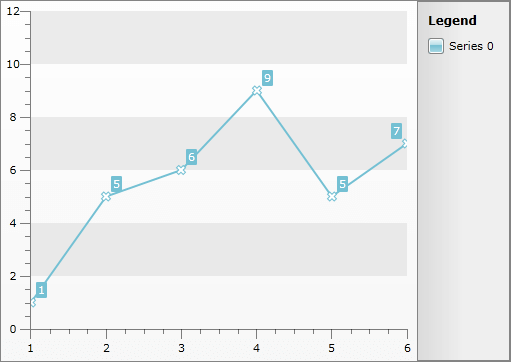

# Templating the Point Marks


## 

There is a set of predefined __PointMark__ shapes, but you are allowed to create your own via templating the __PointMark__ control. To learn more about the predefined shapes and how to manipulate them take a look at the [Chart Point Marks]() topic.

>tip To learn more about styling the point marks read [here]().

To template and change the shape of the mark point you have to use Expression Blend. Open the UserControl containing your __RadChart__ in it. You have to use a dummy control to create a template for the point mark. Go to the Assets tab and from Controls -> All select the __PointMark__ control. Draw an instance of it on the scene, next to your __RadChart__ control. Select the __PointMark__ control that you've just created and right-click on it. Form the context menu select Edit Template -> Edit a Copy. You will be prompted for the name of the style and where to be placed within your application.

>tip If you choose to define the style in Application, it would be available for the entire application. This allows you to define a style only once and then reuse it where needed.

After clicking the OK button, a style with target type __PointMark__ will be created and the Expression Blend will bring you into editing the control's template.

Take a look at the 'Objects and Timeline' pane. Select the __PART_PointMarkPath__. This path defines the shape of the point mark. If you want to change its shape, you have to set its __Data__ property to an appropriate value. Take a look at the generated XAML.


```XAML
	<Style x:Key="PointMarkStyle" TargetType="telerik:PointMark">
	    <Setter Property="Size" Value="10" />
	    <Setter Property="Template">
	        <Setter.Value>
	            <ControlTemplate TargetType="telerik:PointMark">
	                <Canvas>
	                    <Path x:Name="PART_PointMarkPath"
	                          Canvas.Left="{TemplateBinding PointMarkCanvasLeft}"
	                          Canvas.Top="{TemplateBinding PointMarkCanvasTop}"
	                          Width="{TemplateBinding Size}"
	                          Height="{TemplateBinding Size}"
	                          Stretch="Fill"
	                          Style="{TemplateBinding ShapeStyle}" />
	                </Canvas>
	            </ControlTemplate>
	        </Setter.Value>
	    </Setter>
	</Style>
```


You can see that the __Data__ property of the __Path__ is not set. Create the data for your custom shape and set it. Here is a sample data for the path.


```XAML
	<Path x:Name="PART_PointMarkPath"
	      Canvas.Left="{TemplateBinding PointMarkCanvasLeft}"
	      Canvas.Top="{TemplateBinding PointMarkCanvasTop}"
	      Width="{TemplateBinding Size}"
	      Height="{TemplateBinding Size}"
	      Data="F1 M 6.5,3.5 L 3.5,0.5 0.5,3.5 3.5,6.5 0.5,9.5 3.5,12.5 6.5,9.5 9.5,12.5 12.5,9.5 9.5,6.5 12.5,3.5 9.5,0.5 6.5,3.5 Z"
	      Stretch="Fill"
	      Style="{TemplateBinding ShapeStyle}" />
```


>tip To learn more about creating shapes via the Path class in SilverlightWPF read [here](http://msdn.microsoft.com/en-us/library/cc189041%28VS.95%29.aspx)[here](http://msdn.microsoft.com/en-us/library/ms752293.aspx).

After that set the created __PointMark__ style to the __DefaultSeriesDefinition__ of your __RadChart__ and delete the dummy controls.


```C#
	this.radChart.DefaultSeriesDefinition = new LineSeriesDefinition();
	this.radChart.DefaultSeriesDefinition.PointMarkItemStyle = this.Resources["PointMarkStyle"] as Style;
```
```VB.NET
	Me.radChart.DefaultSeriesDefinition = New LineSeriesDefinition()
	Me.radChart.DefaultSeriesDefinition.PointMarkItemStyle = TryCast(Me.Resources("PointMarkStyle"), Style)
```


Here is a snapshot of the result.



Here is the resulting XAML for the __PointMarkItem's Style__:


```XAML
	<Style x:Key="PointMarkStyle" TargetType="telerik:PointMark">
	    <Setter Property="Size" Value="10" />
	    <Setter Property="Template">
	        <Setter.Value>
	            <ControlTemplate TargetType="telerik:PointMark">
	                <Canvas>
	                    <Path x:Name="PART_PointMarkPath"
	                          Canvas.Left="{TemplateBinding PointMarkCanvasLeft}"
	                          Canvas.Top="{TemplateBinding PointMarkCanvasTop}"
	                          Width="{TemplateBinding Size}"
	                          Height="{TemplateBinding Size}"
	                          Data="F1 M 6.5,3.5 L 3.5,0.5 0.5,3.5 3.5,6.5 0.5,9.5 3.5,12.5 6.5,9.5 9.5,12.5 12.5,9.5 9.5,6.5 12.5,3.5 9.5,0.5 6.5,3.5 Z"
	                          Stretch="Fill"
	                          Style="{TemplateBinding ShapeStyle}" />
	                </Canvas>
	            </ControlTemplate>
	        </Setter.Value>
	    </Setter>
	</Style>
```