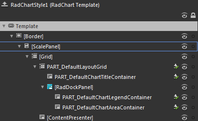
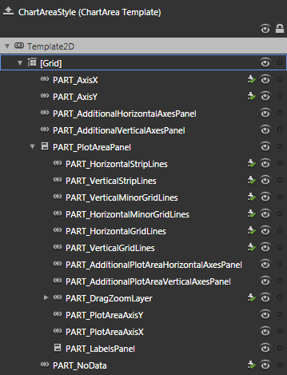

# Template Structure

Like most controls, the __RadChart__also allow you to template it in order to change the control from the inside. Except for templating the whole control, you can template only parts of it. This topic will make you familiar with the structure of the __RadChart's__ templates.

## RadChart

         
      

* __[Border]__ - represents the border around the __RadChart__ and is of type __Border__.

* __[Grid]__ - hosts the elements of the __RadChart__ template and is of type __Grid__.

* __PART_DefaultLayoutGrid__ - hosts the elements of the default layout and is of type __Grid__.

* __PART_DefaultChartTitleContainer__ - represents the container for the default title of the __RadChart__ and is of type __ContentPresenter__.

* __[RadDockPanel]__ - orders the containers for the chart area and the chart legend and is of type __RadDockPanel__.

* __PART_DefaultChartLegendContainer__ - represents the container for the default legend of the __RadChart__ and is of type __ContentPresenter__.

* __PART_DefaultChartAreaContainer__ - represents the container for the default chart area of the __RadChart__ and is of type __ContentPresenter__.

## Chart Area

         
      

* __[Grid]__ - hosts the elements of the __ChartArea's__ template and is of type __Grid__.

* __PART_AxisX__ - represents the x-axis of the __ChartArea__ and is of type __AxisX2D__.

* __PART_AxisY__ - represents the x-axis of the __ChartArea__ and is of type __AxisY2D__.

* __PART_AdditionalHorizontalAxesPanel__ - represents the container for the additional x-axes and is of type __AdditionalAxes2DContainer__.

* __PART_AdditionalVerticalAxesPanel__ - represents the container for the additional y-axes and is of type __AdditionalAxes2DContainer.__

* __PART_PloatAreaPanel__ - represents the container for the elements inside the plot area and is of type __ClipPanel__.

* __PART_HorizontalStripLines__ - represents the horizontal strip lines and is of type HorizontalStripLines2D.

* __PART_VerticalStripLines__ - represents the vertical strip lines and is of type __VerticalStripLines2D__.

* __PART_VerticalMinorGridLines__ - represents the vertical minor grid lines and is of type __VerticalMinorGridlines2D__.

* __PART_HorizontalMinorGridLines__ - represents the horizontal minor grid lines and is of type __HorizontalMinorGridlines2D__.

* __PART_AdditionalPlotAreaHorizontalAxesPanel__ - represents the container for the additional x-axes of the __PlotArea and is of type AdditionalPlotAreaAxes2DContainer__.

* __PART_AdditionalPlotAreaVerticalAxesPanel__ - represents the container for the additional y-axes of the __PlotArea__ and is of type __AdditionalPlotAreaAxes2DContainer__.

* __PART_DragZoomLayer__ - represents the control responsible for dragging and zooming inside the __PlotArea__ and is of type __DragZoomLayerControl__.

* __PART_PlotAreaAxisX__ - represents the x-axis of the __PlotArea__ and is of type __PlotAreaAxisX2D__.

* __PART_PlotAreaAxisY__ - represents the x-axis of the __PlotArea__ and is of type __PlotAreaAxisY2D__.

* __PART_LabelsPanel__ - represents the container for the labels inside the plot area and is of type __LabelsPanel__.

* __PART_NoData__ - represents the control that appears when the __RadCHart__ has no data and is of type __NoDataControl__.

## AxisX

* __[Grid]__ - hosts the elements of the __AxisX__ template and is of type __Grid__.

* __PART_AxisSlider__ - represents the slider, which implements the scrolling and the zooming functionality and is of type __RadSlider__.

* __PART_AxisLine__ - represents the line of the axis and is of type __Line__.

* __[ItemsPresenter]__

* __PART_MinorTickPoints__ - represents the axis' ticks and is of type __VerticalMinorTicks2D__.

* __PART_AxisLabels__ - represents the labels below the axis and is of type __HorizontalAxisLabels2D__.

* __[LayoutTransformControl]__

* __PART_AxisTitle__ - represents the axis title and is of type __AxisTitle__.

## AxisY

* __[Grid]__ - hosts the elements of the __AxisY__ template and is of type __Grid__.

* __[LayoutTransformControl]__

* __PART_AxisTitle__ - represents the axis title and is of type __AxisTitle__.

* __PART_AxisLine__ - represents the line of the axis and is of type __Line__.

* __PART_AxisSlider__ - represents the slider, which implements the scrolling and the zooming functionality and is of type __RadSlider__.

* __PART_AxisLabels__ - represents the labels below the axis and is of type __VerticalAxisLabels2D__.

* __[ItemsPresenter]__

* __PART_MinorTickPoints__ - represents the axis' ticks and is of type __HorizontalMinorTicks2D__.

# See Also

 * [Templating the Point Marks]()
