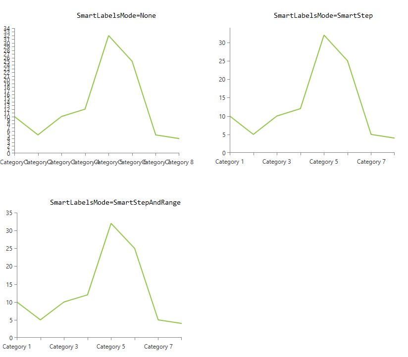
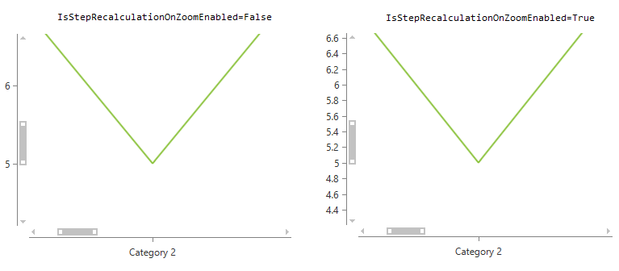

# Axis Smart Labels

The RadChartView suite supports couple of smart mechanisms which control the axis labels generation.
* `SmartLabelsMode`&mdash;If enabled this feature tells the chart to recalculate the actual step of its axis automatically in order to prevent the axis' labels from overlapping one another. The recalculation logic is executed on update of the chart's layout (like resizing).
* `IsStepRecalculationOnZoomEnabled`&mdash;If enabled this feature controls if the axis should recalculate the actual step it uses when the chart gets zoomed. 

>important By default both mechanisms are disabled. 

## Using the Smart Labels Mode

You can enable the smart labels mode by setting the `SmartLabelsMode` property of the axis.

__Setting the smart labels mode to SmartStep__
```XAML
	<telerik:RadCartesianChart.VerticalAxis>
		<telerik:LinearAxis SmartLabelsMode="SmartStep"/>
	</telerik:RadCartesianChart.VerticalAxis>
```

The `SmartLabelMode` property is of type `AxisSmartLabelsMode` enum and it determines the algorithm which should be used for generating the labels. The enumeration expose the following properties:

* `None` (default value)&mdash;Do not attempt to avoid overlapping labels
* `SmartStep`&mdash;The axis will choose a step (or a tick interval) in such a way that labels don’t overlap
* `SmartStepAndRange`&mdash;The axis will choose a step and range in such a way that labels don’t overlap. 
	
	>important `SmartStepAndRange` is supported only by the `LinearAxis` and `LogarithmicAxis`.
	
__Example illustrating the SmartStep mode applied on both chart axes (horizontal and vertical)__



__Example illustrating the SmartStepAndRange mode applied on the vertical axis__



## Disable the Step Recalculation on Zoom

The chart axis major step is automatically recalculated on zoom. To disable this, set the `IsStepRecalculationOnZoomEnabled` property of the axis to `False`.

__Disabling the automatic step recalculation on zoom__
```XAML
	<telerik:RadCartesianChart.VerticalAxis>
		<telerik:LinearAxis IsStepRecalculationOnZoomEnabled="False"/>
	</telerik:RadCartesianChart.VerticalAxis>
```

__Example illustrating how the IsStepRecalculationOnZoomEnabled property affects the axis (applied only on the vertical axis)__


This mechanism is __supported only by the chart's numeric axes__.

## See Also
* [Overview]()
* [Getting Started]()
* [Axis]()
