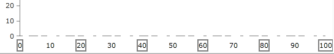

# Axis

The `RadCartesianChart` and `RadPolarChart` plot data points in a coordinate system defined by two axes. There are a few different types of axes and they are: __Linear__, __Logarithmic__, __DateTime__ and __Categorical__. This article discusses the common characteristics of the axes, as well as the specifics of the `LinerAxis`. The other types are discussed in their respective help articles.        

The chart axis is represented by the abstract `Axis` class and is responsible for displaying ticks that simply mark values on the axis at fixed positions. The axis also displays labels that are used to provide a visualization of the values at some or all of the ticks. The default visualization of the labels is text.        

## Common Axis Properties

The chart axes share a set of common features that can be used via the following properties:

* [PlotMode]() (supported by `Categorical` and `DateTimeCategoricalAxis`): RadChartView allows you to modify the layout of the axis to better fit the different chart types in the chart area.

* [LabelInterval](#label-interval): Specifies the value indicating that only one out of n-axis labels should be visible, where n is the value of the property.        

* [LabelFormat](#string-format): Format the text in the axis labels by specified [Standard](http://msdn.microsoft.com/en-us/library/az4se3k1.aspx) or [Custom Format Strings](http://msdn.microsoft.com/en-us/library/8kb3ddd4.aspx).  

* [LabelTemplate](#label-template): Allows you to set a `DataTemplate` used to customize the axis labels appearance.

* [LabelStyle](#label-style): Allows you to set a `Style` that will be applied to the default `TextBlock` visual. The `TargetType` of the style should be `TextBlock`. The `LabelStyle` property will be applied if the `LabelTemplate` is not set. Otherwise, the default `TextBlock` visual is replaced with a `ContentPresenter` and the style is no longer used.

* [MajorStep](#setting-the-step) (available for LinearAxis): Specify a step for the major ticks that determines at which values will major ticks be displayed. It is most commonly used with `Minimum` and `Maximum` properties.        

* [Minimum and Maximum](#setting-the-range-manually) (available for LinearAxis): Use to set the minimal and maximal value of the axis.

* [MajorTickOffset](#setting-the-step): It offsets the major ticks with "n" where "n" is the value of the property. For example, a `LinearAxis` with `MajorStep="2"` and `MajorTickOffset="3"` will have its values start at 6. (6, 8, 10 ... etc.)        

* `MajorTickInterval` (available for `CategoricalAxis` and `DateTimeCategoricalAxis`): Defines a value indicating that one axis label will be common for n number of Ticks where n is the value of the property.        

* `LabelRotationAngle`: Specifies the value indicating the rotation angle for the axis labels. Use when label texts are long and are overlapping each other. In order for the `LabelRotationAngle` property to take effect, the `LabelFitMode` should be set to `Rotate`.        

* `LastLabelVisibility`: Specifies whether the last label should be Clipped, Visible or Hidden.        

* [LabelFitMode](): The axis labels can be laid out in specific ways in order to improve their readability when they become too long and start to overlap each other. `LabelFitMode` positions the labels on different lines and the other fit mode rotates the labels some user defined degree so that they appear inclined or orthogonal to the axis, making them easier to read.        

	

* `ElementBrush`: A `Brush` typed property that colorizes all axis elements (line, ticks, labels and title) at once. You can see the property in action in the [Multiple Axes]() article.

* [SmartLabelsMode](): The property defines the algorithm used by the chart to recalculate the actual step of the axis. 

* [IsStepRecalculationOnZoomEnabled](): The property controls whether the chart should recalculate the actual step it uses when the chart gets zoomed.

* [TickOrigin](#setting-the-tick-origin) (available in `LinearAxis` and `DateTimeContinuousAxis`): Gets or sets a value that indicates where the ticks originate. The positions of the ticks are determined based on the combination of the `MajorStep` and `TickOrigin` values. The axis will generate the ticks and labels in a way so that a label is positioned at the given TickOrigin.

* [DesiredTickCount](#setting-the-desired-ticks-count) (available for `LinearAxis` and `LogarithmicAxis`): This property specifies the desired number of ticks to be drawn on the axis. 

The axis supports arbitrary visualization of the ticks and labels through `DataTemplate` objects. Also, it supports a dash array and a stroke color for the visualization of the axis line. For increased flexibility, the label templates can be selected dynamically with a template selector, as shown in the following examples:

__Setting LabelTemplateSelector of a LinearAxis__
```XAML
	<Grid.Resources>
	   <DataTemplate x:Key="GrayTemplate">
	       <Border BorderThickness="2"
	               BorderBrush="Gray">
	           <TextBlock Text="{Binding}"/>
	       </Border>
	   </DataTemplate>
	   <DataTemplate x:Key="WhiteTemplate">
	       <Border BorderThickness="2"
	               BorderBrush="White">
	           <TextBlock Text="{Binding}"/>
	       </Border>
	   </DataTemplate>
	
	   <local:BinaryTemplateSelector x:Key="Selector"
	                                 Template1="{StaticResource GrayTemplate}"
	                                 Template2="{StaticResource WhiteTemplate}"/>
	</Grid.Resources>
	
	<telerik:RadCartesianChart x:Name="chart">
	    <telerik:RadCartesianChart.HorizontalAxis>
	         <telerik:LinearAxis Maximum="100"
	                           LineStroke="Gray"
	                           LineDashArray="5, 10, 15"
	                           TickThickness="5"
	                           LabelTemplateSelector="{StaticResource Selector}">
	            <telerik:LinearAxis.MajorTickTemplate>
	                <DataTemplate>
	                    <Ellipse Fill="White"/>
	                </DataTemplate>
	            </telerik:LinearAxis.MajorTickTemplate>
	         </telerik:LinearAxis>
	    </telerik:RadCartesianChart.HorizontalAxis>
	
	    <telerik:RadCartesianChart.VerticalAxis>
	        <telerik:LinearAxis Maximum="100"/>
	    </telerik:RadCartesianChart.VerticalAxis>
	</telerik:RadCartesianChart>
```

__BinaryTemplateSelector Definition__
```C#
	public class BinaryTemplateSelector : DataTemplateSelector
	{
	    public DataTemplate Template1
	    {
	        get;
	        set;
	    }
	    public DataTemplate Template2
	    {
	        get;
	        set;
	    }
	    public override DataTemplate SelectTemplate(object item, DependencyObject container)
	    {
	        DataTemplate tmp = this.Template1;
	        this.Template1 = this.Template2;
	        this.Template2 = tmp;
	        return tmp;
	    }
	}
```
```VB.NET
	Public Class BinaryTemplateSelector
	    Inherits DataTemplateSelector
	    Private _template1 As DataTemplate
	    Private _template2 As DataTemplate
	
	    Public Property Template1 As DataTemplate
	        Get
	            Return Me._template1
	        End Get
	        Set(value As DataTemplate)
	            Me._template1 = value
	        End Set
	    End Property
	    Public Property Template2 As DataTemplate
	        Get
	            Return Me._template2
	        End Get
	
	        Set(value As DataTemplate)
	            Me._template2 = value
	        End Set
	    End Property
	    Public Overrides Function SelectTemplate(item As Object, container As System.Windows.DependencyObject) As System.Windows.DataTemplate
	        Dim tmp As DataTemplate
	        tmp = Me.Template1
	        Me.Template1 = Me.Template2
	        Me.Template2 = tmp
	        Return tmp
	    End Function
	End Class
```



## Getting the Axis Actual Range

The range of the chart's continuous axes (LinearAxis, LogarithmicAxis and DateTimeContinuousAxis) can be [adjusted manually](#actual-range) by the `Minimum` and `Maximum` properties. If they are not set the axis range is calculated manually. In this case its range can be get from several properties and events exposed by the axis.

* `ActualRange`&mdash;The property returns an object of type `ValueRange<T>` that contains the actual visible range of the axis. This is the range visible in the plot area of the control. The `ActualVisibleRange` will be different than the `ActualRange` when you zoom-in the chart. See also the `ActualRangeChanged` event in the [Common Events](#common-events) section of this article.

* `ActualVisibleRange`&mdash;The property returns an object of type `ValueRange<T>` that contains the the actual range of the axis - minimum and maximum. See also the `ActualVisibleRangeChanged` event in the [Common Events](#common-events) section of this article.

* `ActualMajorStep`&mdash;The property returns a numeric value that determines the actual major step of the axis. Available only for `LinearAxis`. See also the `ActualMajorStepChanged` event in the [Common Events](#common-events) section of this article.

## Common Events

There are several common events exposed by the different type of axes.

* `ActualRangeChanged`&mdash;Occurs when the actual range changes. The event arguments are of type `NumericalRangeChangedEventArgs` and expose the following properties:
	* `NewRange`&mdash;A property of type `ValueRange<double>` that gets the new range of the axis.
	* `PreviousRange`&mdash;A property of type `ValueRange<double>` that gets the previous range of the axis.
	
* `ActualVisibleRangeChanged`&mdash;Occurs when the actual visible range changes. The event arguments are of type `NumericalRangeChangedEventArgs` and expose the following properties:
	* `NewRange`&mdash;A property of type `ValueRange<double>` that gets the new visible range of the axis.
	* `PreviousRange`&mdash;A property of type `ValueRange<double>` that gets the visible previous range of the axis.

The `ActualRangeChanged` and `ActualVisibleRangeChanged` events are exposed only by the chart's numeric axes: `LinearAxis`, `LogarithmicAxis` and `DateTimeContinuousAxis`.

* `ActualMajorStepChanged`&mdash;Occurs when the actual major step of the axis gets changed. The event arguments are of type `EventArgs`. This event is __exposed only by the `LinearAxis` class__.
	
## See Also
* [Getting Started]()
* [Events]()
* [Create Data-Bound Chart]()
