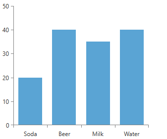
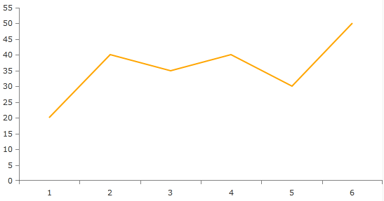
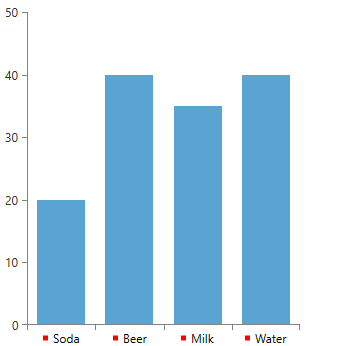

# Categorical Axis

The categorical axis displays a set of categories. The values for each category do not define the order in which they appear. Here is an example of a categorical axis with a few data points.

__Example 1: Chart with categorical axis__
```XAML
	<telerik:RadCartesianChart>
		<telerik:RadCartesianChart.HorizontalAxis>
			<telerik:CategoricalAxis/>
		</telerik:RadCartesianChart.HorizontalAxis>

		<telerik:RadCartesianChart.VerticalAxis>
			<telerik:LinearAxis/>
		</telerik:RadCartesianChart.VerticalAxis>

		<telerik:RadCartesianChart.Series>
			<telerik:BarSeries>
				<telerik:BarSeries.DataPoints>
					<telerik:CategoricalDataPoint Category="Soda" Value="20"/>
					<telerik:CategoricalDataPoint Category="Beer" Value="40"/>
					<telerik:CategoricalDataPoint Category="Milk" Value="35"/>
					<telerik:CategoricalDataPoint Category="Water" Value="40"/>
				</telerik:BarSeries.DataPoints>
			</telerik:BarSeries>
		</telerik:RadCartesianChart.Series>
	</telerik:RadCartesianChart>
```

#### __Figure 1: Result from Example 1__


If a data point category is not defined, the series will set a category automatically. The category will be a numeric value determined by the position of the data point in the data source. For example, "1", "2", "3",etc."

__Example 2: Chart with no category defined for datapoints__
```XAML
	<telerik:RadCartesianChart x:Name="chart">
	   <telerik:RadCartesianChart.HorizontalAxis>
	      <telerik:CategoricalAxis/>
	   </telerik:RadCartesianChart.HorizontalAxis>

	   <telerik:RadCartesianChart.VerticalAxis>
	      <telerik:LinearAxis/>
	   </telerik:RadCartesianChart.VerticalAxis>
	
	   <telerik:RadCartesianChart.Series>
	      <telerik:LineSeries Stroke="Orange"
	                        StrokeThickness="2">
	      <telerik:LineSeries.DataPoints>
	         <telerik:CategoricalDataPoint Value="20"/>
	         <telerik:CategoricalDataPoint Value="40"/>
	         <telerik:CategoricalDataPoint Value="35"/>
	         <telerik:CategoricalDataPoint Value="40"/>
	         <telerik:CategoricalDataPoint Value="30"/>
	         <telerik:CategoricalDataPoint Value="50"/>
	      </telerik:LineSeries.DataPoints>
	   </telerik:LineSeries>
	</telerik:RadCartesianChart.Series>
```

#### __Figure 2: Result from Example 2__


You can customize the CategoricalAxis by utilizing its **LabelTemplate** property. Here is a simple implementation of a rectangle added in the LabelTemplate.

__Example 3: CategoricalAxis with LabelTemplate__
```XAML
	<Grid>
        <Grid.Resources>
            <DataTemplate x:Key="LabelTemplate" DataType="{x:Type telerik:CategoricalAxis}">
                <StackPanel Orientation="Horizontal">
                    <Rectangle Fill="Red" Width="5" Height="5" />
                    <TextBlock Text="{Binding}" Margin="5 0 0 0" />
                </StackPanel>
            </DataTemplate>
        </Grid.Resources>

        <telerik:RadCartesianChart x:Name="RadChart">
            <telerik:RadCartesianChart.HorizontalAxis>
                <telerik:CategoricalAxis LabelTemplate="{StaticResource LabelTemplate}" />
            </telerik:RadCartesianChart.HorizontalAxis>

            <telerik:RadCartesianChart.VerticalAxis>
                <telerik:LinearAxis/>
            </telerik:RadCartesianChart.VerticalAxis>

            <telerik:RadCartesianChart.Series>
                <telerik:BarSeries>

                    <telerik:BarSeries.DataPoints>
                        <telerik:CategoricalDataPoint Category="Soda" Value="20"/>
                        <telerik:CategoricalDataPoint Category="Beer" Value="40"/>
                        <telerik:CategoricalDataPoint Category="Milk" Value="35"/>
                        <telerik:CategoricalDataPoint Category="Water" Value="40"/>
                    </telerik:BarSeries.DataPoints>

                </telerik:BarSeries>
            </telerik:RadCartesianChart.Series>
        </telerik:RadCartesianChart>
    </Grid>
```

#### __Figure 3: Result from Example 3__


## See Also
* [Getting Started]()
* [Axes]()
* [Axis Smart Labels]()