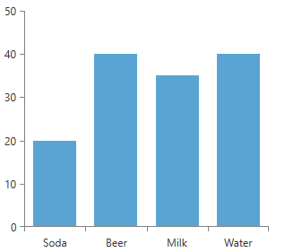
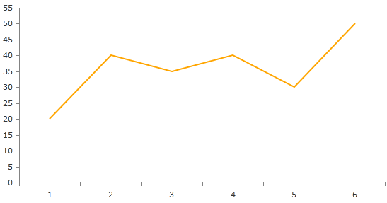
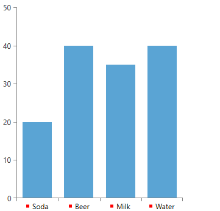

# Categorical Axis

The categorical axis displays a set of categories. The values for each category do not define the order in which they appear. Here is an example of a categorical axis with a few data points.

__Example 1: Chart with categorical axis__
<snippet id='radchartview-axes-categoricalaxis-example_1_chart_with_categorical_axis-xaml' />

#### __Figure 1: Result from Example 1__

If a data point category is not defined, the series will set a category automatically. The category will be a numeric value determined by the position of the data point in the data source. For example, "1", "2", "3",etc."

__Example 2: Chart with no category defined for datapoints__
<snippet id='radchartview-axes-categoricalaxis-example_2_chart_with_no_category_defined_for_datapoints-xaml' />

#### __Figure 2: Result from Example 2__

You can customize the CategoricalAxis by utilizing its **LabelTemplate** property. Here is a simple implementation of a rectangle added in the LabelTemplate.

__Example 3: CategoricalAxis with LabelTemplate__
<snippet id='radchartview-axes-categoricalaxis-example_3_categoricalaxis_with_labeltemplate-xaml' />

#### __Figure 3: Result from Example 3__

## See Also
* [Getting Started]()
* [Axes]()
* [Axis Smart Labels]()