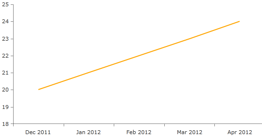

# Date Time Axes

## 

__Date Time Continuous Axis__

The DateTime continuous axis is like a numerical axis but the axis value range consists of DateTime values which are always sorted chronologically. Here is an example XAML snippet that demonstrates how to create a date time continuous axis:
        

#### __XAML__

{{region radchart-axes-datetimeaxes_0}}
	<telerik:RadCartesianChart x:Name="chart">
	   <telerik:RadCartesianChart.HorizontalAxis>
	      <telerik:DateTimeContinuousAxis LabelFitMode="MultiLine"
	                                    LabelFormat="MMM yyyy"/>
	   </telerik:RadCartesianChart.HorizontalAxis>
	
	   <telerik:RadCartesianChart.VerticalAxis>
	      <telerik:LinearAxis/>
	   </telerik:RadCartesianChart.VerticalAxis>
	
	   <telerik:RadCartesianChart.Series>
	      <telerik:LineSeries Stroke="Orange"
	                        StrokeThickness="2"/>
	   </telerik:RadCartesianChart.Series> 						
	</telerik:RadCartesianChart>
	{{endregion}}

Below is the binding logic:
        

#### __C#__

{{region radchart-axes-datetimeaxes_1}}
	public MainPage()
	{
	    InitializeComponent();
	    DateTime lastDate = DateTime.Now;
	    double lastVal = 20;
	
	    List<ChartDataObject> dataSouce = new List<ChartDataObject>();
	    for (int i = 0; i < 5; ++i)
	    {
	        ChartDataObject obj = new ChartDataObject { Date = lastDate.AddMonths(1), Value = lastVal++ };
	        dataSouce.Add(obj);
	        lastDate = obj.Date;
	    }
	    LineSeries series = (LineSeries)this.chart.Series[0];
	    series.CategoryBinding = new PropertyNameDataPointBinding() { PropertyName = "Date" };
	    series.ValueBinding = new PropertyNameDataPointBinding() { PropertyName = "Value" };
	
	    series.ItemsSource = dataSouce;
	}
	{{endregion}}

#### __VB.NET__

{{region radchart-axes-datetimeaxes_2}}
	Public Sub New()
	   InitializeComponent()
	
	   Dim lastDate As DateTime = DateTime.Now
	   Dim lastVal As Double = 20
	
	   Dim dataSource As List(Of ChartDataObject) = New List(Of ChartDataObject)
	   For i As Integer = 0 To 5 Step 1
	      Dim obj As ChartDataObject = New ChartDataObject
	      obj.Date = lastDate.AddMonths(1)
	      obj.Value = lastVal
	
	      lastVal += 1
		  dataSouce.Add(obj)
	      lastDate = obj.Date
	   Next
	
	   Dim series As LineSeries = DirectCast(Me.chart.Series(0), LineSeries)
	
	   Dim categoryBinding As PropertyNameDataPointBinding = New PropertyNameDataPointBinding
	   categoryBinding.PropertyName = "Date"
	
	   Dim valueBinding As PropertyNameDataPointBinding = New PropertyNameDataPointBinding
	   valueBinding.PropertyName = "Value"
	
	   series.CategoryBinding = categoryBinding
	   series.ValueBinding = valueBinding
	   series.ItemsSource = dataSource
	End Sub
	{{endregion}}

And finally the definition of the ChartDataObject class:
        

#### __C#__

{{region radchart-axes-datetimeaxes_3}}
	public class ChartDataObject
	{
	    public DateTime Date
	    {
	        get;
	        set;
	    }
	    public double Value
	    {
	        get;
	        set;
	    }
	}
	{{endregion}}

#### __VB.NET__

{{region radchart-axes-datetimeaxes_4}}
	Public Class ChartDataObject
	    Dim _date As Date
	    Dim _value As Double
	
	    Public Property [Date]() As DateTime
	        Get
	            Return Me._date
	        End Get
	        Set(value As DateTime)
	            Me._date = value
	        End Set
	    End Property
	
	    Public Property Value() As Double
	        Get
	            Return Me._value
	        End Get
	        Set(value As Double)
	            Me._value = value
	        End Set
	    End Property
	End Class
	{{endregion}}

__Date Time Categorical Axis__

The DateTime categorical axis is a categorical axis with Date-Time values which are sorted chronologically and is represented by the DateTimeCategoricalAxis class. It also allows definition of categories based on specific date time components. For example if such an axis displays a range of one year, the data points can be plotted in categories for each month. If the range is one month, the values may be categorized by day and so on. Here is an example that uses the date time categorical axis:
        

#### __XAML__

{{region radchart-axes-datetimeaxes_5}}
	<telerik:RadCartesianChart x:Name="chart">
	   <telerik:RadCartesianChart.HorizontalAxis>
	      <telerik:DateTimeCategoricalAxis LabelFitMode="MultiLine"
	                                     LabelFormat="MMM yyyy"
	                                     DateTimeComponent="Month"/>
	   </telerik:RadCartesianChart.HorizontalAxis>
	
	   <telerik:RadCartesianChart.VerticalAxis>
	      <telerik:LinearAxis/>
	   </telerik:RadCartesianChart.VerticalAxis>
	
	   <telerik:RadCartesianChart.Series>
	      <telerik:LineSeries Stroke="Orange"
	                        StrokeThickness="2"/>
	
	   </telerik:RadCartesianChart.Series>
	</telerik:RadCartesianChart>
	{{endregion}}

