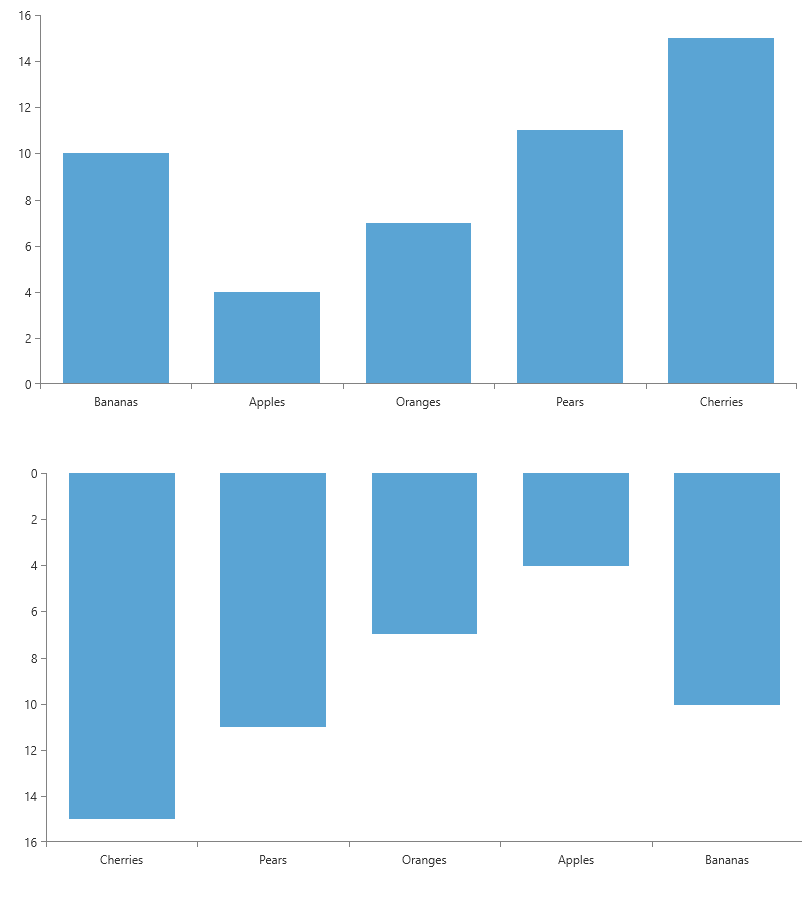

# Invert Axis Range

The chart axis range is moving from left to right when horizontal and from bottom to top when vertical.

The axis range direction can be changed by setting the `IsInverse` property of the corresponding chart axis.


```XAML
	<telerik:RadCartesianChart>
		<telerik:RadCartesianChart.HorizontalAxis>
			<telerik:CategoricalAxis IsInverse="True"/>
		</telerik:RadCartesianChart.HorizontalAxis>	
		<telerik:RadCartesianChart.VerticalAxis>
			<telerik:LinearAxis IsInverse="True"/>
		</telerik:RadCartesianChart.VerticalAxis>	
		<telerik:RadCartesianChart.Series>
			<telerik:BarSeries>
				<telerik:BarSeries.DataPoints>
					<telerik:CategoricalDataPoint Value="10" Category="1"/>
					<telerik:CategoricalDataPoint Value="4" Category="2"/>
					<telerik:CategoricalDataPoint Value="7" Category="3"/>
					<telerik:CategoricalDataPoint Value="11" Category="4"/>
					<telerik:CategoricalDataPoint Value="15" Category="5"/>
				</telerik:BarSeries.DataPoints>
			</telerik:BarSeries>
		</telerik:RadCartesianChart.Series>
	</telerik:RadCartesianChart>
```

The following picture shows two charts - one with the default range direction (on the top) and another with inverted axes ranges (on the bottom).


