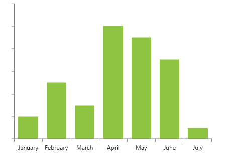
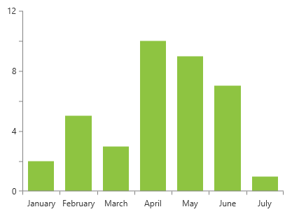
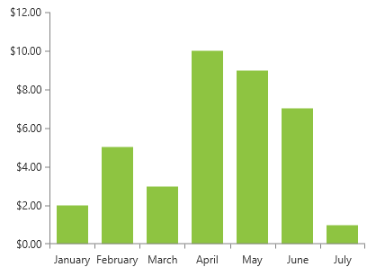
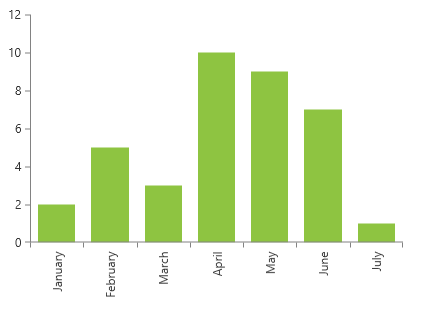
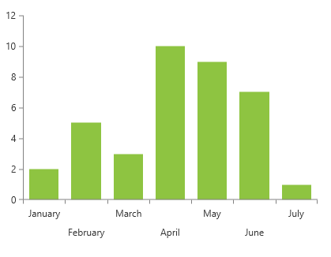
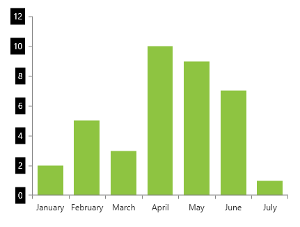
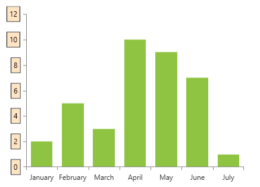

# Customizing Axis Labels

The axis labels are automatically generated based on the plotted data and the axis range. The chart allows you to customize their appearance.

## Hiding Labels 

To hide the axis labels, set the `ShowLabels` property to `False`.

__Setting ShowLabels__
```XAML
	<telerik:RadCartesianChart.VerticalAxis>
		<telerik:LinearAxis ShowLabels="False" />
	</telerik:RadCartesianChart.VerticalAxis>
```

__Vertical axis with hidden labels__  



## Label Interval

The axis labels are positioned on each tick plotted on the axis. To change this, set the `LabelInterval` property of the associated axis.

__Setting LabelInterval__
```XAML
	<telerik:RadCartesianChart.VerticalAxis>
		<telerik:LinearAxis LabelInterval="2" />
	</telerik:RadCartesianChart.VerticalAxis>
```

__Vertical axis with label interval set to 2__  



## String Format 

To adjust the string format of the labels, set the `LabelFormat` property.

__Setting LabelFormat__
```XAML
	<telerik:RadCartesianChart.VerticalAxis>
		<telerik:LinearAxis LabelFormat="C" />
	</telerik:RadCartesianChart.VerticalAxis>
```

__Vertical axis labels formatted using the currency format C__  



## Rotation

To rotate the axis labels, set the `LabelFitMode` property to `Rotate`. This will rotate to labels to a predefined angle. To change the angle, set the `LabelRotationAngle` property. 

In order for the `LabelRotationAngle` property to take effect, the `LabelFitMode` should be set to `Rotate`.

__Setting LabelFitMode to Rotate__
```XAML
	<telerik:RadCartesianChart.HorizontalAxis>
		<telerik:CategoricalAxis LabelFitMode="Rotate" LabelRotationAngle="-90"/>
	</telerik:RadCartesianChart.HorizontalAxis>
```

__Horizontal axis labels rotated by 90 degrees__  



## Multi-line Mode

To arrange the labels on different vertical positions that mimics multi-line layout, set the `LabelFitMode` property to `MultiLine`. 

__Setting LabelFitMode to MultiLine__
```XAML
	<telerik:RadCartesianChart.HorizontalAxis>
		<telerik:CategoricalAxis LabelFitMode="MultiLine" />
	</telerik:RadCartesianChart.HorizontalAxis>
```

__Horizontal axis with multi-line labels__  



## Smart Labels

The axis smart labels feature allows you to avoid situations where the axis has too many labels and they start to overlap one another. The smart mode will try to auto-calculate such label interval that no labels overlap. To enable it, set the `SmartLabelsMode` property of the axis. Read more in the [Axis Smart Labels] article.

## Label Style

The default visual element of the axis labels is `TextBlock`. To customize its appearance, set the axis' `LabelStyle` property. The `TargetType` of the `Style` object should target the `TextBlock` class.

__Setting LabelStyle__
```XAML
	<telerik:RadCartesianChart.VerticalAxis>
		<telerik:LinearAxis>
			<telerik:LinearAxis.LabelStyle>
				<Style TargetType="TextBlock">
					<Setter Property="Foreground" Value="White" />
					<Setter Property="Background" Value="Black" />
					<Setter Property="Padding" Value="4" />
					<Setter Property="Margin" Value="0 0 5 0" />
				</Style>
			</telerik:LinearAxis.LabelStyle>
		</telerik:LinearAxis>
	</telerik:RadCartesianChart.VerticalAxis>
```

__Vertical axis with custom label style__  



## Label Template

To replace the default visual element of the axis labels, set the axis' `LabelTemplate` property.

__Setting LabelTemplate__
```XAML
	<telerik:RadCartesianChart.VerticalAxis>
		<telerik:LinearAxis>
			<telerik:LinearAxis.LabelTemplate>
				<DataTemplate>
					<Border BorderBrush="Black" BorderThickness="1" Background="Bisque" Margin="0 0 5 0">                               
						<TextBlock Padding="4" Text="{Binding}"/>
					</Border>
				</DataTemplate>
			</telerik:LinearAxis.LabelTemplate>
		</telerik:LinearAxis>
	</telerik:RadCartesianChart.VerticalAxis>
```

__Vertical axis with custom label template__  



## Label Template Selector

To replace the default visual element of the axis labels with different elements based on a condition, use the `LabelTemplateSelector` property of the axis. The following example shows how to define a [DataTemplateSelector](https://docs.microsoft.com/en-us/dotnet/api/system.windows.controls.datatemplateselector?view=windowsdesktop-6.0) and use it to choose between two different DataTemplates.

__Defining the view__
```XAML
	<Grid.Resources>
	   <DataTemplate x:Key="GrayTemplate">
	       <Border BorderThickness="2"
	               BorderBrush="Gray">
	           <TextBlock Text="{Binding}"/>
	       </Border>
	   </DataTemplate>
	   <DataTemplate x:Key="WhiteTemplate">
	       <Border BorderThickness="2"
	               BorderBrush="White">
	           <TextBlock Text="{Binding}"/>
	       </Border>
	   </DataTemplate>
	
	   <local:BinaryTemplateSelector x:Key="Selector"
	                                 Template1="{StaticResource GrayTemplate}"
	                                 Template2="{StaticResource WhiteTemplate}"/>
	</Grid.Resources>
	
	<telerik:RadCartesianChart x:Name="chart">
	    <telerik:RadCartesianChart.HorizontalAxis>
	         <telerik:LinearAxis Maximum="100"
	                           LineStroke="Gray"
	                           LineDashArray="5, 10, 15"
	                           TickThickness="5"
	                           LabelTemplateSelector="{StaticResource Selector}">
	            <telerik:LinearAxis.MajorTickTemplate>
	                <DataTemplate>
	                    <Ellipse Fill="White"/>
	                </DataTemplate>
	            </telerik:LinearAxis.MajorTickTemplate>
	         </telerik:LinearAxis>
	    </telerik:RadCartesianChart.HorizontalAxis>
	
	    <telerik:RadCartesianChart.VerticalAxis>
	        <telerik:LinearAxis Maximum="100"/>
	    </telerik:RadCartesianChart.VerticalAxis>
	</telerik:RadCartesianChart>
```

__Defining the template selector__
```XAML
	public class BinaryTemplateSelector : DataTemplateSelector
	{
	    public DataTemplate Template1
	    {
	        get;
	        set;
	    }
	    public DataTemplate Template2
	    {
	        get;
	        set;
	    }
	    public override DataTemplate SelectTemplate(object item, DependencyObject container)
	    {
	        DataTemplate tmp = this.Template1;
	        this.Template1 = this.Template2;
	        this.Template2 = tmp;
	        return tmp;
	    }
	}
```

__Horizontal axis with customized labels and ticks__  


## See Also
* [Getting Started]()
* [Events]()
* [Create Data-Bound Chart]()
