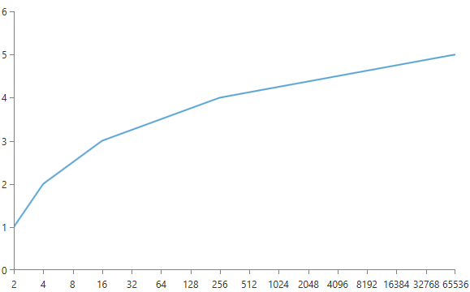
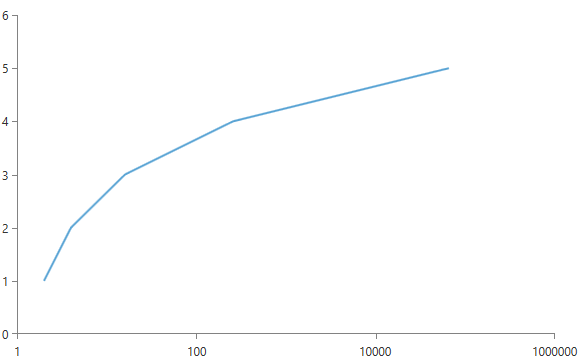

# Logarithmic Axis

In a logarithmic axis the value of each consecutive tick is *X* times higher than the previous value. You can control how much higher each value is with the __LogarithmBase__ property. Another important property that the logarithmic axis exposes in addition to the common properties for all [axes]() is the __ExponentStep__. The default value for the ExponentStep is __1__ and the default value for the LogarithmBase is __10__.

__Example 1: Setting the LogarithmBase property__

```XAML
	<telerik:RadCartesianChart x:Name="chart">
		<telerik:RadCartesianChart.HorizontalAxis>
			<telerik:LogarithmicAxis LogarithmBase="2" />
		</telerik:RadCartesianChart.HorizontalAxis>
		
		<telerik:RadCartesianChart.VerticalAxis>
			<telerik:LinearAxis/>
		</telerik:RadCartesianChart.VerticalAxis>
		
		<telerik:ScatterLineSeries>
			<telerik:ScatterLineSeries.DataPoints>
				<telerik:ScatterDataPoint XValue="2"
											YValue="1"/>
				<telerik:ScatterDataPoint XValue="4"
											YValue="2"/>
				<telerik:ScatterDataPoint XValue="16"
											YValue="3"/>
				<telerik:ScatterDataPoint XValue="256"
											YValue="4"/>
				<telerik:ScatterDataPoint XValue="65536"
											YValue="5"/>
			</telerik:ScatterLineSeries.DataPoints>
		</telerik:ScatterLineSeries>
	</telerik:RadCartesianChart>
```

#### Figure 1: Result from Example 1


__Example 2: Setting the ExponentStep property__
```XAML
	<telerik:RadCartesianChart x:Name="chart">
		<telerik:RadCartesianChart.HorizontalAxis>
			<telerik:LogarithmicAxis ExponentStep="2" />
		</telerik:RadCartesianChart.HorizontalAxis>
		
		<telerik:RadCartesianChart.VerticalAxis>
			<telerik:LinearAxis/>
		</telerik:RadCartesianChart.VerticalAxis>
		
		<telerik:ScatterLineSeries>
			<telerik:ScatterLineSeries.DataPoints>
				<telerik:ScatterDataPoint XValue="2"
											YValue="1"/>
				<telerik:ScatterDataPoint XValue="4"
											YValue="2"/>
				<telerik:ScatterDataPoint XValue="16"
											YValue="3"/>
				<telerik:ScatterDataPoint XValue="256"
											YValue="4"/>
				<telerik:ScatterDataPoint XValue="65536"
											YValue="5"/>
			</telerik:ScatterLineSeries.DataPoints>
		</telerik:ScatterLineSeries>
	</telerik:RadCartesianChart>
```

#### Figure 2: Result from Example 2
