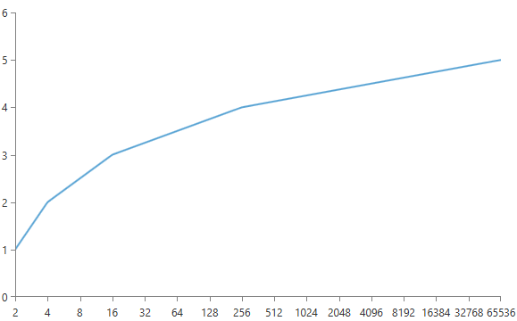
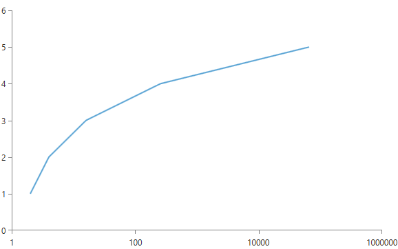

# Logarithmic Axis

In a logarithmic axis the value of each consecutive tick is *X* times higher than the previous value. You can control how much higher each value is with the __LogarithmBase__ property. Another important property that the logarithmic axis exposes in addition to the common properties for all [axes]() is the __ExponentStep__. The default value for the ExponentStep is __1__ and the default value for the LogarithmBase is __10__.

__Example 1: Setting the LogarithmBase property__

<snippet id='radchartview-axes-logarithmicaxis-example_1_setting_the_logarithmbase_property-xaml' />

#### Figure 1: Result from Example 1

__Example 2: Setting the ExponentStep property__
<snippet id='radchartview-axes-logarithmicaxis-example_2_setting_the_exponentstep_property-xaml' />

#### Figure 2: Result from Example 2
