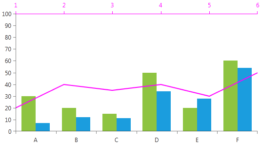
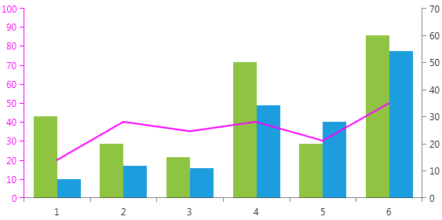

# Multiple Axes

## 

Since Q1 2012 RadChartView supports multiple axes. It may be required when series of a different scale should be presented on the same graph.
        Additional horizontal / vertical axes can be specified through the CartesianSeries.HorizontalAxis / VerticalAxis properties.

This help article will demonstrate the different scenarios in which you may use the multiple axes feature.

* [Two Vertical Axes](#Two_Vertical_Axes)

* [Two Horizontal Axes](#Two_Horizontal_Axes)

* [Shared Horizontal Axis](#Shared_Horizontal_Axis)

* [Shared Vertical Axis](#Shared_Vertical_Axis)

>You may have both multiple Vertical and multiple Horizontal axes in the same chart.
        There is no limit in the number of the axes that can be used.

It is now easier than ever to customize each axis separately.
        For example you may colorize all axis elements (line, ticks, labels and title) simultaneously with a single __Axis.ElementBrush__ property.
        You may also specify the position of horizontal / vertical axes through the __Axis.HorizontalLocation__ / __VerticalLocation__
        enumeration properties respectively. The usage of these properties is shown in the scenarios below.Two Vertical Axes

This is one of the most common scenarios - two or more chart series that have a common Vertical Axis.
              Please take a look at the following example where two line series has their own vertical axis and share a common horizontal axis.
              

#### __XAML__

{{region radchart-axes-multipleaxes_0}}
	 <telerik:RadCartesianChart>
		<telerik:RadCartesianChart.HorizontalAxis>
			<telerik:CategoricalAxis/>
		</telerik:RadCartesianChart.HorizontalAxis>
	
		<telerik:RadCartesianChart.VerticalAxis>
			<telerik:LinearAxis Maximum="100" ElementBrush="Orange"/>
		</telerik:RadCartesianChart.VerticalAxis>
		<telerik:RadCartesianChart.Series>
			<telerik:LineSeries Stroke="Orange" StrokeThickness="2">
				<telerik:LineSeries.DataPoints>
					<telerik:CategoricalDataPoint Value="20"/>
					<telerik:CategoricalDataPoint Value="40"/>
					<telerik:CategoricalDataPoint Value="35"/>
					<telerik:CategoricalDataPoint Value="40"/>
					<telerik:CategoricalDataPoint Value="30"/>
					<telerik:CategoricalDataPoint Value="50"/>
				</telerik:LineSeries.DataPoints>
			</telerik:LineSeries>
			
			<telerik:LineSeries Stroke="Blue" StrokeThickness="2">
				<telerik:LineSeries.VerticalAxis>
					<telerik:LinearAxis HorizontalLocation="Right" ElementBrush="Blue" />
				</telerik:LineSeries.VerticalAxis>
				<telerik:LineSeries.DataPoints>
					<telerik:CategoricalDataPoint Value="30"/>
					<telerik:CategoricalDataPoint Value="20"/>
					<telerik:CategoricalDataPoint Value="15"/>
					<telerik:CategoricalDataPoint Value="50"/>
					<telerik:CategoricalDataPoint Value="20"/>
					<telerik:CategoricalDataPoint Value="60"/>
				</telerik:LineSeries.DataPoints>
			</telerik:LineSeries>
		</telerik:RadCartesianChart.Series>
	</telerik:RadCartesianChart>
	{{endregion}}

Two Horizontal Axes

This is one of the most common scenarios - two or more chart series that have a common Vertical Axis.
              Please take a look at the following example where two line series has their own vertical axis and share a common horizontal axis.
              

#### __XAML__

{{region radchart-axes-multipleaxes_1}}
	<telerik:RadCartesianChart>
	    <telerik:RadCartesianChart.HorizontalAxis>
	        <telerik:CategoricalAxis ElementBrush="Orange"/>
	    </telerik:RadCartesianChart.HorizontalAxis>
	
	    <telerik:RadCartesianChart.VerticalAxis>
	        <telerik:LinearAxis Maximum="100"/>
	    </telerik:RadCartesianChart.VerticalAxis>
	
	    <telerik:RadCartesianChart.Series>
	        <telerik:LineSeries Stroke="Orange" StrokeThickness="2">
	            <telerik:LineSeries.DataPoints>
	                <telerik:CategoricalDataPoint Value="20"/>
	                <telerik:CategoricalDataPoint Value="40"/>
	                <telerik:CategoricalDataPoint Value="35"/>
	                <telerik:CategoricalDataPoint Value="40"/>
	                <telerik:CategoricalDataPoint Value="30"/>
	                <telerik:CategoricalDataPoint Value="50"/>
	            </telerik:LineSeries.DataPoints>
	        </telerik:LineSeries>
	        <telerik:LineSeries Stroke="Blue" StrokeThickness="2">
	            <telerik:LineSeries.HorizontalAxis>
	                <telerik:CategoricalAxis ElementBrush="Blue" VerticalLocation="Top" />
	            </telerik:LineSeries.HorizontalAxis>
	            <telerik:LineSeries.DataPoints>
	                <telerik:CategoricalDataPoint Category="A" Value="30"/>
	                <telerik:CategoricalDataPoint Category="B" Value="20"/>
	                <telerik:CategoricalDataPoint Category="C" Value="15"/>
	                <telerik:CategoricalDataPoint Category="D" Value="50"/>
	                <telerik:CategoricalDataPoint Category="E" Value="20"/>
	                <telerik:CategoricalDataPoint Category="F" Value="60"/>
	            </telerik:LineSeries.DataPoints>
	        </telerik:LineSeries>
	    </telerik:RadCartesianChart.Series>
	</telerik:RadCartesianChart>
	{{endregion}}

Shared Horizontal Axis

There are cases where you would like to have two horizontal axes and a common vertical axis.
              For example you may want one of your series to be plotted on categorical axis while another one - on a linear axis.
              To achieve this you should create an axis collection (a simple class that inherits __System.Collections.ObjectModel.Collection<Axis>__).
              Add it as a static resource in XAML and you may reuse for each series that will share a common axis.
              

#### __XAML__

{{region radchart-axes-multipleaxes_2}}
	xmlns:chart="http://schemas.telerik.com/2008/xaml/presentation"
	xmlns:collection="clr-namespace:ChartView">
	
	<Grid x:Name="LayoutRoot" Background="White">
	<telerik:RadCartesianChart Palette="Metro">
		<telerik:RadCartesianChart.Resources>
			<collection:AxisCollection x:Key="additionalHorizontalAxis">
				<telerik:CategoricalAxis VerticalLocation="Bottom" />
			</collection:AxisCollection>
		</telerik:RadCartesianChart.Resources>
		
		<telerik:RadCartesianChart.HorizontalAxis>
			<telerik:CategoricalAxis VerticalLocation="Top" ElementBrush="Red" />
		</telerik:RadCartesianChart.HorizontalAxis>
	
		<telerik:RadCartesianChart.VerticalAxis>
			<telerik:LinearAxis Maximum="100"/>
		</telerik:RadCartesianChart.VerticalAxis>
	
		<telerik:RadCartesianChart.Series>
			<telerik:BarSeries HorizontalAxis="{Binding Source={StaticResource additionalHorizontalAxis}, Path=[0]}">
				<telerik:BarSeries.DataPoints>
					<telerik:CategoricalDataPoint Category="A" Value="30"/>
					<telerik:CategoricalDataPoint Category="B" Value="20"/>
					<telerik:CategoricalDataPoint Category="C" Value="15"/>
					<telerik:CategoricalDataPoint Category="D" Value="50"/>
					<telerik:CategoricalDataPoint Category="E" Value="20"/>
					<telerik:CategoricalDataPoint Category="F" Value="60"/>
				</telerik:BarSeries.DataPoints>
			</telerik:BarSeries>
			<telerik:BarSeries HorizontalAxis="{Binding Source={StaticResource additionalHorizontalAxis}, Path=[0]}">
				<telerik:BarSeries.DataPoints>
					<telerik:CategoricalDataPoint Category="A" Value="7"/>
					<telerik:CategoricalDataPoint Category="B" Value="12"/>
					<telerik:CategoricalDataPoint Category="C" Value="11"/>
					<telerik:CategoricalDataPoint Category="D" Value="34"/>
					<telerik:CategoricalDataPoint Category="E" Value="28"/>
					<telerik:CategoricalDataPoint Category="F" Value="54"/>
				</telerik:BarSeries.DataPoints>
			</telerik:BarSeries>
			<telerik:LineSeries StrokeThickness="2" Stroke="Red">
				<telerik:LineSeries.DataPoints>
					<telerik:CategoricalDataPoint Value="20"/>
					<telerik:CategoricalDataPoint Value="40"/>
					<telerik:CategoricalDataPoint Value="35"/>
					<telerik:CategoricalDataPoint Value="40"/>
					<telerik:CategoricalDataPoint Value="30"/>
					<telerik:CategoricalDataPoint Value="50"/>
				</telerik:LineSeries.DataPoints>
			</telerik:LineSeries>
		</telerik:RadCartesianChart.Series>
	</telerik:RadCartesianChart>
	</Grid>
	{{endregion}}


              To achieve this you should add the desired axis as a static resource in XAML and you may reuse for each series that will share a common axis.
              

#### __XAML__

{{region radchart-axes-multipleaxes_3}}
	<telerik:RadCartesianChart Palette="Metro">
		<telerik:RadCartesianChart.Resources>
			<telerik:CategoricalAxis VerticalLocation="Bottom" x:Key="additionalHorizontalAxis" />
		</telerik:RadCartesianChart.Resources>
	
		<telerik:RadCartesianChart.HorizontalAxis>
			<telerik:CategoricalAxis VerticalLocation="Top" ElementBrush="Magenta" />
		</telerik:RadCartesianChart.HorizontalAxis>
	
		<telerik:RadCartesianChart.VerticalAxis>
			<telerik:LinearAxis Maximum="100"/>
		</telerik:RadCartesianChart.VerticalAxis>
	
		<telerik:RadCartesianChart.Series>
			<telerik:BarSeries HorizontalAxis="{StaticResource additionalHorizontalAxis}">
				<telerik:BarSeries.DataPoints>
					<telerik:CategoricalDataPoint Category="A" Value="30"/>
					<telerik:CategoricalDataPoint Category="B" Value="20"/>
					<telerik:CategoricalDataPoint Category="C" Value="15"/>
					<telerik:CategoricalDataPoint Category="D" Value="50"/>
					<telerik:CategoricalDataPoint Category="E" Value="20"/>
					<telerik:CategoricalDataPoint Category="F" Value="60"/>
				</telerik:BarSeries.DataPoints>
			</telerik:BarSeries>
			<telerik:BarSeries HorizontalAxis="{StaticResource additionalHorizontalAxis}">
				<telerik:BarSeries.DataPoints>
					<telerik:CategoricalDataPoint Category="A" Value="7"/>
					<telerik:CategoricalDataPoint Category="B" Value="12"/>
					<telerik:CategoricalDataPoint Category="C" Value="11"/>
					<telerik:CategoricalDataPoint Category="D" Value="34"/>
					<telerik:CategoricalDataPoint Category="E" Value="28"/>
					<telerik:CategoricalDataPoint Category="F" Value="54"/>
				</telerik:BarSeries.DataPoints>
			</telerik:BarSeries>
			<telerik:LineSeries StrokeThickness="2" Stroke="Magenta">
				<telerik:LineSeries.DataPoints>
					<telerik:CategoricalDataPoint Value="20"/>
					<telerik:CategoricalDataPoint Value="40"/>
					<telerik:CategoricalDataPoint Value="35"/>
					<telerik:CategoricalDataPoint Value="40"/>
					<telerik:CategoricalDataPoint Value="30"/>
					<telerik:CategoricalDataPoint Value="50"/>
				</telerik:LineSeries.DataPoints>
			</telerik:LineSeries>
		</telerik:RadCartesianChart.Series>
	</telerik:RadCartesianChart>
	{{endregion}}



Shared Vertical Axis

The approach is absolutely the same as the one presented in Sharing Horizontal Axis amongst series section. Here's an example:

#### __XAML__

{{region radchart-axes-multipleaxes_4}}
	xmlns:chart="http://schemas.telerik.com/2008/xaml/presentation"
	xmlns:collection="clr-namespace:ChartView">
	
	<Grid x:Name="LayoutRoot" Background="White">
	<telerik:RadCartesianChart Palette="Metro">
		<telerik:RadCartesianChart.Resources>
			<collection:AxisCollection x:Key="additionalVerticalAxis">
				<telerik:LinearAxis HorizontalLocation="Right" />
			</collection:AxisCollection>
		</telerik:RadCartesianChart.Resources>
		
		<telerik:RadCartesianChart.HorizontalAxis>
			<telerik:CategoricalAxis />
		</telerik:RadCartesianChart.HorizontalAxis>
	
		<telerik:RadCartesianChart.VerticalAxis>
			<telerik:LinearAxis Maximum="100" ElementBrush="Red" />
		</telerik:RadCartesianChart.VerticalAxis>
	
		<telerik:RadCartesianChart.Series>
			<telerik:BarSeries VerticalAxis="{Binding Source={StaticResource additionalVerticalAxis}, Path=[0]}">
				<telerik:BarSeries.DataPoints>
					<telerik:CategoricalDataPoint Value="30"/>
					<telerik:CategoricalDataPoint Value="20"/>
					<telerik:CategoricalDataPoint Value="15"/>
					<telerik:CategoricalDataPoint Value="50"/>
					<telerik:CategoricalDataPoint Value="20"/>
					<telerik:CategoricalDataPoint Value="60"/>
				</telerik:BarSeries.DataPoints>
			</telerik:BarSeries>
			<telerik:BarSeries VerticalAxis="{Binding Source={StaticResource additionalVerticalAxis}, Path=[0]}">
				<telerik:BarSeries.DataPoints>
					<telerik:CategoricalDataPoint Value="7"/>
					<telerik:CategoricalDataPoint Value="12"/>
					<telerik:CategoricalDataPoint Value="11"/>
					<telerik:CategoricalDataPoint Value="34"/>
					<telerik:CategoricalDataPoint Value="28"/>
					<telerik:CategoricalDataPoint Value="54"/>
				</telerik:BarSeries.DataPoints>
			</telerik:BarSeries>
			<telerik:LineSeries StrokeThickness="2" Stroke="Red">
				<telerik:LineSeries.DataPoints>
					<telerik:CategoricalDataPoint Value="20"/>
					<telerik:CategoricalDataPoint Value="40"/>
					<telerik:CategoricalDataPoint Value="35"/>
					<telerik:CategoricalDataPoint Value="40"/>
					<telerik:CategoricalDataPoint Value="30"/>
					<telerik:CategoricalDataPoint Value="50"/>
				</telerik:LineSeries.DataPoints>
			</telerik:LineSeries>
		</telerik:RadCartesianChart.Series>
	</telerik:RadCartesianChart>
	</Grid>
	{{endregion}}



#### __XAML__

{{region radchart-axes-multipleaxes_5}}
	 <telerik:RadCartesianChart Palette="Metro">
		<telerik:RadCartesianChart.Resources>
			<telerik:LinearAxis x:Key="additionalVerticalAxis" HorizontalLocation="Right" />
		</telerik:RadCartesianChart.Resources>
		
		<telerik:RadCartesianChart.HorizontalAxis>
			<telerik:CategoricalAxis />
		</telerik:RadCartesianChart.HorizontalAxis>
	
		<telerik:RadCartesianChart.VerticalAxis>
			<telerik:LinearAxis Maximum="100" ElementBrush="Magenta" />
		</telerik:RadCartesianChart.VerticalAxis>
	
		<telerik:RadCartesianChart.Series>
			<telerik:BarSeries VerticalAxis="{StaticResource additionalVerticalAxis}">
				<telerik:BarSeries.DataPoints>
					<telerik:CategoricalDataPoint Value="30"/>
					<telerik:CategoricalDataPoint Value="20"/>
					<telerik:CategoricalDataPoint Value="15"/>
					<telerik:CategoricalDataPoint Value="50"/>
					<telerik:CategoricalDataPoint Value="20"/>
					<telerik:CategoricalDataPoint Value="60"/>
				</telerik:BarSeries.DataPoints>
			</telerik:BarSeries>
			<telerik:BarSeries VerticalAxis="{StaticResource additionalVerticalAxis}">
				<telerik:BarSeries.DataPoints>
					<telerik:CategoricalDataPoint Value="7"/>
					<telerik:CategoricalDataPoint Value="12"/>
					<telerik:CategoricalDataPoint Value="11"/>
					<telerik:CategoricalDataPoint Value="34"/>
					<telerik:CategoricalDataPoint Value="28"/>
					<telerik:CategoricalDataPoint Value="54"/>
				</telerik:BarSeries.DataPoints>
			</telerik:BarSeries>
			<telerik:LineSeries StrokeThickness="2" Stroke="Magenta">
				<telerik:LineSeries.DataPoints>
					<telerik:CategoricalDataPoint Value="20"/>
					<telerik:CategoricalDataPoint Value="40"/>
					<telerik:CategoricalDataPoint Value="35"/>
					<telerik:CategoricalDataPoint Value="40"/>
					<telerik:CategoricalDataPoint Value="30"/>
					<telerik:CategoricalDataPoint Value="50"/>
				</telerik:LineSeries.DataPoints>
			</telerik:LineSeries>
		</telerik:RadCartesianChart.Series>
	</telerik:RadCartesianChart>
	{{endregion}}



