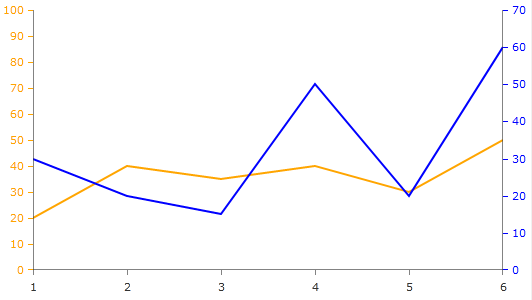
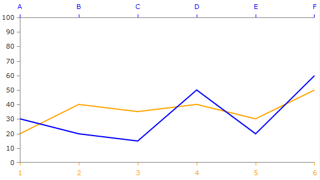
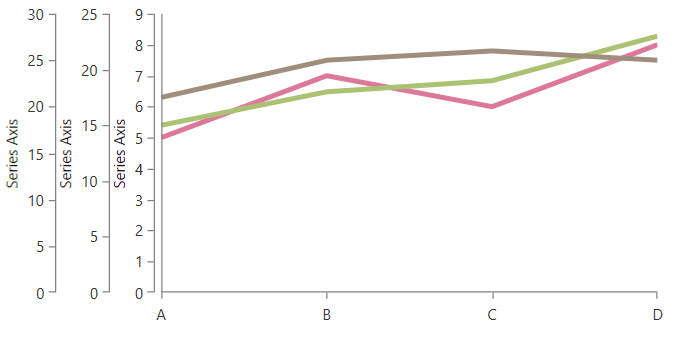

# Multiple Axes

RadChartView allows you to define multiple horizontal and vertical axis elements in the Cartesian chart.

By default you can show a single horizontal and a single vertical axis by setting the `HorizontalAxis` and `VerticalAxis` properties of the `RadCartesianChart` control.

To include additional axes you can set also the `HorizontalAxis` or `VerticalAxis` properties of the corresponding chart series. You can add up to one additional (to the chart axes) horizontal and one vertical axis per series.

>tip By default the additional axes will stack next to one another. You can control the alignment of an axis (top, left, bottom, right) by setting its `HorizontalLocation` or `VerticalLocation` properties.

The following sections show a couple of sample scenarios where you can use multiple axes.

## Two Vertical Axes

This example shows two chart series with a common horizontal axis and two vertical axes. In this case one of the series has its `VerticalAxis` property set and the other one uses the `VerticalAxis` of the `RadCartesianChart`. 

#### __XAML__ 
```XAML
	 <telerik:RadCartesianChart>
		<telerik:RadCartesianChart.HorizontalAxis>
			<telerik:CategoricalAxis/>
		</telerik:RadCartesianChart.HorizontalAxis>
	
		<telerik:RadCartesianChart.VerticalAxis>
			<telerik:LinearAxis Maximum="100" ElementBrush="Orange"/>
		</telerik:RadCartesianChart.VerticalAxis>
		<telerik:RadCartesianChart.Series>
			<telerik:LineSeries Stroke="Orange" StrokeThickness="2">
				<telerik:LineSeries.DataPoints>
					<telerik:CategoricalDataPoint Value="20"/>
					<telerik:CategoricalDataPoint Value="40"/>
					<telerik:CategoricalDataPoint Value="35"/>
					<telerik:CategoricalDataPoint Value="40"/>
					<telerik:CategoricalDataPoint Value="30"/>
					<telerik:CategoricalDataPoint Value="50"/>
				</telerik:LineSeries.DataPoints>
			</telerik:LineSeries>
			
			<telerik:LineSeries Stroke="Blue" StrokeThickness="2">
				<telerik:LineSeries.VerticalAxis>
					<telerik:LinearAxis HorizontalLocation="Right" ElementBrush="Blue" />
				</telerik:LineSeries.VerticalAxis>
				<telerik:LineSeries.DataPoints>
					<telerik:CategoricalDataPoint Value="30"/>
					<telerik:CategoricalDataPoint Value="20"/>
					<telerik:CategoricalDataPoint Value="15"/>
					<telerik:CategoricalDataPoint Value="50"/>
					<telerik:CategoricalDataPoint Value="20"/>
					<telerik:CategoricalDataPoint Value="60"/>
				</telerik:LineSeries.DataPoints>
			</telerik:LineSeries>
		</telerik:RadCartesianChart.Series>
	</telerik:RadCartesianChart>
```



## Two Horizontal Axes

This example shows two chart series with a common vertical axis and two horizontal axes. In this case one of the series has its `HorizontalAxis` property set and the other one uses the `HorizontalAxis` of the `RadCartesianChart`. 

#### __XAML__  
```XAML
	<telerik:RadCartesianChart>
	    <telerik:RadCartesianChart.HorizontalAxis>
	        <telerik:CategoricalAxis ElementBrush="Orange"/>
	    </telerik:RadCartesianChart.HorizontalAxis>	
	    <telerik:RadCartesianChart.VerticalAxis>
	        <telerik:LinearAxis Maximum="100"/>
	    </telerik:RadCartesianChart.VerticalAxis>	
	    <telerik:RadCartesianChart.Series>
	        <telerik:LineSeries Stroke="Orange" StrokeThickness="2">
	            <telerik:LineSeries.DataPoints>
	                <telerik:CategoricalDataPoint Value="20"/>
	                <telerik:CategoricalDataPoint Value="40"/>
	                <telerik:CategoricalDataPoint Value="35"/>
	                <telerik:CategoricalDataPoint Value="40"/>
	                <telerik:CategoricalDataPoint Value="30"/>
	                <telerik:CategoricalDataPoint Value="50"/>
	            </telerik:LineSeries.DataPoints>
	        </telerik:LineSeries>
	        <telerik:LineSeries Stroke="Blue" StrokeThickness="2">
	            <telerik:LineSeries.HorizontalAxis>
	                <telerik:CategoricalAxis ElementBrush="Blue" VerticalLocation="Top" />
	            </telerik:LineSeries.HorizontalAxis>
	            <telerik:LineSeries.DataPoints>
	                <telerik:CategoricalDataPoint Category="A" Value="30"/>
	                <telerik:CategoricalDataPoint Category="B" Value="20"/>
	                <telerik:CategoricalDataPoint Category="C" Value="15"/>
	                <telerik:CategoricalDataPoint Category="D" Value="50"/>
	                <telerik:CategoricalDataPoint Category="E" Value="20"/>
	                <telerik:CategoricalDataPoint Category="F" Value="60"/>
	            </telerik:LineSeries.DataPoints>
	        </telerik:LineSeries>
	    </telerik:RadCartesianChart.Series>
	</telerik:RadCartesianChart>
```



## Multiple Axes and SeriesProvider

To define multiple axes for the different chart series when [SeriesProvider]() is setup, you can use the `SeriesCreated` event of the provider. In the event handler, you can define a new instance of an axis to each series.

#### __XAML__  
```XAML
	<telerik:ChartSeriesProvider Source="{Binding Data}" 
								 SeriesCreated="ChartSeriesProvider_SeriesCreated">
		<telerik:CategoricalSeriesDescriptor CategoryPath="Category"
											 ValuePath="Value"
											 ItemsSourcePath="Items">
			<telerik:CategoricalSeriesDescriptor.Style>
				<Style TargetType="telerik:LineSeries">
					<Setter Property="StrokeThickness" Value="4" />                                    
				</Style>
			</telerik:CategoricalSeriesDescriptor.Style>
		</telerik:CategoricalSeriesDescriptor>
	</telerik:ChartSeriesProvider>
```

#### __C#__  
```C#
	private void ChartSeriesProvider_SeriesCreated(object sender, ChartSeriesCreatedEventArgs e)
	{
		var series = (CartesianSeries)e.Series;
		series.VerticalAxis = new LinearAxis() { Title = "Series Axis" };
	}
```



>tip Defining additional axis in a Style setter will apply the same axis instance to all series. 

## See Also

* [Axis]()
* [CategoricalAxis]()
