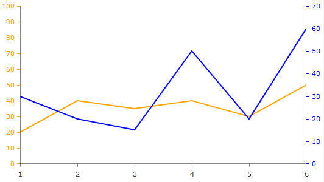
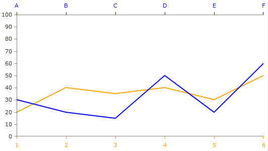
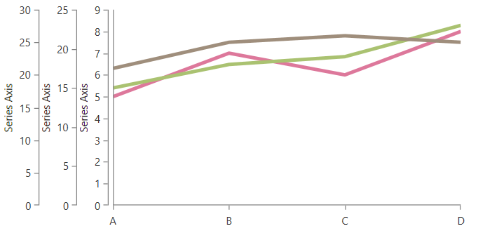

# Multiple Axes

RadChartView allows you to define multiple horizontal and vertical axis elements in the Cartesian chart.

By default you can show a single horizontal and a single vertical axis by setting the `HorizontalAxis` and `VerticalAxis` properties of the `RadCartesianChart` control.

To include additional axes you can set also the `HorizontalAxis` or `VerticalAxis` properties of the corresponding chart series. You can add up to one additional (to the chart axes) horizontal and one vertical axis per series.

>tip By default the additional axes will stack next to one another. You can control the alignment of an axis (top, left, bottom, right) by setting its `HorizontalLocation` or `VerticalLocation` properties.

The following sections show a couple of sample scenarios where you can use multiple axes.

## Two Vertical Axes

This example shows two chart series with a common horizontal axis and two vertical axes. In this case one of the series has its `VerticalAxis` property set and the other one uses the `VerticalAxis` of the `RadCartesianChart`. 

 
<snippet id='radchartview-axes-multipleaxes-block_1-xaml' />

## Two Horizontal Axes

This example shows two chart series with a common vertical axis and two horizontal axes. In this case one of the series has its `HorizontalAxis` property set and the other one uses the `HorizontalAxis` of the `RadCartesianChart`. 

  
<snippet id='radchartview-axes-multipleaxes-block_2-xaml' />

## Multiple Axes and SeriesProvider

To define multiple axes for the different chart series when [SeriesProvider]() is setup, you can use the `SeriesCreated` event of the provider. In the event handler, you can define a new instance of an axis to each series.

  
<snippet id='radchartview-axes-multipleaxes-block_3-xaml' />

  
<snippet id='radchartview-axes-multipleaxes-block_4-cs' />

>tip Defining additional axis in a Style setter will apply the same axis instance to all series. 

## See Also

* [Axis]()
* [CategoricalAxis]()
