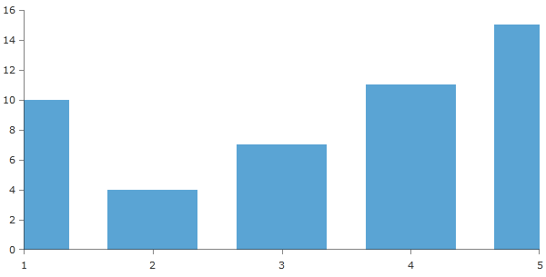
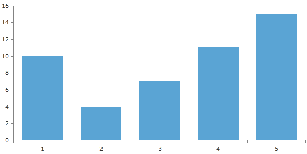
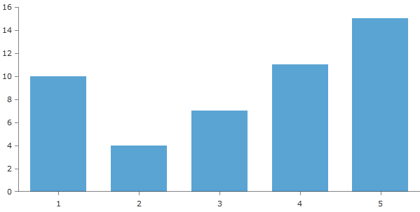

# Plot Mode

RadChartView allows you to modify the layout of the Categorical and Date Time axes to improve the look and feel of the series presented. Depending on the selected plot mode, the axis's ticks and labels will be visualized differently.

>The default PlotMode property is BetweenTicks.

You can set the PlotMode from XAML like this:        

#### __XAML__

```XAML
	<telerik:RadCartesianChart x:Name="telerik">
		<telerik:RadCartesianChart.HorizontalAxis>
			<telerik:CategoricalAxis PlotMode="BetweenTicks"/>
		</telerik:RadCartesianChart.HorizontalAxis>
	
		<telerik:RadCartesianChart.VerticalAxis>
			<telerik:LinearAxis/>
		</telerik:RadCartesianChart.VerticalAxis>
	
		<telerik:RadCartesianChart.Series>
			<telerik:BarSeries>
				<telerik:BarSeries.DataPoints>
					<telerik:CategoricalDataPoint Value="10" Category="1"/>
					<telerik:CategoricalDataPoint Value="4" Category="2"/>
					<telerik:CategoricalDataPoint Value="7" Category="3"/>
					<telerik:CategoricalDataPoint Value="11" Category="4"/>
					<telerik:CategoricalDataPoint Value="15" Category="5"/>
				</telerik:BarSeries.DataPoints>
			</telerik:BarSeries>
		</telerik:RadCartesianChart.Series>
	</telerik:RadCartesianChart>
```

The PlotMode property can be used with the following predefined values:        

* __OnTicks__ - in this mode, the ticks match labels. Best for Linear series.  
            

* __BetweenTicks__ - ticks are margins (labels are between two ticks); a small margin on both sides is provided. Useful for Bar series.  
            

* __OnTicksPadded__ - ticks match labels; a small margin on both sides is provided for better presentation. It is recomended to be used with Scatter series.  
            
