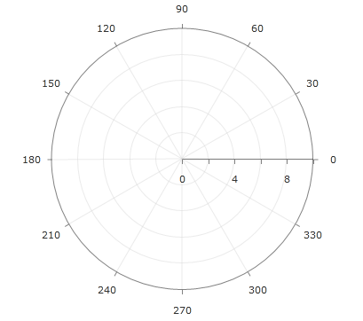

# Polar Axis


## 

In order to create a valid RadPolarChart object users must set its __PolarAxis__ and __RadialAxis__ properties to __PolarAxis__ and __NumericRadialAxis__ objects respectively.
The PolarAxis class contains three properties and these are __MajorStep__, __Minimum__ and __Maximum__ which define the tick step, the minimum value and the maximum value of the axis.
NumericRadialAxis does not define any properties specific to it.

Below is an example of RadPolarChart that demonstrates the properties of its polar axis:

#### __XAML__

```XAML
	<telerikChart:RadPolarChart>
	    <telerikChart:RadPolarChart.Grid>
	        <telerikChart:PolarChartGrid/>
	    </telerikChart:RadPolarChart.Grid>
	
	    <telerikChart:RadPolarChart.PolarAxis>
	        <telerikChart:PolarAxis LabelInterval="2"
	                                MajorStep="2"
	                                Maximum="10"/>
	    </telerikChart:RadPolarChart.PolarAxis>
	
	    <telerikChart:RadPolarChart.RadialAxis>
	        <telerikChart:NumericRadialAxis/>
	    </telerikChart:RadPolarChart.RadialAxis>
	</telerikChart:RadPolarChart>
	```



