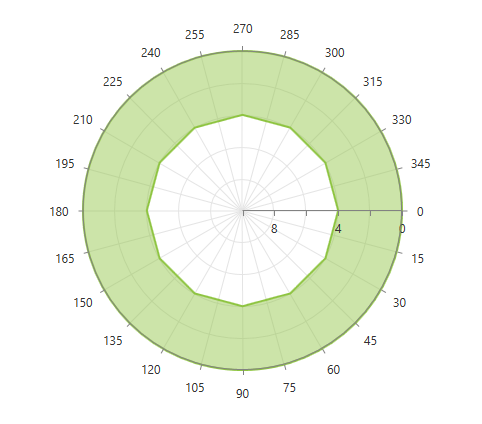

# Polar Axis

To create a valid `RadPolarChart`, set its `PolarAxis` and `RadialAxis` properties to `PolarAxis` and `NumericRadialAxis` objects, respectively.


## PolarAxis

The PolarAxis class plots points along the radius of the chart. It provides the following properties:

* __MajorStep__: Defines the major step between each axis tick.
* __Minimum__: Defines the user-defined minimum value of the axis.
* __Maximum__: Defines the user-defined maximum value of the axis.
* __IsInverse__: A boolean property inherited from `LineAxis` that determines whether the axis range is inverted (moving inward from the outer edge).

## RadialAxis and NumericRadialAxis

The radial axis is the circular (angle) axis of the `RadPolarChart`. 

`RadialAxis` provides the following properties:

* __SweepDirection__: A property of type `System.Windows.Media.SweepDirection` that controls the direction in which the radial angles and numbers advance. By default, it is set to `Counterclockwise`. Setting it to `Clockwise` reverses the sweep direction so values advance clockwise around the chart.

`NumericRadialAxis` extends `RadialAxis` to plot numerical angle values and defines:

* __MajorStep__: Gets or sets the step of the ticks on the axis ellipse.
* __MinorTicksPerMajor__: Gets or sets the number of minor ticks per major interval.
* __MinorTickTemplate__: Gets or sets the data template for minor ticks.
* __MinorTickStyle__: Gets or sets the style applied to minor ticks.

## Example
Below is an example of `RadPolarChart` that demonstrates configuring the polar axis and reversing the radial sweep direction using `SweepDirection`:
Below is an example of RadPolarChart that demonstrates configuring the polar axis and reversing the radial sweep direction using `SweepDirection`:

```XAML
 <telerik:RadPolarChart Palette="Windows8" MinWidth="400" MinHeight="400"
					   HorizontalAlignment="Stretch" VerticalAlignment="Stretch">
     <telerik:RadPolarChart.Grid>
         <telerik:PolarChartGrid />
     </telerik:RadPolarChart.Grid>
     <telerik:RadPolarChart.PolarAxis>
         <telerik:PolarAxis LabelInterval="2" MajorStep="2" Maximum="10" IsInverse="True"  />
     </telerik:RadPolarChart.PolarAxis>
     <telerik:RadPolarChart.RadialAxis>
         <telerik:NumericRadialAxis SweepDirection="Clockwise" MajorStep="15" />
     </telerik:RadPolarChart.RadialAxis>
     <telerik:RadPolarChart.Series>
         <telerik:PolarAreaSeries>
             <telerik:PolarAreaSeries.DataPoints>
                 <telerik:PolarDataPoint Angle="30" Value="4"/>
                 <telerik:PolarDataPoint Angle="60" Value="4"/>
                 <telerik:PolarDataPoint Angle="90" Value="4"/>
                 <telerik:PolarDataPoint Angle="120" Value="4"/>
                 <telerik:PolarDataPoint Angle="150" Value="4"/>
                 <telerik:PolarDataPoint Angle="180" Value="4"/>
                 <telerik:PolarDataPoint Angle="210" Value="4"/>
                 <telerik:PolarDataPoint Angle="240" Value="4"/>
                 <telerik:PolarDataPoint Angle="270" Value="4"/>
                 <telerik:PolarDataPoint Angle="300" Value="4"/>
                 <telerik:PolarDataPoint Angle="330" Value="4"/>
                 <telerik:PolarDataPoint Angle="360" Value="4"/>
             </telerik:PolarAreaSeries.DataPoints>
         </telerik:PolarAreaSeries>
     </telerik:RadPolarChart.Series>
 </telerik:RadPolarChart>

```


