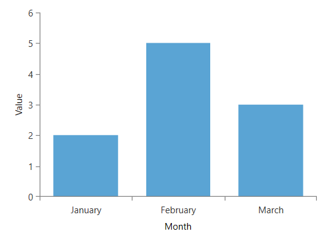
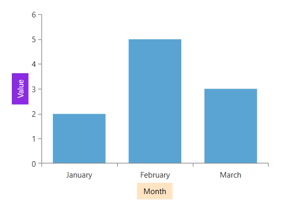

# Axis Title

The chart axes allows you to display a title aligned next to the axis line.

To show the title, set the `Title` property of the axis element (`LinearAxis`, `CategoricalAxis`, etc.).

__Setting the axis title to a string value__
```XAML
	<telerik:RadCartesianChart>
		<telerik:RadCartesianChart.HorizontalAxis>		 
			<telerik:CategoricalAxis Title="Month"/>
			</telerik:RadCartesianChart.HorizontalAxis>
			<telerik:RadCartesianChart.VerticalAxis>
			 <telerik:LinearAxis Title="Value" />
			</telerik:RadCartesianChart.VerticalAxis>
			<telerik:RadCartesianChart.Series>
			 <telerik:BarSeries>
				 <telerik:BarSeries.DataPoints>
					 <telerik:CategoricalDataPoint Category="January" Value="2" />
					 <telerik:CategoricalDataPoint Category="February" Value="5" />
					 <telerik:CategoricalDataPoint Category="March" Value="3" />
				 </telerik:BarSeries.DataPoints>
			 </telerik:BarSeries>
		</telerik:RadCartesianChart.Series>
	</telerik:RadCartesianChart>
```



__Setting the axis title to a visual element__
```XAML
	<telerik:RadCartesianChart>
		<telerik:RadCartesianChart.HorizontalAxis>		 
			<telerik:CategoricalAxis>
				 <telerik:CategoricalAxis.Title>
					 <Border Background="Bisque" Padding="10 5">
						 <TextBlock Text="Month" />
					 </Border>
				 </telerik:CategoricalAxis.Title>
			 </telerik:CategoricalAxis>
			</telerik:RadCartesianChart.HorizontalAxis>
			<telerik:RadCartesianChart.VerticalAxis>
			 <telerik:LinearAxis>
				 <telerik:LinearAxis.Title>
					 <Border Background="BlueViolet" Padding="10 5">
						 <TextBlock Text="Value" Foreground="White"/>
					 </Border>
				 </telerik:LinearAxis.Title>
			 </telerik:LinearAxis>
			</telerik:RadCartesianChart.VerticalAxis>
			<telerik:RadCartesianChart.Series>
			 <telerik:BarSeries>
				 <telerik:BarSeries.DataPoints>
					 <telerik:CategoricalDataPoint Category="January" Value="2" />
					 <telerik:CategoricalDataPoint Category="February" Value="5" />
					 <telerik:CategoricalDataPoint Category="March" Value="3" />
				 </telerik:BarSeries.DataPoints>
			 </telerik:BarSeries>
		</telerik:RadCartesianChart.Series>
	</telerik:RadCartesianChart>
```



The axis can be customized also through the `TitleTemplate` property. 

__Setting Axis TitleTemplate__
```XAML
	<telerik:RadCartesianChart >
		<telerik:RadCartesianChart.HorizontalAxis>
			<telerik:CategoricalAxis Title="Month">
				<telerik:CategoricalAxis.TitleTemplate>
					<DataTemplate>
						<Border Background="Bisque" Padding="10 5">
							<TextBlock Text="{Binding}" />
						</Border>
					</DataTemplate>
				</telerik:CategoricalAxis.TitleTemplate>
			</telerik:CategoricalAxis>
		</telerik:RadCartesianChart.HorizontalAxis>
		<telerik:RadCartesianChart.VerticalAxis>
			<telerik:LinearAxis Title="Value">
				<telerik:LinearAxis.TitleTemplate>
					<DataTemplate>
						<Border Background="BlueViolet" Padding="10 5">
							<TextBlock Text="{Binding}" Foreground="White"/>
						</Border>
					</DataTemplate>
				</telerik:LinearAxis.TitleTemplate>
			</telerik:LinearAxis>
		</telerik:RadCartesianChart.VerticalAxis>
		<telerik:RadCartesianChart.Series>
			<telerik:BarSeries>
				<telerik:BarSeries.DataPoints>
					<telerik:CategoricalDataPoint Category="January" Value="2" />
					<telerik:CategoricalDataPoint Category="February" Value="5" />
					<telerik:CategoricalDataPoint Category="March" Value="3" />
				</telerik:BarSeries.DataPoints>
			</telerik:BarSeries>
		</telerik:RadCartesianChart.Series>
	</telerik:RadCartesianChart>
```

The data context in the `DataTemplate` will be the value of the `Title` property.


## See Also
* [Getting Started]()
* [Events]()
* [Create Data-Bound Chart]()
