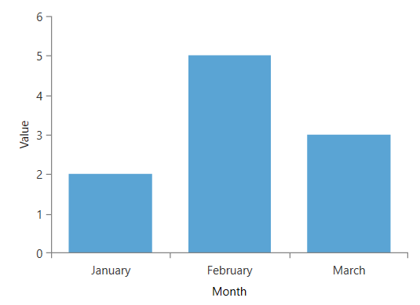
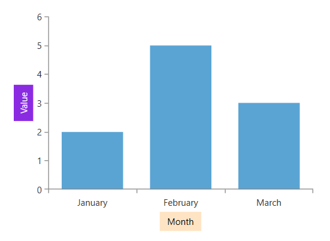

# Axis Title

The chart axes allows you to display a title aligned next to the axis line.

To show the title, set the `Title` property of the axis element (`LinearAxis`, `CategoricalAxis`, etc.).

__Setting the axis title to a string value__
<snippet id='radchartview-axes-title-setting_the_axis_title_to_a_string_value-xaml' />

__Setting the axis title to a visual element__
<snippet id='radchartview-axes-title-setting_the_axis_title_to_a_visual_element-xaml' />

The axis can be customized also through the `TitleTemplate` property. 

__Setting Axis TitleTemplate__
<snippet id='radchartview-axes-title-setting_axis_titletemplate-xaml' />

The data context in the `DataTemplate` will be the value of the `Title` property.

## See Also
* [Getting Started]()
* [Events]()
* [Create Data-Bound Chart]()
