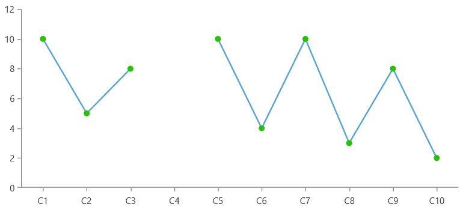

# Empty Data Points

The `RadCartesianChart` control allows you to show gaps in the data without removing the associated data item. This is done by setting the value property of the corresponding [data point]() to `null`. This is useful in different scenarios, like adding gaps in the line visualization or an empty bar for a specific category.

__Adding an empty data point in LineSeries__
```XAML
	<telerik:RadCartesianChart>
		<telerik:RadCartesianChart.VerticalAxis>
			<telerik:LinearAxis />
		</telerik:RadCartesianChart.VerticalAxis>
		<telerik:RadCartesianChart.HorizontalAxis>
			<telerik:CategoricalAxis PlotMode="OnTicksPadded" />
		</telerik:RadCartesianChart.HorizontalAxis>
		<telerik:LineSeries>
			<telerik:LineSeries.DefaultVisualStyle>
				<Style TargetType="Path">
					<Setter Property="Width" Value="8"/>
					<Setter Property="Height" Value="8"/>
					<Setter Property="Fill" Value="#27C106"/>
				</Style>
			</telerik:LineSeries.DefaultVisualStyle>
			<telerik:LineSeries.DataPoints>
				<telerik:CategoricalDataPoint Category="C1" Value="10" />
				<telerik:CategoricalDataPoint Category="C2" Value="5" />
				<telerik:CategoricalDataPoint Category="C3" Value="8" />
				<telerik:CategoricalDataPoint Category="C4" Value="{x:Null}" />
				<telerik:CategoricalDataPoint Category="C5" Value="10" />
				<telerik:CategoricalDataPoint Category="C6" Value="4" />
				<telerik:CategoricalDataPoint Category="C7" Value="10" />
				<telerik:CategoricalDataPoint Category="C8" Value="3" />
				<telerik:CategoricalDataPoint Category="C9" Value="8" />
				<telerik:CategoricalDataPoint Category="C10" Value="2" />
			</telerik:LineSeries.DataPoints>
		</telerik:LineSeries>
	</telerik:RadCartesianChart>
```



The following example shows how to assign the value of the data point in code.

__Creating an empty data point in code__
```C#
	this.lineSeries.DataPoints.Add(new CategoricalDataPoint() { Category = "C4", Value = null };
	
	this.scatterLineSeries.DataPoints.Add(new ScatterDataPoint() { XValue = 4, YValue = null };
```

## Data Binding Setup

When the chart series is data-bound via its ItemsSource property, the assignment of the null value is implemented in the data point models.

__Defining the data point model__
```C#
	public class PlotInfo
	{
		public string Category { get; set; }
		public double? Value { get; set; }
	}
```

__Populating with data__
```C#
	var dataItems = new ObservableCollection<PlotInfo>();
	// add other data points here
	dataItems.Add(new PlotInfo() { Category = "Category 4", Value = null };
	// add other data points here
```

__Setting up chart series in data binding scenario__
```XAML
	<telerik:LineSeries CategoryBinding="Category" ValueBinding="Value" ItemsSource="{Binding MyDataItems}" />
```
