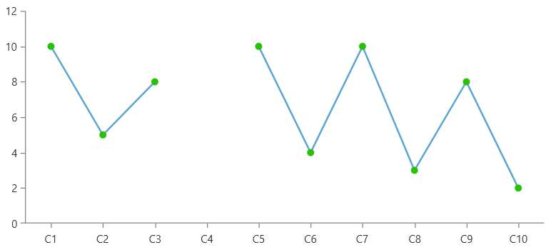

# Empty Data Points

The `RadCartesianChart` control allows you to show gaps in the data without removing the associated data item. This is done by setting the value property of the corresponding [data point]() to `null`. This is useful in different scenarios, like adding gaps in the line visualization or an empty bar for a specific category.

__Adding an empty data point in LineSeries__
<snippet id='radchartview-empty-data-points-adding_an_empty_data_point_in_lineseries-xaml' />

The following example shows how to assign the value of the data point in code.

__Creating an empty data point in code__
<snippet id='radchartview-empty-data-points-creating_an_empty_data_point_in_code-cs' />

## Data Binding Setup

When the chart series is data-bound via its ItemsSource property, the assignment of the null value is implemented in the data point models.

__Defining the data point model__
<snippet id='radchartview-empty-data-points-defining_the_data_point_model-cs' />

__Populating with data__
<snippet id='radchartview-empty-data-points-populating_with_data-cs' />

__Setting up chart series in data binding scenario__
<snippet id='radchartview-empty-data-points-setting_up_chart_series_in_data_binding_scenario-xaml' />

