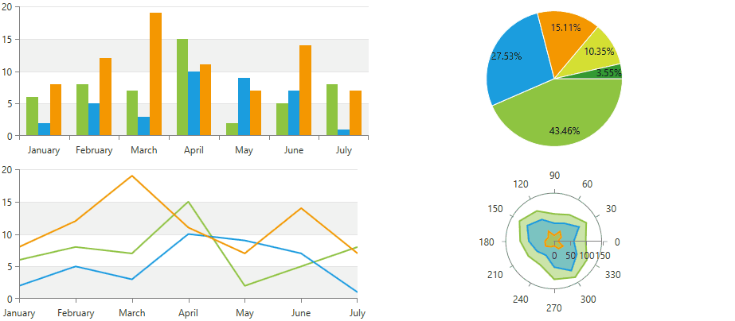
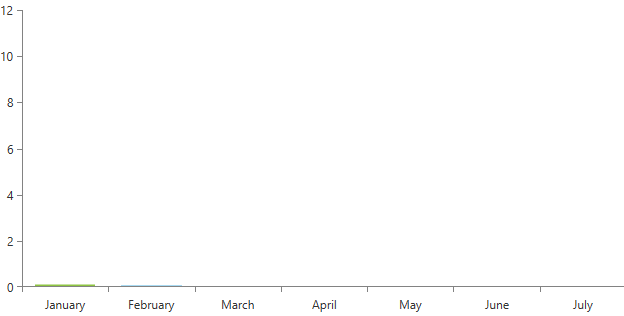
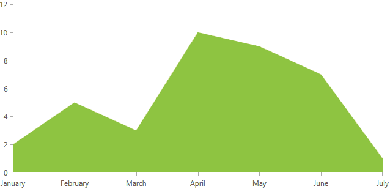
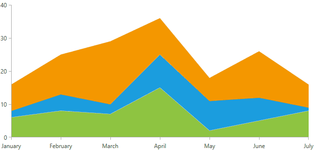
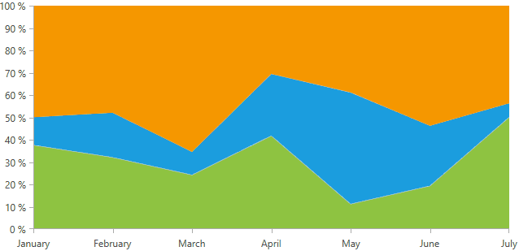
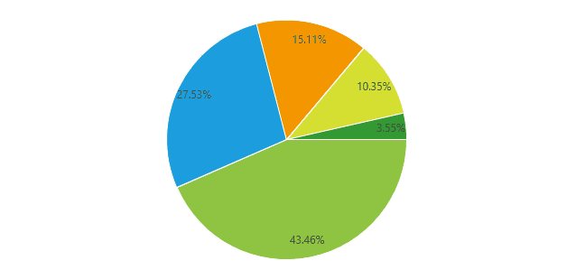
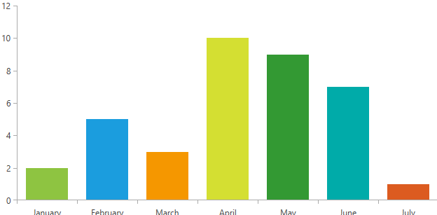

# Animations

With the __R2 2018__ version of our controls, you can now animate RadChartView series and their points. The series and the points can be animated using either built-in or custom animation effects. To animate the series or the points first you need to set the __SeriesAnimation__ and/or __PointAnimation__ property with your animation. Depending on which element you want to animate (Series,Points or Both) you can call the __PlaySeriesAnimation()__ and __PlayPointAnimations()__ methods. 

* [Animation Types](#animations-type)
	* [Animation Base Class](#animation-base-class)
	* [Move Animation](#move-animation)
	* [Reveal Animation](#reveal-animation)
	* [Fade Animation](#fade-animation)
	* [Drop and Fade Animation](#drop-and-fade-animation)
	* [Scale Animation](#scale-animation)
	* [Pie Chart Angle Range Animation](#pie-chart-angle-range-animation)
	* [Pie Chart Radius Factor Animation](#pie-chart-radius-factor-animation)
* [Custom Animation](#custom-animation)
* [Events](#events)
* [Series Animations Support](#series-animations-support)
* [Notes](#notes)

#### __Figure 1: Chart Animations__


## Animation Types

There are several different built-in animations which can be used to animate the chart series and their points. Each animation allows you to apply duration, delay and an easing function to its animated effect. The easing functions make the animation much more realistic and smoother. There is a set of predefined easing functions in WPF and you are allowed to create custom ones, too.

>To learn more about the easing functions you can take a look at this [MSDN help article](
https://msdn.microsoft.com/en-us/library/ee308751%28v=VS.100%29.aspx?f=255&MSPPError=-2147217396).

### Animation Base Class

The build-in animations of the chart derives from the __ChartAnimationBase__ base class. All animation expose the following properties which can be used to further customize their effect.

* __Delay:__ A property of type __TimeSpan__ that gets or sets the delay of the chart animation instance.
* __Duration:__ A property of type __TimeSpan__ that gets or sets the duration of the chart animation instance.
* __Easing:__ A property of type __IEasingFunction__ that gets or sets the easing function used in this chart animation instance.

### Move Animation

The __ChartMoveAnimation__ animates the sliding effect of the series/point from the four sides of the plot area to their places on the plot area. To modify the animation you can use the following properties:

* __MoveAnimationType:__ A property of type __MoveAnimationType__ that gets or sets from which side of the chart plot area the elements animation starts. The move animation type property is an enumeration and it allows the following values:
	* Left: Default value. When set the series or points are moved starting from the __left__ side of the plot area.
	* Top: When set series or points are moved starting from the __top__ side of the plot area.
	* Right: When set series or points are moved starting from the __right__ side of the plot area.	
	* Bottom: When set series or points are moved starting from the __left__ side of the plot area.

__Example 1: Setting move animation in XAML__
```XAML
	<telerik:RadCartesianChart Palette="Windows8">
		<telerik:RadCartesianChart.HorizontalAxis>
			<telerik:CategoricalAxis/>
		</telerik:RadCartesianChart.HorizontalAxis>
		<telerik:RadCartesianChart.VerticalAxis>
			<telerik:LinearAxis />
		</telerik:RadCartesianChart.VerticalAxis>
		<telerik:RadCartesianChart.Series>
			<telerik:BarSeries PaletteMode="DataPoint">
				<telerik:BarSeries.DataPoints>
					<telerik:CategoricalDataPoint Category="January" Value="2" />
					<telerik:CategoricalDataPoint Category="February" Value="5" />
					<telerik:CategoricalDataPoint Category="March" Value="3" />
					<telerik:CategoricalDataPoint Category="April" Value="10" />
					<telerik:CategoricalDataPoint Category="May" Value="9" />
					<telerik:CategoricalDataPoint Category="June" Value="7" />
					<telerik:CategoricalDataPoint Category="July" Value="1" />
				</telerik:BarSeries.DataPoints>
				<telerik:BarSeries.PointAnimation>
					<telerik:ChartMoveAnimation Delay="0:0:0.125" Duration="0:0:1.55" MoveAnimationType="Top" >
						<telerik:ChartMoveAnimation.Easing>
							<BounceEase EasingMode="EaseOut" Bounces="20" Bounciness="5" />
						</telerik:ChartMoveAnimation.Easing>
					</telerik:ChartMoveAnimation>
				</telerik:BarSeries.PointAnimation>
			</telerik:BarSeries>         
		</telerik:RadCartesianChart.Series>
	</telerik:RadCartesianChart>
```

#### __Figure 2: This animation look as follows__


### Reveal Animation

The __ChartRevealAnimation__  animation animates the clipping of the series and their points. The revealing can be horizontally or vertically.

* __AnimationDirection:__ A property of type __AnimationDirection__ that gets or sets the direction of the animation. The animation direction property is an enumeration and it allows the following values:
	* __In:__ Default value. When set the animation animates an element that appears.
	* __Out:__ 	When set the animation animates an element that disappears.
* __Orientation:__ A property of type __Orientation__ that gets or sets the orientation of the animation. The orientation property is an enumeration and it allows the following values:
	* __Horizontal:__ Default value. When set the animation is horizontally oriented.
	* __Vertical:__ When set the animation is vertically oriented.

__Example 2: Setting reveal animation in XAML__
```XAML
	<telerik:RadCartesianChart Palette="Windows8">
		<telerik:RadCartesianChart.HorizontalAxis>
			<telerik:CategoricalAxis/>
		</telerik:RadCartesianChart.HorizontalAxis>
		<telerik:RadCartesianChart.VerticalAxis>
			<telerik:LinearAxis />
		</telerik:RadCartesianChart.VerticalAxis>
		<telerik:RadCartesianChart.Series>
			<telerik:AreaSeries>
				<telerik:AreaSeries.DataPoints>
					<telerik:CategoricalDataPoint Category="January" Value="2" />
					<telerik:CategoricalDataPoint Category="February" Value="5" />
					<telerik:CategoricalDataPoint Category="March" Value="3" />
					<telerik:CategoricalDataPoint Category="April" Value="10" />
					<telerik:CategoricalDataPoint Category="May" Value="9" />
					<telerik:CategoricalDataPoint Category="June" Value="7" />
					<telerik:CategoricalDataPoint Category="July" Value="1" />
				</telerik:AreaSeries.DataPoints>
				<telerik:AreaSeries.SeriesAnimation>
					<telerik:ChartRevealAnimation AnimationDirection="In" Orientation="Horizontal" >
						<telerik:ChartRevealAnimation.Easing>
							<QuarticEase EasingMode="EaseOut"/>
						</telerik:ChartRevealAnimation.Easing>
					</telerik:ChartRevealAnimation>
				</telerik:AreaSeries.SeriesAnimation>
			</telerik:AreaSeries>
		</telerik:RadCartesianChart.Series>
	</telerik:RadCartesianChart>
```

#### __Figure 3: This animation look as follows__


### Fade Animation

The __ChartFadeAnimation__ fades in the series and their points. The fade effect can be additionally modified by specifying the fade range using the __MinOpacity__ and __MaxOpacity__ properties.

* __MinOpacity:__ A property of type __double__ that gets or sets the initial opacity of the animation. Default value is __0.01__
* __MaxOpacity:__ A property of type __double__ that gets or sets the final opacity of the animation. Default value is __1__.

__Example 3: Setting fade animation in XAML__
```XAML
	<telerik:RadCartesianChart Palette="Windows8">
		<telerik:RadCartesianChart.HorizontalAxis>
			<telerik:CategoricalAxis />
		</telerik:RadCartesianChart.HorizontalAxis>
		<telerik:RadCartesianChart.VerticalAxis>
			<telerik:LinearAxis />
		</telerik:RadCartesianChart.VerticalAxis>
		<telerik:RadCartesianChart.Series>
			<telerik:BubbleSeries ShowLabels="True" PaletteMode="DataPoint">
				<telerik:BubbleSeries.DataPoints>
					<telerik:BubbleDataPoint BubbleSize="50" Category="Mexico" Value="20" />
					<telerik:BubbleDataPoint BubbleSize="100" Category="USA" Value="8" />
					<telerik:BubbleDataPoint BubbleSize="70" Category="UK" Value="13" />
					<telerik:BubbleDataPoint BubbleSize="50" Category="France" Value="20" />
					<telerik:BubbleDataPoint BubbleSize="42" Category="Germany" Value="5" />
				</telerik:BubbleSeries.DataPoints>
				<telerik:BubbleSeries.PointAnimation>
					<telerik:ChartFadeAnimation/>
				</telerik:BubbleSeries.PointAnimation>
			</telerik:BubbleSeries>
		</telerik:RadCartesianChart.Series>
	</telerik:RadCartesianChart>
```

#### __Figure 4: This animation look as follows__


### Drop and Fade Animation

The __ChartDropFadeAnimation__ derives from __ChartMoveAnimation__. The difference here is that this animation add additional fade in effect.

__Example 4: Setting drop and fade animation in XAML__
```XAML
	<telerik:RadCartesianChart x:Name="chart" Palette="Windows8">
		<telerik:RadCartesianChart.HorizontalAxis>
			<telerik:CategoricalAxis />
		</telerik:RadCartesianChart.HorizontalAxis>
		<telerik:RadCartesianChart.VerticalAxis>
			<telerik:LinearAxis />
		</telerik:RadCartesianChart.VerticalAxis>
		<telerik:RadCartesianChart.Series>
			<telerik:AreaSeries CombineMode="Stack">
				<telerik:AreaSeries.DataPoints>
					<telerik:CategoricalDataPoint Category="January" Value="6" />
					<telerik:CategoricalDataPoint Category="February" Value="8" />
					<telerik:CategoricalDataPoint Category="March" Value="7" />
					<telerik:CategoricalDataPoint Category="April" Value="15" />
					<telerik:CategoricalDataPoint Category="May" Value="2" />
					<telerik:CategoricalDataPoint Category="June" Value="5" />
					<telerik:CategoricalDataPoint Category="July" Value="8" />
				</telerik:AreaSeries.DataPoints>
				<telerik:AreaSeries.SeriesAnimation>
					<telerik:ChartDropFadeAnimation MoveAnimationType="Top" Duration="0:0:1.500" Delay="0:0:0.200"/>       
				</telerik:AreaSeries.SeriesAnimation>
			</telerik:AreaSeries>
			<telerik:AreaSeries CombineMode="Stack">
				<telerik:AreaSeries.DataPoints>
					<telerik:CategoricalDataPoint Category="January" Value="2" />
					<telerik:CategoricalDataPoint Category="February" Value="5" />
					<telerik:CategoricalDataPoint Category="March" Value="3" />
					<telerik:CategoricalDataPoint Category="April" Value="10" />
					<telerik:CategoricalDataPoint Category="May" Value="9" />
					<telerik:CategoricalDataPoint Category="June" Value="7" />
					<telerik:CategoricalDataPoint Category="July" Value="1" />
				</telerik:AreaSeries.DataPoints>
				<telerik:AreaSeries.SeriesAnimation>
					<telerik:ChartDropFadeAnimation MoveAnimationType="Top" Duration="0:0:1.500" Delay="0:0:0.200"/>
				</telerik:AreaSeries.SeriesAnimation>
			</telerik:AreaSeries>
			<telerik:AreaSeries CombineMode="Stack">
				<telerik:AreaSeries.DataPoints>
					<telerik:CategoricalDataPoint Category="January" Value="8" />
					<telerik:CategoricalDataPoint Category="February" Value="12" />
					<telerik:CategoricalDataPoint Category="March" Value="19" />
					<telerik:CategoricalDataPoint Category="April" Value="11" />
					<telerik:CategoricalDataPoint Category="May" Value="7" />
					<telerik:CategoricalDataPoint Category="June" Value="14" />
					<telerik:CategoricalDataPoint Category="July" Value="7" />
				</telerik:AreaSeries.DataPoints>
				<telerik:AreaSeries.SeriesAnimation>
					<telerik:ChartDropFadeAnimation MoveAnimationType="Top" Duration="0:0:1.500" Delay="0:0:0.200" />
				</telerik:AreaSeries.SeriesAnimation>
			</telerik:AreaSeries>
		</telerik:RadCartesianChart.Series>
	</telerik:RadCartesianChart>
```

#### __Figure 5: This animation look as follows__


### Scale Animation

The __ChartScaleAnimation__ animates the size of the series and their points. You can customize this animation by setting the starting point of the animation and the scale mode.

* __MinScale:__ A property of type __double__ that gets or sets the initial scale of the animation.
* __MaxScale:__ A property of type __double__ that gets or sets the final scale of the animation.
* __RenderTransformOrigin:__ A property of type __Point__ that gets or sets the starting point of the scaling. Default value is Point(0.5,0.5).
* __ScaleMode:__ A property of type __ScaleMode__ that gets or sets the orientation of the animation. The scale mode property is an enumeration and it allows the following values:
	* __Horizontal:__ Default value. When set the scaling is performed horizontally.
	* __Vertical:__ When set the scaling is performed vertically.
	* __Both:__ When set the scaling is performed in both directions.

__Example 5: Setting scale animation in XAML__
```XAML
	<telerik:RadCartesianChart x:Name="chart" Palette="Windows8">
		<telerik:RadCartesianChart.HorizontalAxis>
			<telerik:CategoricalAxis />
		</telerik:RadCartesianChart.HorizontalAxis>
		<telerik:RadCartesianChart.VerticalAxis>
			<telerik:LinearAxis />
		</telerik:RadCartesianChart.VerticalAxis>
		<telerik:RadCartesianChart.Series>
			<telerik:AreaSeries CombineMode="Stack100">
				<telerik:AreaSeries.DataPoints>
					<telerik:CategoricalDataPoint Category="January" Value="6" />
					<telerik:CategoricalDataPoint Category="February" Value="8" />
					<telerik:CategoricalDataPoint Category="March" Value="7" />
					<telerik:CategoricalDataPoint Category="April" Value="15" />
					<telerik:CategoricalDataPoint Category="May" Value="2" />
					<telerik:CategoricalDataPoint Category="June" Value="5" />
					<telerik:CategoricalDataPoint Category="July" Value="8" />
				</telerik:AreaSeries.DataPoints>
				<telerik:AreaSeries.SeriesAnimation>
					<telerik:ChartScaleAnimation ScaleMode="Both" />
				</telerik:AreaSeries.SeriesAnimation>
			</telerik:AreaSeries>
			<telerik:AreaSeries CombineMode="Stack100">
				<telerik:AreaSeries.DataPoints>
					<telerik:CategoricalDataPoint Category="January" Value="2" />
					<telerik:CategoricalDataPoint Category="February" Value="5" />
					<telerik:CategoricalDataPoint Category="March" Value="3" />
					<telerik:CategoricalDataPoint Category="April" Value="10" />
					<telerik:CategoricalDataPoint Category="May" Value="9" />
					<telerik:CategoricalDataPoint Category="June" Value="7" />
					<telerik:CategoricalDataPoint Category="July" Value="1" />
				</telerik:AreaSeries.DataPoints>
				<telerik:AreaSeries.SeriesAnimation>
					<telerik:ChartScaleAnimation ScaleMode="Both" />
				</telerik:AreaSeries.SeriesAnimation>
			</telerik:AreaSeries>
			<telerik:AreaSeries CombineMode="Stack100">
				<telerik:AreaSeries.DataPoints>
					<telerik:CategoricalDataPoint Category="January" Value="8" />
					<telerik:CategoricalDataPoint Category="February" Value="12" />
					<telerik:CategoricalDataPoint Category="March" Value="19" />
					<telerik:CategoricalDataPoint Category="April" Value="11" />
					<telerik:CategoricalDataPoint Category="May" Value="7" />
					<telerik:CategoricalDataPoint Category="June" Value="14" />
					<telerik:CategoricalDataPoint Category="July" Value="7" />
				</telerik:AreaSeries.DataPoints>
				<telerik:AreaSeries.SeriesAnimation>
					<telerik:ChartScaleAnimation ScaleMode="Both" />
				</telerik:AreaSeries.SeriesAnimation>
			</telerik:AreaSeries>
		</telerik:RadCartesianChart.Series>
	</telerik:RadCartesianChart>
```

#### __Figure 6: This animation look as follows__


### Pie Chart Angle Range Animation

> The __PieChartAngleRangeAnimation__ build-in animation will animate the __AngleRange__ property of the PieSeries and needs to be set to __SeriesAnimation__ property.

The __PieChartAngleRangeAnimation__ animates the __AngleRange__ property of the PieSeries. It animates simultaneously the __StartAngle__ and __SweepAngle__ properties of the __AngleRange__. The __StartAngle__ specifies the start angle from which the arc starts and the __SweepAngle__ specifies the angle that defines the length of the arc. Their default value is __(0,360)__. The first animation will animates the rotation of the pie starting from __InitialStartAngle(-90)__  to  __StartAngle(0)__  and second animation will animate the unroll of the series staring from __InitialSweepAngle(0)__  to __SweepAngle(360)__.

* __InitialStartAngle:__ A property of type __double__ that gets or sets the initial value of the start angle. Default value is __-90__.
* __InitialSweepAngle:__ A property of type __double__ that gets or sets the initial value of the sweep angle. Default value is __0__.

__Example 6: Setting pie chart angle range animation in XAML__
```XAML
	<telerik:RadPieChart Palette="Windows8">
		<telerik:RadPieChart.Series>
			<telerik:PieSeries>
				<telerik:PieSeries.DataPoints>
					<telerik:PieDataPoint Label="43.46%" Value="43.46"/>
					<telerik:PieDataPoint Label="27.53%" Value="27.53"/>
					<telerik:PieDataPoint Label="15.11%" Value="15.11"/>
					<telerik:PieDataPoint Label="10.35%" Value="10.35"/>
					<telerik:PieDataPoint Label="3.55%" Value="3.55"/>
				</telerik:PieSeries.DataPoints>
				<telerik:PieSeries.SeriesAnimation>
					<telerik:PieChartAngleRangeAnimation InitialStartAngle="-90" InitialSweepAngle="180" Duration="0:0:0.8" />
				</telerik:PieSeries.SeriesAnimation>
			</telerik:PieSeries>
		</telerik:RadPieChart.Series>
	</telerik:RadPieChart>
```

#### __Figure 7: This animation look as follows__


### Pie Chart Radius Factor Animation

>The __PieChartRadiusFactorAnimation__ build-in animation will animate the __RadiusFactor__ property of the PieSeries and needs to be set to __SeriesAnimation__ property.

The __PieChartRadiusFactorAnimation__ animates the __RadiusFactor__ property of the PieSeries. The animation stars from 0 to the value of the __RadiusFactor__ property.

__Example 7: Setting pie chart radius factor animation in XAML__
```XAML
	<telerik:RadPieChart Palette="Windows8">
		<telerik:RadPieChart.Series>
			<telerik:PieSeries>
				<telerik:PieSeries.DataPoints>
					<telerik:PieDataPoint Label="43.46%" Value="43.46"/>
					<telerik:PieDataPoint Label="27.53%" Value="27.53"/>
					<telerik:PieDataPoint Label="15.11%" Value="15.11"/>
					<telerik:PieDataPoint Label="10.35%" Value="10.35"/>
					<telerik:PieDataPoint Label="3.55%" Value="3.55"/>
				</telerik:PieSeries.DataPoints>
				<telerik:PieSeries.SeriesAnimation>
					<telerik:PieChartRadiusFactorAnimation Duration="0:0:1"/>
				</telerik:PieSeries.SeriesAnimation>
			</telerik:PieSeries>
		</telerik:RadPieChart.Series>
	</telerik:RadPieChart>	 
```

#### __Figure 8: This animation look as follows__


## Custom Animation

All built-in animation of the chart derives from __ChartAnimationBase__. In order to create a custom animation, you need to define a custom class which derives from this base class. This class provides __BuildPointAnimation()__ and __BuildSeriesAnimation()__ methods which can be overridden so you can create your own animation. __Example 2__ demonstrate custom point animation.

__Example 8: Custom point animation__
```C#
	public class CustomAnimation : ChartAnimationBase
    {
        protected override RadAnimation BuildPointAnimation(FrameworkElement visual, DataPoint point, RadRect plotAreaClip)
        {
            AnimationGroup g = new AnimationGroup();
            g.Children.Add(new FadeAnimation());
            MoveAnimation moveAnimation = new MoveAnimation()
            {
                Duration = this.Duration,
                Easing = this.Easing,
            };
            double width = plotAreaClip.Right - point.LayoutSlot.X;
            double height = plotAreaClip.Bottom - point.LayoutSlot.Y;
            MoveAnimation.SetOldPosition(visual, new Point(width, height));
            MoveAnimation.SetCurrentPosition(visual, new Point(0, 0));
            g.Children.Add(moveAnimation);
            return g;
        }
    }
```

__Example 8: Setting custom animation in XAML__
```XAML
	<telerik:RadCartesianChart  x:Name="chart" Palette="Windows8" >
		<telerik:RadCartesianChart.HorizontalAxis>
			<telerik:CategoricalAxis/>
		</telerik:RadCartesianChart.HorizontalAxis>
		<telerik:RadCartesianChart.VerticalAxis>
			<telerik:LinearAxis />
		</telerik:RadCartesianChart.VerticalAxis>
		<telerik:RadCartesianChart.Series>                
			<telerik:BubbleSeries PaletteMode="DataPoint">
				<telerik:BubbleSeries.DataPoints>
					<telerik:BubbleDataPoint Category="January" Value="2" BubbleSize="83" />
					<telerik:BubbleDataPoint Category="February" Value="5" BubbleSize="75" />
					<telerik:BubbleDataPoint Category="March" Value="3" BubbleSize="65"/>
					<telerik:BubbleDataPoint Category="April" Value="6" BubbleSize="30"/>
					<telerik:BubbleDataPoint Category="May" Value="9" BubbleSize="45"/>
					<telerik:BubbleDataPoint Category="June" Value="7" BubbleSize="89"/>
					<telerik:BubbleDataPoint Category="July" Value="1" BubbleSize="35" />
				</telerik:BubbleSeries.DataPoints>
				<telerik:BubbleSeries.PointAnimation>
					<local:CustomAnimation Delay="0:0:0.125" Duration="0:0:1.55">
						<local:CustomAnimation.Easing>
							<BounceEase EasingMode="EaseOut" Bounces="20" Bounciness="5" />
						</local:CustomAnimation.Easing>
					</local:CustomAnimation>
				</telerik:BubbleSeries.PointAnimation>
			</telerik:BubbleSeries>                     
		</telerik:RadCartesianChart.Series>
	</telerik:RadCartesianChart>
```

#### __Figure 9: This custom animation look as follows__


## Events

This section covers the events exposed for the animation.
* __PointAnimationsCompleted:__ This event is fired when the animation for all datapoints of the series is completed.
* __SeriesAnimationCompleted:__ This event is fired when the animation of the series is completed.

## Series Animations Support

The RadChartView series supports animations for its series and data points. Depending on the type of the series, the supported animation can be SeriesAnimation or PointAnimation, or as in some series, both.

### CartesianChart Series	
| Series | Series Animation | Point Animation |
|---------|---------|---------|
| Area Series | YES | YES |
| Bar Series | NO | YES |
| Bubble Series | NO | YES |
| CandleStick Series | NO | YES |
| Line Series | YES | YES |
| OHLC Series  | NO | YES |
| Point Series  | NO | YES |
| Range Bar Series  | NO | YES |
| Range Series  | YES | NO |
| Range Spline Series | YES | NO |
| Scatter Area Series | YES | YES |
| Scatter Bubble Series | NO | YES |
| Scatter Line Series | YES | YES |
| Scatter Point Series | NO | YES |
| Scatter Spline Area Series | YES | YES |
| Scatter Spline Series | YES | YES |
| Spline Area Series | YES | YES |
| Spline Series | YES | YES |
| Step Area Series | YES | YES |
| Step Line Series | YES | YES |

### PieChart Series
| Series | Series Animation  | Point Animation |
|---------|---------|---------|
| Pie Series | YES | YES |
| Dougnat Series | YES | YES |

### PolarChart Series
| Series | Series Animation  | Point Animation |
|---------|---------|---------|
| Polar Area Series | YES | YES |
| Polar Line Series | YES | YES |
| Polar Point Series | NO | YES |
| Radar Area Series | YES | YES |
| Radar Line Series | YES | YES |
| Radar Point Series | NO | YES |

### FunnelChart Series
| Series | Series Animation  | Point Animation |
|---------|---------|---------|
| Funnel Series | NO | YES |
	

## Notes

* Internally in our code, there is Telerik.Windows.Controls.Animation.CircleEase function. When specifying __CircleEase__ function to the __Easing__ property of the animation you have to use the WPF predefined __Sysmtem.Windows.Media.Animation.CicleEase__ or exception will be thrown.

* Labels in __PointAnimation__ are not animated.

* When using __ScaleAnimation__ the __MaxScale__ property should not be set to a value bigger than 1. Value bigger than 1 will lead to potential misposition of chart elements.

## See Also
* [Chart Series Overview]()
* [Dynamic Number of Series]()
* [Customizing Series Appearance]()
