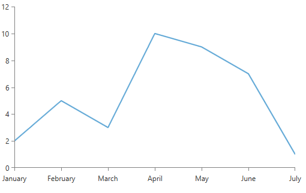
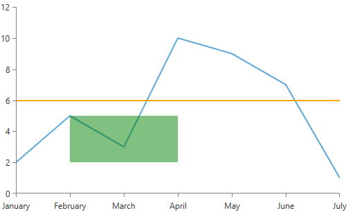

# AnnotationsProvider

RadChartView supports an annotations provider that is used for creating chart annotations in a data-bound scenario. Basically, the provider accepts a collection of models describing the annotations and a descriptor (or descriptors) that defines their type and appearance.

The provider is set through the __AnnotationsProvider__ property of the chart (see __Example 1__) and it can be populated with a collection of models through its __Source__ property.

__Example 1: Setting the AnnotationsProvider__  
```XAML  
	<telerik:RadCartesianChart.AnnotationsProvider>
		<telerik:ChartAnnotationsProvider Source="{Binding AnnotationModelsCollection}" />
	</telerik:RadCartesianChart.AnnotationsProvider/>
```
	
You can choose from a few approaches to determine the type and set up the annotations:
* [Defining a Descriptor](#defining-a-descriptor)
* [Defining a Descriptor Selector](#defining-a-descriptor-selector)
* [Using the AnnotationCreated Event](#using-the-annotationcreated-event)

You can find an example of the provider in the [How to Use AnnotationsProvider](#how-to-use-annotationsprovider) section.

## Defining a Descriptor

You can define an object of type __ChartAnnotationDescriptor__ for the provider (__Example 2__). The descriptor exposes a single property of type Style that determines the type of the annotation. You can use the style to set up the annotation - set its position and visual appearance.

__Example 2: Setting a ChartAnnotationDescriptor__  
```XAML  
	<telerik:RadCartesianChart.AnnotationsProvider>
		<telerik:ChartAnnotationsProvider Source="{Binding AnnotationModelsCollection}">
			<telerik:ChartAnnotationDescriptor>
				<telerik:ChartAnnotationDescriptor.Style>
					<Style TargetType="telerik:CartesianGridLineAnnotation">
						<Setter Property="Axis" Value="{Binding ElementName=verticalAxis}" />
						<Setter Property="Value" Value="{Binding Value}" />
						<Setter Property="Stroke" Value="{Binding Stroke}" />
					</Style>
				</telerik:ChartAnnotationDescriptor.Style>
			</telerik:ChartAnnotationDescriptor>
		</telerik:ChartAnnotationsProvider>
	</telerik:RadCartesianChart.AnnotationsProvider>
```
	
The annotation descriptor in *Example 2* will create a CartesianGridLineAnnotation for each item in the Source collection of the provider.

> The data context passed in the Style of the descriptor is an object from the Source collection.

## Defining a Descriptor Selector

The annotations provider allows you to decide what type of annotation to create at runtime. You can do that using a descriptor selector. You can create a custom class that derives from __ChartAnnotationDescriptorSelector__ and override its __SelectDescriptor()__ method (__Example 3__). Based on a condition, you can return different styles for each item from the Source collection.

__Example 3: Creating ChartAnnotationDescriptorSelector__  
```C#  
	public class MyAnnotationDescriptorSelector : ChartAnnotationDescriptorSelector
    {
        public ChartAnnotationDescriptor MarkedZoneAnnotationDescriptor { get; set; }
        public ChartAnnotationDescriptor GridLineAnnotationDescriptor { get; set; }

        public override ChartAnnotationDescriptor SelectDescriptor(ChartAnnotationsProvider provider, object context)
        {
	    // Here you can define logic that returns different descriptors based on a condition.
            if (context is ModelA)
            {
                return this.MarkedZoneAnnotationDescriptor;
            }
            else if (context is ModelB)
            {
                return this.GridLineAnnotationDescriptor;
            }
			else
			{
				return base.SelectDescriptor(provider, context);
			}            
        }
    }
```
	
__Example 4: Setting the descriptor selector__  
```XAML  
	<telerik:RadCartesianChart.AnnotationsProvider>
		<telerik:ChartAnnotationsProvider Source="{Binding AnnotationModelsCollection}">
			<telerik:ChartAnnotationsProvider.AnnotationDescriptorSelector>
				<local:MyAnnotationDescriptorSelector />
			</telerik:ChartAnnotationsProvider.AnnotationDescriptorSelector>
		</telerik:ChartAnnotationsProvider>
	</telerik:RadCartesianChart.AnnotationsProvider>
```

You can find a runnable code example that demonstrates the descriptor selector in the [How to use AnnotationsProvider](#how-to-use-annotationsprovider) section of this article.
	
## Using the AnnotationCreated Event

The __AnnotationCreated__ event allows you to set up or modify the created annotations at runtime. Also, you can use the event to replace the created annotation with a new one. 

As *Example 5* and *Example 6* demonstrate, you can use the event to create an annotation and let the provider add it in the chart's Annotations collection. 

The event arguments are of type __ChartAnnotationCreatedEventArgs__ and expose the following properties:
* __Annotation__: A property of type __ChartAnnotation__ that holds the created annotation.
* __Context__: A property of type __object__ that holds the model of the annotation.

__Example 5: Subscribing for the AnnotationCreated event__  
```XAML  
	<telerik:ChartAnnotationsProvider AnnotationCreated="ChartAnnotationsProvider_AnnotationCreated">
```
	
__Example 6: Defining the AnnotationCreated event handler__  
```C#  
	private void ChartAnnotationsProvider_AnnotationCreated(object sender, ChartAnnotationCreatedEventArgs e)
	{
		object annotationViewModel = e.Context;
		var annotation = new CartesianGridLineAnnotation();
		// set up the annotation
		e.Annotation = annotation;
	}
```

## How to Use AnnotationsProvider

The following example demonstrates how to use __AnnotationsProvider__ and __AnnotationDescriptorSelector__.

> You can find all of the described features of the provider demonstrated in our [AnnotationsProvider](https://github.com/telerik/xaml-sdk/tree/master/ChartView/SL/AnnotationsProvider)[AnnotationsProvider](https://github.com/telerik/xaml-sdk/tree/master/ChartView/WPF/AnnotationsProvider) SDK example.

__Example 7: Setting up the view__  
```XAML  
	<telerik:RadCartesianChart>
		<telerik:RadCartesianChart.VerticalAxis>
			<telerik:LinearAxis x:Name="verticalAxis" />
		</telerik:RadCartesianChart.VerticalAxis>
		<telerik:RadCartesianChart.HorizontalAxis>
			<telerik:CategoricalAxis />
		</telerik:RadCartesianChart.HorizontalAxis>
		
		<telerik:LineSeries>
			<telerik:LineSeries.DataPoints>
				<telerik:CategoricalDataPoint Category="January" Value="2" />
				<telerik:CategoricalDataPoint Category="February" Value="5" />
				<telerik:CategoricalDataPoint Category="March" Value="3" />
				<telerik:CategoricalDataPoint Category="April" Value="10" />
				<telerik:CategoricalDataPoint Category="May" Value="9" />
				<telerik:CategoricalDataPoint Category="June" Value="7" />
				<telerik:CategoricalDataPoint Category="July" Value="1" />
			</telerik:LineSeries.DataPoints>
		</telerik:LineSeries>
	</telerik:RadCartesianChart>
```

*Example 7* will generate the visual result shown in *Figure 1*.

#### __Figure 1: The initial view__


The classes defined in *Example 8* will be used as models for the annotations. 

__Example 8: Defining the annotation models__  
```C#  
	public class GridLineAnnotationModel
    {
        public double Value { get; set; }
        public Brush Fill { get; set; }        
    }

    public class MarkedZoneAnnotationModel
    {
        public double VerticalFrom { get; set; }
        public double VerticalTo { get; set; }
        public string HorizontalFrom { get; set; }
        public string HorizontalTo { get; set; }
        public Brush Fill { get; set; }
    }
```

You can create a class that will expose a collection of objects that holds the annotation models.

__Example 9: Defining a main view model class__  
```C#  
	public class MainViewModel
	{
		public ObservableCollection<object> AnnotationModelsCollection { get; set; }
		public MainViewModel()
		{
			this.AnnotationModelsCollection = new ObservableCollection<object>()
			{
				new MarkedZoneAnnotationModel() 
				{ 
					HorizontalFrom = "February", 
					HorizontalTo="April", 
					VerticalTo = 5,  
					VerticalFrom = 2, 
					Fill = Brushes.Green, 
				},				
				new GridLineAnnotationModel() { Value = 6, Fill = Brushes.Orange, },
			};
		}
	}
```
	
*Example 10* demonstrates a custom __AnnotationDescriptorSelector__ that returns a different descriptor based on the type of the model.

__Example 10: Creating the descriptor selector__  
```C#  
	public class MyAnnotationsDescriptorSelector : ChartAnnotationDescriptorSelector
    {
        public ChartAnnotationDescriptor MarkedZoneAnnotationDescriptor { get; set; }
        public ChartAnnotationDescriptor GridLineAnnotationDescriptor { get; set; }

        public override ChartAnnotationDescriptor SelectDescriptor(ChartAnnotationsProvider provider, object context)
        {
            if (context is MarkedZoneAnnotationModel)
            {
                return this.MarkedZoneAnnotationDescriptor;
            }
            else if (context is GridLineAnnotationModel)
            {
                return this.GridLineAnnotationDescriptor;
            }

            return base.SelectDescriptor(provider, context);
        }
    }
```
	
*Example 11* demonsrates how to define the AnnotationProvider and set its AnnotationDescriptorSelector.

__Example 11: Setting the annotation descriptor__  
```XAML  
	<telerik:RadCartesianChart>
		<telerik:RadCartesianChart.VerticalAxis>
			<telerik:LinearAxis x:Name="verticalAxis" />
		</telerik:RadCartesianChart.VerticalAxis>
		<telerik:RadCartesianChart.HorizontalAxis>
			<telerik:CategoricalAxis />
		</telerik:RadCartesianChart.HorizontalAxis>		
		<telerik:LineSeries>
			<telerik:LineSeries.DataPoints>
				<telerik:CategoricalDataPoint Category="January" Value="2" />
				<telerik:CategoricalDataPoint Category="February" Value="5" />
				<telerik:CategoricalDataPoint Category="March" Value="3" />
				<telerik:CategoricalDataPoint Category="April" Value="10" />
				<telerik:CategoricalDataPoint Category="May" Value="9" />
				<telerik:CategoricalDataPoint Category="June" Value="7" />
				<telerik:CategoricalDataPoint Category="July" Value="1" />
			</telerik:LineSeries.DataPoints>
		</telerik:LineSeries>
		
		<telerik:RadCartesianChart.AnnotationsProvider>
			<telerik:ChartAnnotationsProvider Source="{Binding AnnotationModelsCollection}">
				<telerik:ChartAnnotationsProvider.AnnotationDescriptorSelector>
					<local:MyAnnotationsDescriptorSelector>
						<local:MyAnnotationsDescriptorSelector.MarkedZoneAnnotationDescriptor>
							<telerik:ChartAnnotationDescriptor>
								<telerik:ChartAnnotationDescriptor.Style>
									<Style TargetType="telerik:CartesianMarkedZoneAnnotation">                                            
										<Setter Property="VerticalFrom" Value="{Binding VerticalFrom}" />
										<Setter Property="VerticalTo" Value="{Binding VerticalTo}" />
										<Setter Property="HorizontalFrom" Value="{Binding HorizontalFrom}" />
										<Setter Property="HorizontalTo" Value="{Binding HorizontalTo}" />
										<Setter Property="Fill" Value="{Binding Fill}" />
										<Setter Property="Opacity" Value="0.5"/>
									</Style>
								</telerik:ChartAnnotationDescriptor.Style>
							</telerik:ChartAnnotationDescriptor>
						</local:MyAnnotationsDescriptorSelector.MarkedZoneAnnotationDescriptor>
						<local:MyAnnotationsDescriptorSelector.GridLineAnnotationDescriptor>
							<telerik:ChartAnnotationDescriptor>
								<telerik:ChartAnnotationDescriptor.Style>
									<Style TargetType="telerik:CartesianGridLineAnnotation">
										<Setter Property="Axis" Value="{Binding ElementName=verticalAxis}" />
										<Setter Property="Value" Value="{Binding Value}" />
										<Setter Property="Stroke" Value="{Binding Stroke}" />
										<Setter Property="StrokeThickness" Value="2" />
									</Style>
								</telerik:ChartAnnotationDescriptor.Style>
							</telerik:ChartAnnotationDescriptor>
						</local:MyAnnotationsDescriptorSelector.GridLineAnnotationDescriptor>
					</local:MyAnnotationsDescriptorSelector>
				</telerik:ChartAnnotationsProvider.AnnotationDescriptorSelector>                  
			</telerik:ChartAnnotationsProvider>
		</telerik:RadCartesianChart.AnnotationsProvider>
	</telerik:RadCartesianChart>
```
	
#### __Figure 2: The final result that shows the generated annotations__


## See Also
* [Introduction]()
* [Annotations Getting Started]()
* [Create Data-Bound Chart]()
* [GridLineAnnotation]()
* [MarkedZoneAnnotation]()
