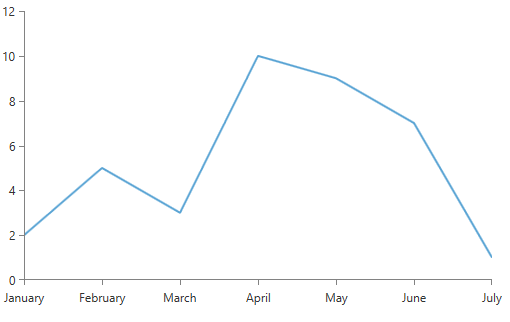
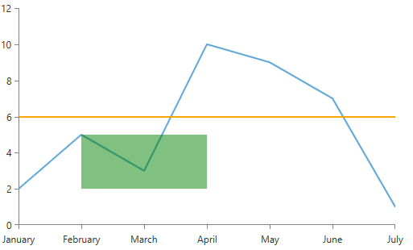

# AnnotationsProvider

RadChartView supports an annotations provider that is used for creating chart annotations in a data-bound scenario. Basically, the provider accepts a collection of models describing the annotations and a descriptor (or descriptors) that defines their type and appearance.

The provider is set through the __AnnotationsProvider__ property of the chart (see __Example 1__) and it can be populated with a collection of models through its __Source__ property.

__Example 1: Setting the AnnotationsProvider__  
<snippet id='radchartview-features-annotations-annotations-provider-example_1_setting_the_annotationsprovider-xaml' />

	
You can choose from a few approaches to determine the type and set up the annotations:
* [Defining a Descriptor](#defining-a-descriptor)
* [Defining a Descriptor Selector](#defining-a-descriptor-selector)
* [Using the AnnotationCreated Event](#using-the-annotationcreated-event)

You can find an example of the provider in the [How to Use AnnotationsProvider](#how-to-use-annotationsprovider) section.

## Defining a Descriptor

You can define an object of type __ChartAnnotationDescriptor__ for the provider (__Example 2__). The descriptor exposes a single property of type Style that determines the type of the annotation. You can use the style to set up the annotation - set its position and visual appearance.

__Example 2: Setting a ChartAnnotationDescriptor__  
<snippet id='radchartview-features-annotations-annotations-provider-example_2_setting_a_chartannotationdescriptor-xaml' />

	
The annotation descriptor in *Example 2* will create a CartesianGridLineAnnotation for each item in the Source collection of the provider.

> The data context passed in the Style of the descriptor is an object from the Source collection.

## Defining a Descriptor Selector

The annotations provider allows you to decide what type of annotation to create at runtime. You can do that using a descriptor selector. You can create a custom class that derives from __ChartAnnotationDescriptorSelector__ and override its __SelectDescriptor()__ method (__Example 3__). Based on a condition, you can return different styles for each item from the Source collection.

__Example 3: Creating ChartAnnotationDescriptorSelector__  
<snippet id='radchartview-features-annotations-annotations-provider-example_3_creating_chartannotationdescriptorselector-cs' />

	
__Example 4: Setting the descriptor selector__  
<snippet id='radchartview-features-annotations-annotations-provider-example_4_setting_the_descriptor_selector-xaml' />

You can find a runnable code example that demonstrates the descriptor selector in the [How to use AnnotationsProvider](#how-to-use-annotationsprovider) section of this article.
	
## Using the AnnotationCreated Event

The __AnnotationCreated__ event allows you to set up or modify the created annotations at runtime. Also, you can use the event to replace the created annotation with a new one. 

As *Example 5* and *Example 6* demonstrate, you can use the event to create an annotation and let the provider add it in the chart's Annotations collection. 

The event arguments are of type __ChartAnnotationCreatedEventArgs__ and expose the following properties:
* __Annotation__: A property of type __ChartAnnotation__ that holds the created annotation.
* __Context__: A property of type __object__ that holds the model of the annotation.

__Example 5: Subscribing for the AnnotationCreated event__  
<snippet id='radchartview-features-annotations-annotations-provider-example_5_subscribing_for_the_annotationcreated_event-xaml' />

	
__Example 6: Defining the AnnotationCreated event handler__  
<snippet id='radchartview-features-annotations-annotations-provider-example_6_defining_the_annotationcreated_event_handler-cs' />

## How to Use AnnotationsProvider

The following example demonstrates how to use __AnnotationsProvider__ and __AnnotationDescriptorSelector__.

> You can find all of the described features of the provider demonstrated in our [AnnotationsProvider](https://github.com/telerik/xaml-sdk/tree/master/ChartView/SL/AnnotationsProvider)[AnnotationsProvider](https://github.com/telerik/xaml-sdk/tree/master/ChartView/WPF/AnnotationsProvider) SDK example.

__Example 7: Setting up the view__  
<snippet id='radchartview-features-annotations-annotations-provider-example_7_setting_up_the_view-xaml' />

*Example 7* will generate the visual result shown in *Figure 1*.

#### __Figure 1: The initial view__

The classes defined in *Example 8* will be used as models for the annotations. 

__Example 8: Defining the annotation models__  
<snippet id='radchartview-features-annotations-annotations-provider-example_8_defining_the_annotation_models-cs' />

You can create a class that will expose a collection of objects that holds the annotation models.

__Example 9: Defining a main view model class__  
<snippet id='radchartview-features-annotations-annotations-provider-example_9_defining_a_main_view_model_class-cs' />

	
*Example 10* demonstrates a custom __AnnotationDescriptorSelector__ that returns a different descriptor based on the type of the model.

__Example 10: Creating the descriptor selector__  
<snippet id='radchartview-features-annotations-annotations-provider-example_10_creating_the_descriptor_selector-cs' />

	
*Example 11* demonsrates how to define the AnnotationProvider and set its AnnotationDescriptorSelector.

__Example 11: Setting the annotation descriptor__  
<snippet id='radchartview-features-annotations-annotations-provider-example_11_setting_the_annotation_descriptor-xaml' />

	
#### __Figure 2: The final result that shows the generated annotations__

## See Also
* [Introduction]()
* [Annotations Getting Started]()
* [Create Data-Bound Chart]()
* [GridLineAnnotation]()
* [MarkedZoneAnnotation]()
