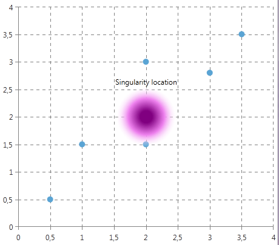
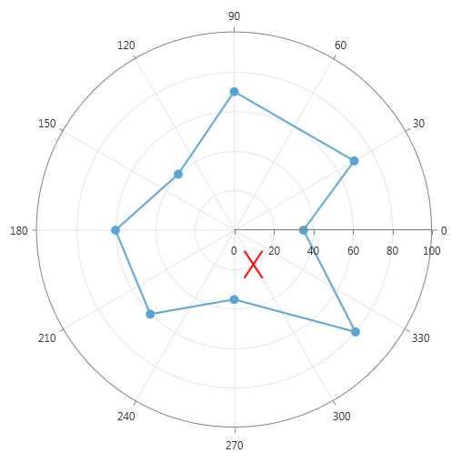

# Custom Annotations

You can place arbitary visual elements on the chart plot area by using the __CartesianCustomAnnotation__ and __PolarCustomAnnotation__.
      

## Cartesian Custom Annotation

The Cartesian Custom Annotation renders its __Content__ starting at the specified (HorizontalValue, VerticalValue) position. You can change the visualization by using the __ContentTemplate__ property.
        

Here is what __CartesianCustomAnnotation__ looks like:
        

#### __XAML__

```XAML
	<telerik:CartesianCustomAnnotation HorizontalValue="2" VerticalValue="2"
	                                   HorizontalAlignment="Center" VerticalAlignment="Center"
	                                   VerticalOffset="-8">
	    <telerik:CartesianCustomAnnotation.Content>
	        <StackPanel Orientation="Vertical">
	            <TextBlock Text="Singularity location"/>
	            <Rectangle Width="100" Height="100">
	                <Rectangle.Fill>
	                    <RadialGradientBrush Center="0.5,0.5" RadiusX="0.5" RadiusY="0.5" GradientOrigin="0.5,0.5">
	                        <GradientStop Color="Purple" Offset="0.2"></GradientStop>
	                        <GradientStop Color="Violet" Offset="0.6"></GradientStop>
	                        <GradientStop Color="Transparent" Offset="1"></GradientStop>
	                    </RadialGradientBrush>
	                </Rectangle.Fill>
	            </Rectangle>
	        </StackPanel>
	    </telerik:CartesianCustomAnnotation.Content>
	</telerik:CartesianCustomAnnotation>
	```



## Polar Custom Annotation

The content of the PolarCustomAnnotation is rendered at the __(RadialValue, PolarValue)__ position.        

#### __XAML__

```XAML
	<telerik:PolarCustomAnnotation PolarValue="20" RadialValue="300" 
	                               HorizontalAlignment="Center" VerticalAlignment="Center">
	    <telerik:PolarCustomAnnotation.Content>
	            <Path Stroke="Red" StrokeThickness="2">
	                <Path.Data>
	                    <PathGeometry>
	                        <PathGeometry.Figures>
	                            <PathFigure StartPoint="0,0">
	                                <LineSegment Point="20,30"/>
	                            </PathFigure>
	                            <PathFigure StartPoint="0,30">
	                                <LineSegment Point="20,0"/>
	                            </PathFigure>
	                        </PathGeometry.Figures>
	                    </PathGeometry>
	                </Path.Data>
	            </Path>
	    </telerik:PolarCustomAnnotation.Content>
	</telerik:PolarCustomAnnotation>
	```



## Properties

Common:        

* __Content__ This property sets the content of the annotation.            

* __ContentTemplate__ This property defines the DataTemplate used to display the content of the annotation.            

* __HorizontalOffset__ This property specifies an offset in pixels, applied after the annotation is positioned on the axis depending on its Horizontal/Vertical or Polar/Radial values.            

* __VerticalOffset__ This property specifies an offset in pixels, applied after the annotation is positioned on the axis depending on its Horizontal/Vertical or Polar/Radial values.
            

Cartesian:        

* __HorizontalValue__ The place on the Horizontal Axis, where the annotation is positioned.            

	>When the axis is numerical (Linear or Logarithmic) a numeric value is expected, and when it is a CategoricalAxis - a category.              

* __VerticalValue__ The place on the Horizontal Axis, where the annotation is positioned.            

	>When the axis is numerical (Linear or Logarithmic) a numeric value is expected, and when it is a CategoricalAxis - a category.              

Polar:        

* __PolarValue__ The place on the Polar Axis, where the annotation is positioned.            

* __RadialValue__ The place on the Radial Axis, where the annotation is positioned.            

	>When the radial axis is NumericRadialAxis a numeric value is expected and when it is a CategoricalRadialAxis - a category.              
