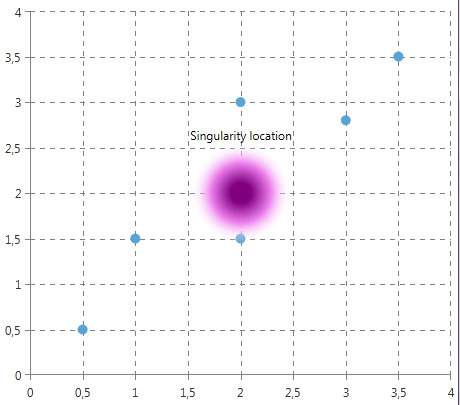
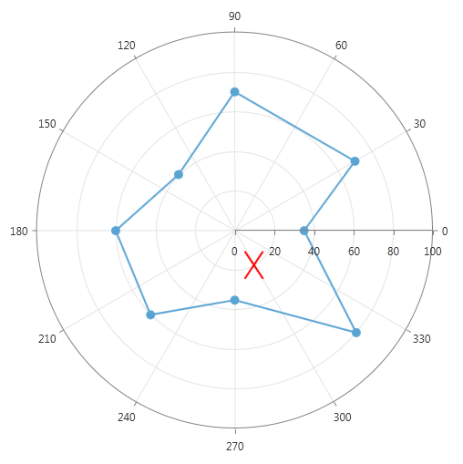

# Custom Annotations

You can place arbitary visual elements on the chart plot area by using the __CartesianCustomAnnotation__ and __PolarCustomAnnotation__.
      

## Cartesian Custom Annotation

The Cartesian Custom Annotation renders its __Content__ starting at the specified (HorizontalValue, VerticalValue) position. You can change the visualization by using the __ContentTemplate__ property.
        

Here is what __CartesianCustomAnnotation__ looks like:

<snippet id='radchartview-features-annotations-custom-block_1-xaml' />

## Polar Custom Annotation

The content of the PolarCustomAnnotation is rendered at the __(RadialValue, PolarValue)__ position.        

<snippet id='radchartview-features-annotations-custom-block_2-xaml' />

## Properties

Common:        

* __Content__ This property sets the content of the annotation.            

* __ContentTemplate__ This property defines the DataTemplate used to display the content of the annotation.            

* __HorizontalOffset__ This property specifies an offset in pixels, applied after the annotation is positioned on the axis depending on its Horizontal/Vertical or Polar/Radial values.            

* __VerticalOffset__ This property specifies an offset in pixels, applied after the annotation is positioned on the axis depending on its Horizontal/Vertical or Polar/Radial values.
            

Cartesian:        

* __HorizontalValue__ The place on the Horizontal Axis, where the annotation is positioned.            

	>When the axis is numerical (Linear or Logarithmic) a numeric value is expected, and when it is a CategoricalAxis - a category.              

* __VerticalValue__ The place on the Horizontal Axis, where the annotation is positioned.            

	>When the axis is numerical (Linear or Logarithmic) a numeric value is expected, and when it is a CategoricalAxis - a category.              

Polar:        

* __PolarValue__ The place on the Polar Axis, where the annotation is positioned.            

* __RadialValue__ The place on the Radial Axis, where the annotation is positioned.            

	>When the radial axis is NumericRadialAxis a numeric value is expected and when it is a CategoricalRadialAxis - a category.              
