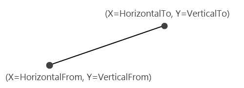
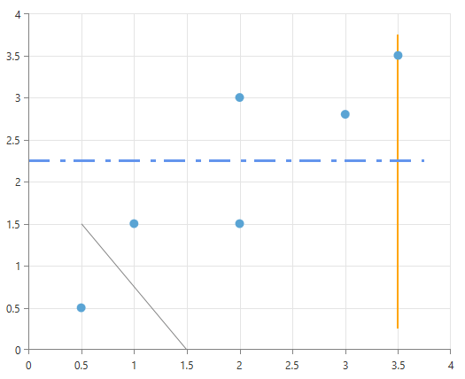

# CustomLine Annotations

The __CartesianCustomLineAnnotation__ is used to for  visualizing lines from point to point. These points are defined by the __HorizontalFrom/To__ and __VerticalFrom/To__ properties of annotation.
      

## Properties

Besides the __HorizontalFrom/To__ and __VerticalFrom/To__ properties that are used for defining the line, the __CartesianCustomLineAnnotation__ exposes the following properties:
        

* __HorizontalAxis__ and __VerticalAxis__ Used for associating the annotation with the chart axes.            

	>By default the annotation is associated with the __RadCartesianChart.HorizontalAxis__ and __RadCartesianChart.VerticalAxis__ axes, so it is not necessary to specify these properties. They are usually used in a multiple axis scenarios.              

* __DashArray__ A collection of System.Double values that indicate the pattern of dashes and gaps that is used to outline the border of the marked zone.            

* __Stroke__ Specifies the stroke of the marked zone.            

* __StrokeThickness__ S pecifies the stroke thickness of the marked zone.            

## Examples

A __CartesianCustomLineAnnotation__ is defined like this:        

#### __XAML__

```XAML
	<telerik:CartesianCustomLineAnnotation HorizontalFrom="0.5" VerticalFrom="1.5" 
	                                       HorizontalTo="1.5" VerticalTo="0.0"/>
	
	<telerik:CartesianCustomLineAnnotation HorizontalFrom="0.0" VerticalFrom="2.25"
	                                       HorizontalTo="3.75" VerticalTo="2.25"
	                                       Stroke="CornflowerBlue" 
	                                       StrokeThickness="3"
	                                       DashArray="8 4 2 3"/>
	
	<telerik:CartesianCustomLineAnnotation HorizontalFrom="3.5" VerticalFrom="0.25"
	                                       HorizontalTo="3.5"  VerticalTo="3.75"
	                                       Stroke="Orange"
	                                       StrokeThickness="2"
	                                       ZIndex="-200"/>
```

By default, the __Stroke__ of the CustomLine is *#FF828282*.        

The second declaration shows that you can use the __DashArray__ property to create an interesting Stroke pattern.        

The last example in the above code snippet shows that you can use the __ZIndex__ property to place an annotation behind the ChartSeries (by default annotations are placed in front of the ChartSeries).


