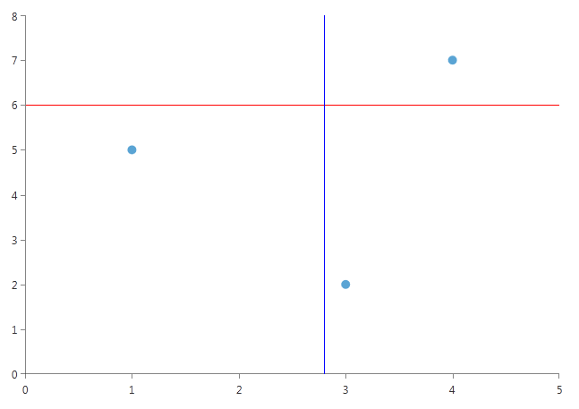
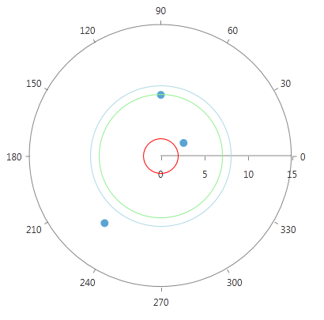
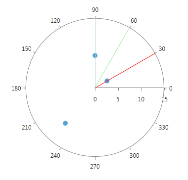

# GridLine Annotations

GridLine annotations are lines or circles that cross the chart grid at a location on the axis, specified by their __Value__ property.

## Cartesian GridLine Annotation

In the case of RadCartesianChart, the CartesianGridLineAnnotation represents a vertical or horizontal line that crosses the entire plot area. 

__Example 1: Adding CartesianGridLineAnnotations__

```XAML
	<telerik:RadCartesianChart x:Name="cartesianChart">
		<telerik:RadCartesianChart.Annotations>
			<telerik:CartesianGridLineAnnotation Axis="{Binding ElementName=verticalAxis}" 
													Value="6"
													Stroke="Red"
													StrokeThickness="1"/>
			<telerik:CartesianGridLineAnnotation Axis="{Binding ElementName=horizontalAxis}" 
													Value="2.8"
													Stroke="Blue"
													StrokeThickness="1"/>
		</telerik:RadCartesianChart.Annotations>

		<telerik:RadCartesianChart.Series>
			<telerik:ScatterPointSeries>
				<telerik:ScatterPointSeries.DataPoints>
					<telerik:ScatterDataPoint XValue="1" YValue="5"/>
					<telerik:ScatterDataPoint XValue="3" YValue="2"/>
					<telerik:ScatterDataPoint XValue="4" YValue="7"/>
				</telerik:ScatterPointSeries.DataPoints>
			</telerik:ScatterPointSeries>
		</telerik:RadCartesianChart.Series>

		<telerik:RadCartesianChart.VerticalAxis>
			<telerik:LinearAxis x:Name="verticalAxis"/>
		</telerik:RadCartesianChart.VerticalAxis>

		<telerik:RadCartesianChart.HorizontalAxis>
			<telerik:LinearAxis x:Name="horizontalAxis"/>
		</telerik:RadCartesianChart.HorizontalAxis>
	</telerik:RadCartesianChart>
```

#### __Figure 1: CartesianGridLineAnnotations in RadCartesianChart__


## Polar Axis GridLine Annotation

PolarAxisGridLineAnnotations represent concentric circles that cross the polar axis at the corresponding __Value__.

__Example 2: Adding PolarAxisGridLineAnnotation__

```XAML
	<telerik:RadPolarChart>
		<telerik:RadPolarChart.Annotations>
			<telerik:PolarAxisGridLineAnnotation Value="2" Stroke="Red"/>
			<telerik:PolarAxisGridLineAnnotation Value="7" Stroke="LightGreen"/>
			<telerik:PolarAxisGridLineAnnotation Value="8" Stroke="LightBlue"/>
		</telerik:RadPolarChart.Annotations>

		<telerik:RadPolarChart.Series>
			<telerik:PolarPointSeries>
				<telerik:PolarPointSeries.DataPoints>
					<telerik:PolarDataPoint Value="2" Angle="30"/>
					<telerik:PolarDataPoint Value="7" Angle="90"/>
					<telerik:PolarDataPoint Value="8" Angle="230"/>
				</telerik:PolarPointSeries.DataPoints>
			</telerik:PolarPointSeries>
		</telerik:RadPolarChart.Series>

		<telerik:RadPolarChart.RadialAxis>
			<telerik:NumericRadialAxis/>
		</telerik:RadPolarChart.RadialAxis>

		<telerik:RadPolarChart.PolarAxis>
			<telerik:PolarAxis/>
		</telerik:RadPolarChart.PolarAxis>
	</telerik:RadPolarChart>
```

#### __Figure 2: PolarAxisGridLineAnnotations in RadPolarChart__


## Radial Axis GridLine Annotation

RadialAxisGridLineAnnotations basically represent the radius of a RadPolarChart.
        

__Example 3: Defining RadialAxisGridLineAnnotation__

```XAML
	<telerik:RadPolarChart>
		<telerik:RadPolarChart.Annotations>
			<telerik:RadialAxisGridLineAnnotation Value="30" Stroke="Red"/>
			<telerik:RadialAxisGridLineAnnotation Value="60" Stroke="LightGreen"/>
			<telerik:RadialAxisGridLineAnnotation Value="90" Stroke="LightBlue"/>
		</telerik:RadPolarChart.Annotations>

		<telerik:RadPolarChart.Series>
			<telerik:PolarPointSeries>
				<telerik:PolarPointSeries.DataPoints>
					<telerik:PolarDataPoint Value="2" Angle="30"/>
					<telerik:PolarDataPoint Value="7" Angle="90"/>
					<telerik:PolarDataPoint Value="8" Angle="230"/>
				</telerik:PolarPointSeries.DataPoints>
			</telerik:PolarPointSeries>
		</telerik:RadPolarChart.Series>

		<telerik:RadPolarChart.RadialAxis>
			<telerik:NumericRadialAxis/>
		</telerik:RadPolarChart.RadialAxis>

		<telerik:RadPolarChart.PolarAxis>
			<telerik:PolarAxis/>
		</telerik:RadPolarChart.PolarAxis>
	</telerik:RadPolarChart>
```

#### __Figure 3: RadialAxisGridLineAnnotations in RadPolarChart__


## Properties

__Common__:

* __DashArray__ : Gets or sets a collection of System.Double values that indicate the pattern of dashes and gaps that is used to outline annotations.

* __Stroke__ : Gets or sets the System.Windows.Media.Brush that specifies how the annotations outline is painted.

* __StrokeThickness__ :  Gets or sets the width of the annotations stroke outline.

__CartesianGridLineAnnotation__:     

* __Axis__ : The CartesianGridLineAnnotation needs to be associated with horizontal or vertical axis explicitly.

* __Value__ (of type object) : The place on the associated axis where the annotation crosses it. When the associated axis is numerical (Linear or Logarithmic) a numeric value is expected and when it is a CategoricalAxis - a category.

* __Label__ : The string that is displayed in the label.

* __LabelDefinition__ : Defines the position of the annotation label. Check the [Annotation Labels]() help topic for more details.

__PolarAxisGridLineAnnotations__:   

* __Value__ (of type double) : Specifies the location on the polar axis (the radius), where the grid line will cross.

__RadialAxisGridLineAnnotation__:     

* __Value__ (of type object) : Specifies the location on the radial axis, where the grid line will cross. When the radial axis is NumericRadialAxis a numeric value is expected and when it is a CategoricalRadialAxis - a category.
            
## See also

* [Custom Annotations]()
* [MarkedZone Annotations]()
* [AnnotationsProvider]()