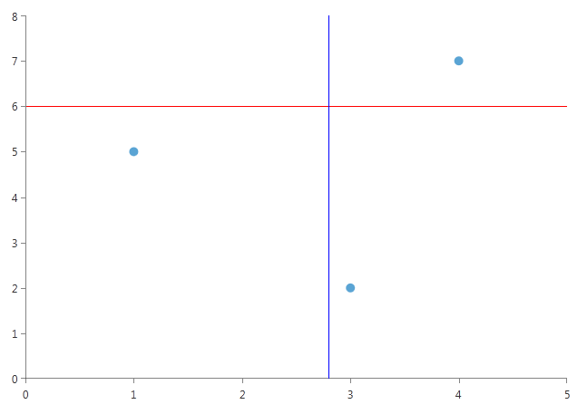
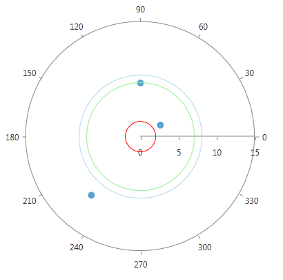
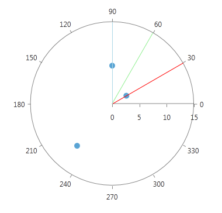

# GridLine Annotations

GridLine annotations are lines or circles that cross the chart grid at a location on the axis, specified by their __Value__ property.

## Cartesian GridLine Annotation

In the case of RadCartesianChart, the CartesianGridLineAnnotation represents a vertical or horizontal line that crosses the entire plot area. 

__Example 1: Adding CartesianGridLineAnnotations__

<snippet id='radchartview-features-annotations-gridline-example_1_adding_cartesiangridlineannotations-xaml' />

#### __Figure 1: CartesianGridLineAnnotations in RadCartesianChart__

## Polar Axis GridLine Annotation

PolarAxisGridLineAnnotations represent concentric circles that cross the polar axis at the corresponding __Value__.

__Example 2: Adding PolarAxisGridLineAnnotation__

<snippet id='radchartview-features-annotations-gridline-example_2_adding_polaraxisgridlineannotation-xaml' />

#### __Figure 2: PolarAxisGridLineAnnotations in RadPolarChart__

## Radial Axis GridLine Annotation

RadialAxisGridLineAnnotations basically represent the radius of a RadPolarChart.
        

__Example 3: Defining RadialAxisGridLineAnnotation__

<snippet id='radchartview-features-annotations-gridline-example_3_defining_radialaxisgridlineannotation-xaml' />

#### __Figure 3: RadialAxisGridLineAnnotations in RadPolarChart__

## Properties

__Common__:

* __DashArray__ : Gets or sets a collection of System.Double values that indicate the pattern of dashes and gaps that is used to outline annotations.

* __Stroke__ : Gets or sets the System.Windows.Media.Brush that specifies how the annotations outline is painted.

* __StrokeThickness__ :  Gets or sets the width of the annotations stroke outline.

__CartesianGridLineAnnotation__:     

* __Axis__ : The CartesianGridLineAnnotation needs to be associated with horizontal or vertical axis explicitly.

* __Value__ (of type object) : The place on the associated axis where the annotation crosses it. When the associated axis is numerical (Linear or Logarithmic) a numeric value is expected and when it is a CategoricalAxis - a category.

* __Label__ : The string that is displayed in the label.

* __LabelDefinition__ : Defines the position of the annotation label. Check the [Annotation Labels]() help topic for more details.

__PolarAxisGridLineAnnotations__:   

* __Value__ (of type double) : Specifies the location on the polar axis (the radius), where the grid line will cross.

__RadialAxisGridLineAnnotation__:     

* __Value__ (of type object) : Specifies the location on the radial axis, where the grid line will cross. When the radial axis is NumericRadialAxis a numeric value is expected and when it is a CategoricalRadialAxis - a category.
            
## See also

* [Custom Annotations]()
* [MarkedZone Annotations]()
* [AnnotationsProvider]()