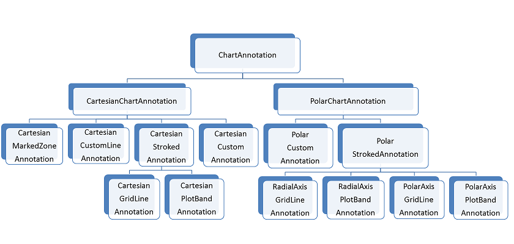

# Overview

Annotations are visual elements that can be used highlight certain areas on the plot area and denote statistical significance.
      

## 

The ChartView provides the following types of annotations:
        

* Cartesian GridLine

* Cartesian PlotBand

* Cartesian Custom

* Cartesian MarkedZone

* Cartesian CustomLine

* Polar Axis GridLine (associated with the polar axis)

* Polar Axis PlotBand (associated with the polar axis)

* Radial Axis GridLine (associated with the radial axis)

* Radial Axis PlotBand (associated with the radial axis)

* Polar Custom

# See Also
