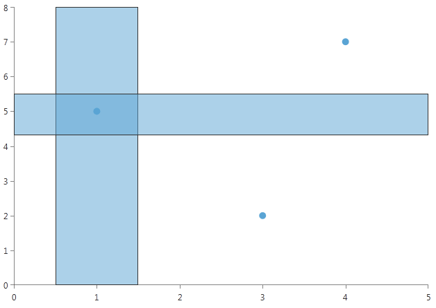
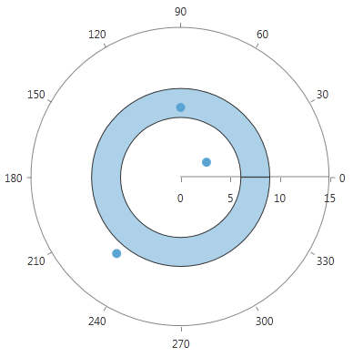
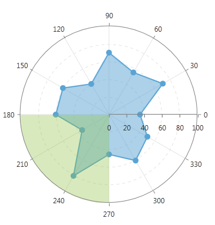

# PlotBand Annotations


Plot Band Annotation is a stripe, crossing its corresponding axis, specified by the __From__ and __To__ properties.
      

## Cartesian PlotBand Annotation

Cartesian PlotBand annotation is either a horizontal or a vertical stripe that crosses from start to end the vertical or the horizontal axis respectively.
        

Here is what __CartesianPlotBandAnnotation__ looks like:
        

#### __XAML__

```XAML
	<telerik:CartesianPlotBandAnnotation From="4.3" To="5.5" Axis="{Binding ElementName=verticalAxis}"/>
	<telerik:CartesianPlotBandAnnotation From="0.5" To="1.5" Axis="{Binding ElementName=horizontalAxis}"/>
	```



## Polar Axis PlotBand Annotation

The Polar axis PlotBand annotation resembles a donut.
        

Here is what __PolarAxisPlotBandAnnotation__ looks like:
        

#### __XAML__

```XAML
	<telerik:PolarAxisPlotBandAnnotation From="6" To="9"/>
	```



## Radial Axis PlotBand Annotation

Radial Axis PlotBand annotations represent visually a sector of the circle (pie slice).
        

A plotband starting from *180* degrees and ending in *270* degrees will look like this:
        

#### __XAML__

```XAML
	<telerik:RadialAxisPlotBandAnnotation From="270" To="180" />
	```



If you wonder how to annotate the bigger segment from the image above, then you should switch the __From__ and __To__ values.
        

#### __XAML__

```XAML
	<telerik:RadialAxisPlotBandAnnotation From="270" To="180" />
	```


## Properties

Common:
        

* __Fill__

* __DashArray__

* __Stroke__

* __StrokeThickness__

Cartesian:
        

* __Axis__ The Cartesian PlotBand annotation needs to be associated with horizontal or vertical axis explicitly.
            

* __From__ (of type object) The starting point for the plot band. When the associated axis is numerical (Linear or Logarithmic) a numeric value is expected and when it is a CategoricalAxis - a category.
            

* __To__ (of type object) The ending point for the plot band.*When the associated axis is numerical (Linear or Logarithmic) a numeric value is expected and when it is a CategoricalAxis - a category.
            

* __Label__ The string, defining the label.
            

* __LabelDefinition__ Defines the position of the annotation label, check the [Annotation Labels]() help topic for more details.
            

Polar:
        

* __From__ (of type double) The starting point for the plot band. __To__ (of type double) The ending point for the plot band.
            

Radial:
        

* __From__ (of type object) The starting point for the plot band. When the radial axis is NumericRadialAxis a numeric value is expected and when it is a CategoricalRadialAxis - a category.
            

* __To__ (of type object) The ending point for the plot band. When the radial axis is NumericRadialAxis a numeric value is expected and when it is a CategoricalRadialAxis - a category.
            
